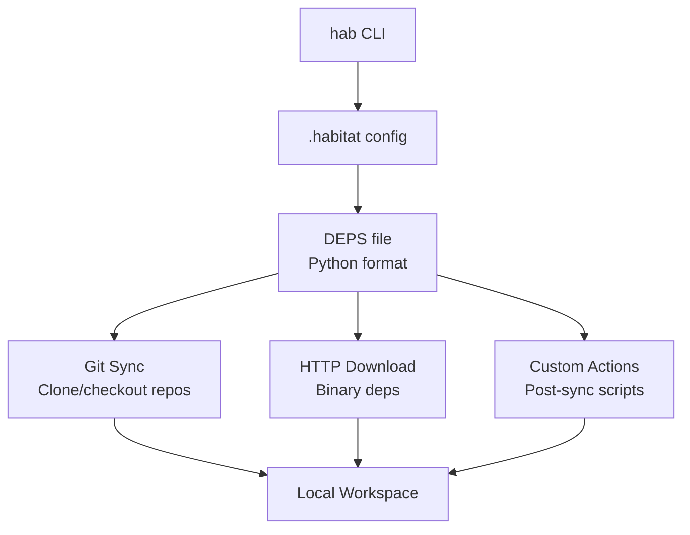

# Project Exploration: Habitat

## Overview

Habitat is a lightweight command-line tool for managing source and binary dependencies in monorepo-style environments. It is the Lynx family's answer to the problem of coordinating dependencies across multiple separate git repositories. Similar in concept to Chromium's `gclient`/`DEPS` system, Habitat reads a `DEPS` file and syncs git repositories, HTTP downloads, and custom actions.

For developers, the workflow is simple: `./hab sync .` sets up the entire local development environment with all required dependencies.

## Repository

- **Location:** `/home/darkvoid/Boxxed/@formulas/src.rust/src.lynxfamily/habitat`
- **Remote:** https://github.com/lynx-family/habitat
- **Primary Language:** Python
- **License:** Apache 2.0

## Directory Structure

```
habitat/
  bin/                     # CLI binary/entry point
  core/                    # Core dependency resolution logic
  tests/                   # Test suite
  __init__.py              # Python package init
  setup.py                 # Setuptools package config
  Makefile                 # Build automation
  MANIFEST.in              # Package manifest
  requirements.txt         # Python dependencies
  tox.ini                  # Tox test runner config
```

## Architecture



### Dependency Types

| Type | Description |
|------|-------------|
| `git` | Clone a git repository at a specific commit/branch |
| `http` | Download and optionally decompress an archive |
| `action` | Run shell commands after dependencies are synced |

## Key Insights

- Habitat is the glue that holds the multi-repo Lynx ecosystem together
- The DEPS file format is Python (similar to Chromium's gclient), allowing conditional dependencies per platform
- Supports SHA256 verification for HTTP downloads
- Dependencies can be marked `ignore_in_git: True` to keep them out of version control
- The `condition` field enables platform-specific dependencies (linux, darwin, windows)
- Actions can have `require` fields for dependency ordering
