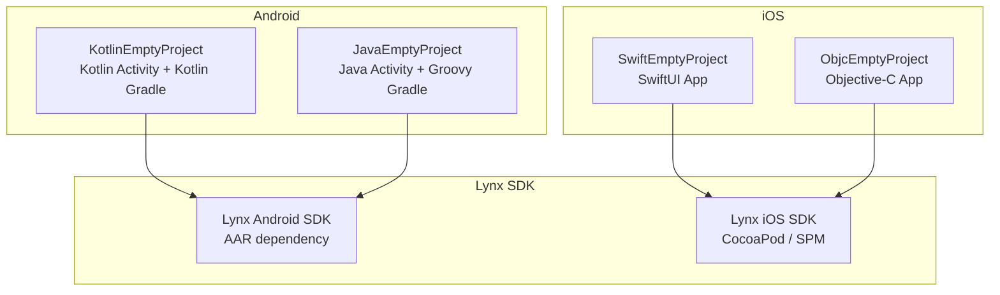

# Project Exploration: Integrating Lynx Demo Projects

## Overview

This repository provides minimal starter templates for integrating the Lynx rendering engine into existing native mobile applications. It contains four "empty project" scaffolds -- two for Android (Kotlin and Java) and two for iOS (Swift/SwiftUI and Objective-C) -- demonstrating the minimum boilerplate required to embed Lynx into a platform application and render Lynx bundles.

The project serves as a reference implementation for developers who already have a native mobile app and want to add Lynx-powered views into their existing codebase, rather than starting from scratch with a Lynx-first project.

## Repository

- **Location:** `/home/darkvoid/Boxxed/@formulas/src.rust/src.lynxfamily/integrating-lynx-demo-projects`
- **Remote:** https://github.com/lynx-family/integrating-lynx-demo-projects
- **Primary Languages:** Kotlin, Java, Swift, Objective-C
- **License:** Apache 2.0

## Directory Structure

```
integrating-lynx-demo-projects/
  android/
    KotlinEmptyProject/       # Kotlin + Kotlin Gradle DSL starter
    JavaEmptyProject/         # Java + Groovy Gradle starter
  ios/
    SwiftEmptyProject/        # Swift + SwiftUI starter
    ObjcEmptyProject/         # Objective-C starter
  README.md
  LICENSE
  .gitignore
```

## Architecture



## Key Components

### Android Projects

1. **KotlinEmptyProject:** Uses Kotlin for both the main Activity and Gradle build configuration (Kotlin DSL). Demonstrates how to initialize the Lynx runtime, create a `LynxView`, load a template bundle, and attach it to the Android view hierarchy.

2. **JavaEmptyProject:** Same integration pattern but using Java for the Activity and Groovy for build configuration. Targets developers working in legacy Java codebases.

Both Android projects depend on the Lynx Android SDK distributed as an AAR artifact, pulled via Gradle dependencies.

### iOS Projects

1. **SwiftEmptyProject:** A SwiftUI-based project showing how to wrap a Lynx rendering view within a SwiftUI view hierarchy using `UIViewRepresentable` or similar bridging patterns.

2. **ObjcEmptyProject:** A traditional Objective-C project demonstrating direct integration with the Lynx iOS SDK's Objective-C APIs.

Both iOS projects consume the Lynx iOS SDK, typically distributed via CocoaPods or Swift Package Manager.

## Integration Pattern

The typical integration flow across all four projects is:

1. Add the Lynx SDK as a dependency (Gradle for Android, CocoaPods/SPM for iOS)
2. Initialize the Lynx engine in the application lifecycle (Application/AppDelegate)
3. Create a Lynx rendering view and attach it to the native view hierarchy
4. Load a pre-built template bundle (produced by `rspeedy build` from the lynx-stack toolchain)
5. The Lynx engine renders the bundle natively using platform UI components

## Role in the Lynx Ecosystem

This project serves as the "last mile" reference -- it bridges the gap between the JavaScript/TypeScript development workflow (handled by lynx-stack and lynx-examples) and actual platform deployment. While lynx-examples focuses on the ReactLynx component side, this project focuses on the native host application side, showing how the Lynx SDK gets embedded into real Android and iOS applications.

## Key Insights

- The repository is intentionally minimal, containing only README and license files at the top level plus four skeleton projects
- Each demo project is self-contained with its own build configuration
- The Android projects use Android Gradle Plugin 7.2.0, targeting API 21+ (Android 5.0)
- The projects demonstrate that Lynx integration requires very little native code -- the bulk of the work is in the JavaScript/TypeScript layer
- This is a GitHub template repository, designed to be used with "Use this template" to bootstrap new integration projects
