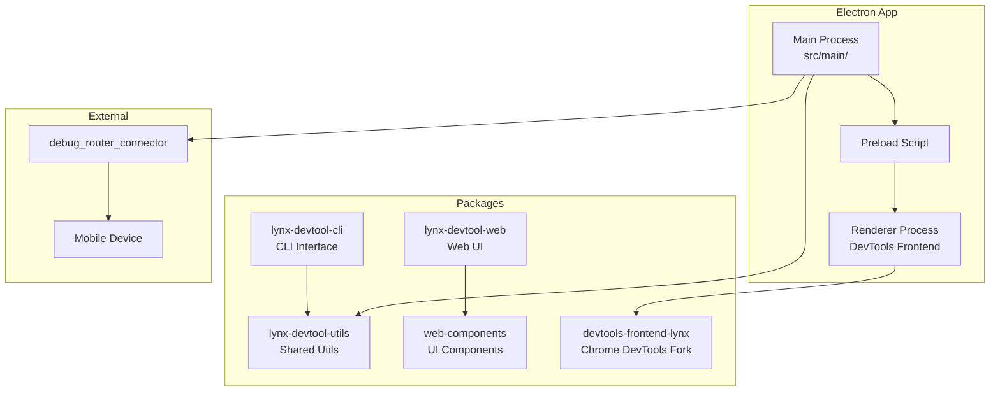

# Project Exploration: Lynx DevTool

## Overview

Lynx DevTool is an Electron-based desktop application that provides mobile debugging features for Lynx applications. It includes a custom Chrome DevTools frontend, a CLI toolkit, common utilities, and a web-based interface. The tool connects to mobile devices running Lynx apps via the DebugRouter infrastructure and provides console, element inspection, network monitoring, and performance profiling.

## Repository

- **Location:** `/home/darkvoid/Boxxed/@formulas/src.rust/src.lynxfamily/lynx-devtool`
- **Remote:** https://github.com/lynx-family/lynx-devtool
- **Primary Language:** TypeScript
- **License:** Apache 2.0

## Directory Structure

```
lynx-devtool/
  src/                          # Main Electron application
    main/                       # Electron main process
    utils/                      # Utility functions
  packages/                     # Sub-packages
    devtools-frontend-lynx/     # Custom Chrome DevTools frontend
    lynx-devtool-cli/           # CLI toolkit for automation
    lynx-devtool-utils/         # Shared utility library
    lynx-devtool-web/           # Web frontend UI
    lynx-devtool-web-components/ # Reusable web components
  log/                          # Logging utilities
  res/                          # Resources (icons, assets)
  scripts/                      # Build and dev scripts
  preload.js                    # Electron preload script
  rsbuild.config.ts             # Rsbuild config (main process)
  rsbuild.renderer.config.ts    # Rsbuild config (renderer)
  package.json                  # Package manifest
  pnpm-workspace.yaml           # pnpm workspace config
  tsconfig.json                 # TypeScript config
```

## Architecture



## Key Insights

- Built with Rsbuild (Rspack-based) for both main and renderer processes
- The Chrome DevTools frontend is forked and customized for Lynx-specific panels
- The CLI package enables automated testing and CI debugging workflows
- Requires Node.js 18 and pnpm 7.33.6 specifically
- The web components package suggests the UI is designed for reuse outside the Electron shell
