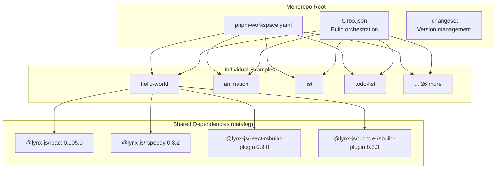

# Project Exploration: Lynx Examples

## Overview

Lynx Examples is the official example gallery for the Lynx cross-platform framework. It is a pnpm monorepo containing 30+ individual example projects that demonstrate every major feature of the Lynx platform -- from basic element usage (text, image, view, list) through styling (CSS, animation, layout), APIs (fetch, lazy-bundle, performance), accessibility, i18n, and web platform rendering.

Each example is a standalone ReactLynx application built with Rspeedy (the Lynx build tool), publishable to npm, and embeddable directly into the lynx-website documentation via the `<Go />` component.

## Repository

- **Location:** `/home/darkvoid/Boxxed/@formulas/src.rust/src.lynxfamily/lynx-examples`
- **Remote:** https://github.com/lynx-family/lynx-examples
- **Primary Language:** TypeScript, CSS
- **License:** Apache 2.0
- **Package Manager:** pnpm 10.4.1 with Turborepo

## Directory Structure

```
lynx-examples/
  examples/
    accessibility/         # Accessibility (A11y) patterns
    action-sheet/          # ActionSheet UI component
    animation/             # CSS and JS animation examples
    BankCards/             # Tutorial: bank cards project
    composing-elements/    # Tutorial: composing elements in ReactLynx
    css/                   # CSS feature demos
    element-manipulation/  # DOM element manipulation
    event/                 # Touch event handling
    fetch/                 # Fetch API usage
    Gallery/               # Tutorial: discover page gallery
    hello-world/           # Minimal starter example
    i18n/                  # Internationalization
    ifr/                   # Inline frame rendering
    image/                 # Image element usage
    layout/                # Layout styling (flexbox, etc.)
    lazy-bundle/           # Code-splitting and lazy loading
    list/                  # Reusable scrollable list container
    local-storage/         # Local storage API
    main-thread/           # Main-thread execution (worklets)
    native-element/        # Native element integration
    networking/            # Network request patterns
    page/                  # Page navigation
    performance-api/       # Performance monitoring APIs
    react-lifecycle/       # React lifecycle hooks
    scroll-view/           # Scrollable container
    swiper/                # Swipeable views
    text/                  # Text and inline-text rendering
    todo-list/             # Full app: to-do list
    view/                  # Basic view element
    web-platform/          # Lynx Web Platform rendering
  api/                     # (workspace) API-related packages
  .changeset/              # Changeset configuration for versioning
  .husky/                  # Git hooks (pre-commit with dprint)
  package.json             # Root monorepo config
  pnpm-workspace.yaml      # Workspace: examples/* and api/*
  turbo.json               # Turborepo build orchestration
  .dprint.jsonc            # Code formatting config
```

## Architecture



## Key Components

### Example Project Structure

Each example follows a consistent pattern:

```
examples/<name>/
  src/
    App.tsx           # Main component
    index.tsx         # Entry point (root.render)
    App.css           # Styles
    rspeedy-env.d.ts  # TypeScript declarations
  lynx.config.ts      # Rspeedy build configuration
  package.json        # Dependencies, scripts (build, dev, preview)
  tsconfig.json       # TypeScript configuration
```

### Dependency Catalog

The monorepo uses pnpm's catalog feature to pin shared dependency versions across all examples:

- `@lynx-js/react`: 0.105.0 (ReactLynx component library)
- `@lynx-js/rspeedy`: 0.8.2 (Build tool wrapping Rspack/Rsbuild)
- `@lynx-js/react-rsbuild-plugin`: 0.9.0 (React transform plugin)
- `@lynx-js/qrcode-rsbuild-plugin`: 0.3.3 (Dev QR code for mobile preview)

### Build System

- **Turborepo** orchestrates parallel builds across all examples
- Each example's `build` task depends on `src/`, `lynx.config.ts`, and `tsconfig.json` as inputs, producing `dist/` as output
- **dprint** handles code formatting (CSS, SCSS, JS, JSX, TS, TSX, JSON, MD)
- **Husky + nano-staged** run formatting on pre-commit

### Website Integration

Examples are published to npm and consumed by the lynx-website via the `@lynx-example/*` scope. The website's `<Go />` component renders live, interactive examples directly in the documentation using Lynx Web Platform.

## Example Categories

| Category | Examples | Description |
|----------|----------|-------------|
| Tutorials | Gallery, BankCards, composing-elements | Step-by-step learning projects |
| Builtin Elements | event, image, list, scroll-view, text, view | Core Lynx element demos |
| Styling | animation, css, layout | CSS features and layout |
| APIs | fetch, lazy-bundle, performance-api, local-storage | Platform API usage |
| Web Platform | web-platform | Lynx rendering in browser |
| UI Components | action-sheet, swiper | Reusable UI patterns |
| A11y | accessibility | Accessibility support |
| I18n | i18n | Internationalization |
| Full Apps | todo-list | Complete application examples |

## Role in the Lynx Ecosystem

Lynx Examples serves a dual purpose:

1. **Learning resource:** Developers clone this repo and run individual examples to learn Lynx features
2. **Documentation integration:** Published examples are embedded in the lynx-website docs as live interactive demos

The examples exclusively use the lynx-stack toolchain (ReactLynx + Rspeedy), making them the canonical reference for the JavaScript/TypeScript development experience.

## Key Insights

- Every example is independently runnable with `pnpm dev` -- no need to build the full monorepo
- The QR code plugin generates a scannable code during `pnpm dev` for testing on LynxExplorer (mobile preview app)
- Examples require Node.js >= 18, with pnpm 10.4.1 as the package manager
- The web-platform example demonstrates Lynx's browser rendering capability, which is architecturally distinct from native rendering
- The `main-thread` and `native-element` examples show advanced patterns not typically covered in cross-platform frameworks
- Total of 30 example directories covering the full breadth of Lynx capabilities
