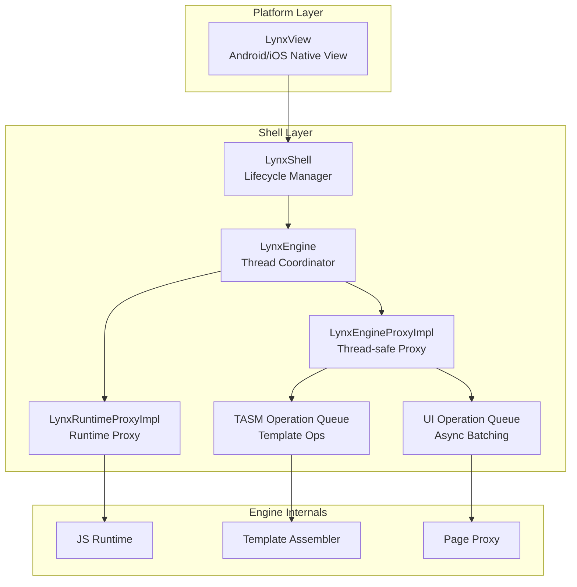
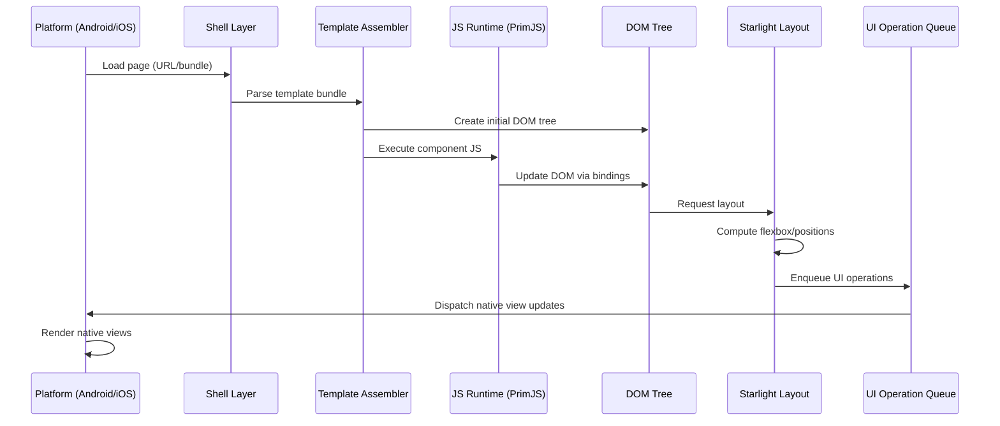

# Project Exploration: Lynx Core Engine

## Overview

Lynx is the core C++ rendering engine of the Lynx family. It implements a cross-platform UI framework that takes web-style components (CSS, DOM-like trees) and renders them natively on Android and iOS. The engine features a multi-threaded architecture managed by a "shell" layer, a template assembler (TASM) for efficient component instantiation, integration with PrimJS (or V8) as the JavaScript runtime, and a custom layout engine called Starlight.

The engine is built using the Chromium-derived GN/Ninja build system and targets Android (via JNI) and iOS (via Objective-C bridging). It is the central piece of the entire Lynx ecosystem -- all other repositories either feed into it (lynx-stack produces bundles for it), support it (PrimJS provides the JS runtime), or build on top of it (devtools inspect it).

## Repository

- **Location:** `/home/darkvoid/Boxxed/@formulas/src.rust/src.lynxfamily/lynx`
- **Remote:** https://github.com/lynx-family/lynx
- **Primary Language:** C++
- **License:** Apache 2.0

## Directory Structure

```
lynx/
  base/                    # Base utilities (threading, logging, memory)
  core/                    # The main engine implementation
    animation/             # CSS animations, transitions, keyframe management
    base/                  # Core base utilities
    event/                 # Event system
    inspector/             # DevTools inspector protocol
    parser/                # Input stream / CSS parsing
    public/                # Public API headers
    renderer/              # DOM, layout, CSS style, template assembler
      css/                 # CSS property resolution
      data/                # Renderer data types
      dom/                 # DOM tree implementation
      events/              # DOM events
      signal/              # Reactive signal system
      starlight/           # Layout engine (Starlight)
        event/             # Layout events
        layout/            # Layout computation
        style/             # Layout style types
        types/             # Layout type definitions
      tasm/                # Template Assembler (component instantiation)
        react/             # React-specific TASM bindings
        i18n/              # Internationalization
        sysinfo/           # System info
      ui_component/        # UI component abstractions
      ui_wrapper/          # Platform UI wrapper
      utils/               # Renderer utilities
      worklet/             # Main-thread worklet execution
    resource/              # Resource management
    runtime/               # JavaScript runtime integration
      bindings/            # Native<->JS bindings
      common/              # Common runtime utilities
      jscache/             # JS bytecode caching
      jsi/                 # JavaScript Interface (engine-agnostic)
      piper/               # Cross-thread piping
      profile/             # Runtime profiling
      vm/                  # VM abstraction layer
    services/              # Core services
    shared_data/           # Shared data structures
    shell/                 # Multi-threaded architecture (the orchestration layer)
      android/             # Android shell implementation
      ios/                 # iOS shell implementation
      common/              # Common shell code
      testing/             # Shell test utilities
    style/                 # CSS style data types (animation, background, transform, etc.)
    template_bundle/       # Template bundle format
    value_wrapper/         # Value type wrappers
  build_overrides/         # GN build override configs
  devtool/                 # In-engine devtool hooks
  explorer/                # Explorer app (demo/testing app)
  js_libraries/            # Bundled JS libraries
  oliver/                  # Oliver tool (unknown purpose)
  patches/                 # Patches for third-party deps
  platform/                # Platform-specific code
    android/               # Android SDK integration
    darwin/                # iOS/macOS SDK integration
  testing/                 # Test infrastructure
  third_party/             # Vendored third-party code
  tools/                   # Build and development tools
  BUILD.gn                 # Root build file
  config.gni               # Build configuration
  DEPS                     # Habitat dependency manifest
  root.gn                  # GN root config
```

## Architecture

### Multi-threaded Shell Architecture



### Component Breakdown

#### Shell (`core/shell/`)
- **Purpose:** Manages the multi-threaded lifecycle of the Lynx engine. Coordinates communication between the UI thread, JS runtime thread, and layout thread.
- **Key Classes:** `LynxShell`, `LynxEngine`, `LynxEngineProxyImpl`, `LynxRuntimeProxyImpl`
- **Pattern:** Actor model with operation queues for cross-thread message passing
- **Dependencies:** base threading, platform layer
- **Dependents:** Everything else -- shell is the top-level orchestrator

#### Renderer (`core/renderer/`)
- **Purpose:** Implements the DOM tree, CSS style resolution, layout computation, and platform UI dispatch
- **Sub-components:**
  - `dom/` - DOM node tree (similar to browser DOM)
  - `css/` - CSS property parsing and cascade
  - `starlight/` - Custom layout engine (flexbox, etc.)
  - `tasm/` - Template assembler for pre-compiled component instantiation
  - `ui_wrapper/` - Bridge to platform-specific native views
  - `signal/` - Reactive signal system for efficient updates
  - `worklet/` - Main-thread JS worklet execution

#### Runtime (`core/runtime/`)
- **Purpose:** Abstracts the JavaScript runtime, providing an engine-agnostic JSI layer
- **Sub-components:**
  - `jsi/` - JavaScript Interface (like React Native's JSI)
  - `bindings/` - Native object bindings exposed to JS
  - `vm/` - Virtual machine abstraction (PrimJS or V8)
  - `jscache/` - Bytecode caching for fast startup
  - `piper/` - Cross-thread communication for JS calls

#### Animation (`core/animation/`)
- **Purpose:** CSS animations, transitions, and keyframe management
- **Key Classes:** `Animation`, `CSSKeyframeManager`, `CSSTransitionManager`, `KeyframeEffect`
- **Pattern:** Curve-based animation with configurable timing functions

#### Style (`core/style/`)
- **Purpose:** CSS style data types -- animation data, backgrounds, filters, shadows, transforms, transitions
- **All C++ structs/classes representing parsed CSS values

#### Parser (`core/parser/`)
- **Purpose:** Input stream handling for CSS/template parsing

## Entry Points

### Android Entry
- **File:** `platform/android/` + shell JNI bindings
- **Flow:** Android Activity -> LynxView -> JNI -> LynxShell -> LynxEngine

### iOS Entry
- **File:** `platform/darwin/` + shell Obj-C bindings
- **Flow:** UIViewController -> LynxView -> Obj-C Bridge -> LynxShell -> LynxEngine

### Template Bundle Loading
- **File:** `core/renderer/template_assembler.cc`
- **Flow:** Bundle loaded -> TASM parses -> DOM nodes created -> Layout computed -> Native views dispatched

## Data Flow



## External Dependencies

| Dependency | Purpose |
|------------|---------|
| PrimJS | Default JavaScript engine |
| V8 (optional) | Alternative JS engine |
| xHook | Android native hook library |
| buildroot | GN build configurations |
| buildtools | GN, Ninja, Clang binaries |
| Node.js 18 | Build tooling runtime |
| Gradle | Android build |
| CocoaPods | iOS dependency management |
| emsdk | WebAssembly target (TASM) |

## Configuration

- **GN args:** Build configuration via `gn gen out/Default --args='...'`
- **config.gni:** Project-level GN configuration
- **DEPS:** Habitat dependency manifest (Python format)
- **Habitat (.habitat):** Workspace configuration for dependency sync

## Testing

- Unit tests co-located with source files (e.g., `*_unittest.cc`, `*_unittests.cc`)
- Shell layer has extensive unit tests for thread safety
- Test infrastructure in `testing/` directory
- Uses Google Test framework patterns

## Key Insights

- The shell module is the architectural centerpiece -- it implements an actor-based threading model that decouples JS execution, layout computation, and UI rendering onto separate threads
- The template assembler (TASM) is a performance innovation: components are pre-compiled into binary templates that can be rapidly instantiated without runtime JS parsing
- Starlight is a custom layout engine (not Yoga), handling CSS flexbox and related layout modes
- The JSI abstraction allows swapping between PrimJS and V8 without changing engine internals
- Operation queues (UI, TASM, async) provide batched, ordered cross-thread communication
- The codebase follows Chromium coding conventions and build patterns throughout
