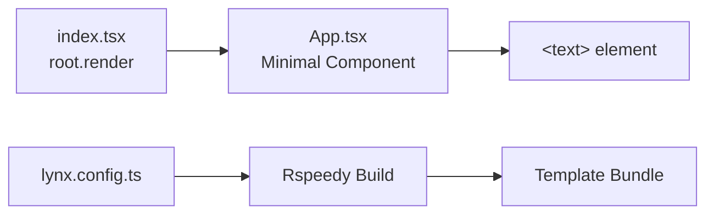

# Project Exploration: Lynx Repro

## Overview

Lynx Repro is a minimal GitHub template repository designed for creating reproducible bug reports for the Lynx framework. It provides the absolute minimum ReactLynx application scaffold -- a single component rendering a text element -- that users can fork or clone to demonstrate issues with the Lynx engine, toolchain, or platform behavior.

This is analogous to create-react-app or Vite's templates but specifically tailored for Lynx bug reproduction workflows.

## Repository

- **Location:** `/home/darkvoid/Boxxed/@formulas/src.rust/src.lynxfamily/lynx-repro`
- **Remote:** https://github.com/lynx-family/lynx-repro
- **Primary Language:** TypeScript
- **License:** Apache 2.0

## Directory Structure

```
lynx-repro/
  src/
    App.tsx                # Minimal App component (single <text> element)
    App.css                # Empty/minimal styles
    index.tsx              # Entry point: root.render(<App />)
    rspeedy-env.d.ts       # Rspeedy TypeScript declarations
  lynx.config.ts           # Rspeedy config with QRCode + ReactLynx plugins
  package.json             # Dependencies and scripts
  tsconfig.json            # TypeScript configuration
  pnpm-lock.yaml           # Locked dependencies
  README.md
  LICENSE
  .gitignore
```

## Architecture



## Key Components

### Entry Point (src/index.tsx)

```typescript
import { root } from '@lynx-js/react'
import { App } from './App.js'

root.render(<App />)

if (import.meta.webpackHot) {
  import.meta.webpackHot.accept()
}
```

The entry point uses `root.render()` from `@lynx-js/react` (not `react-dom`) and includes HMR (Hot Module Replacement) support for development.

### App Component (src/App.tsx)

```typescript
import { useEffect } from "@lynx-js/react";
import "./App.css";

export function App() {
  useEffect(() => {
    console.info("Hello, ReactLynx");
  }, []);

  return (
    <text>
      Thank you for helping us improve by providing a clear reproduction!
    </text>
  );
}
```

Deliberately minimal -- renders a single `<text>` element. The `useEffect` hook confirms the JS runtime is functioning. Users modify this component to reproduce their bug.

### Build Configuration (lynx.config.ts)

Uses `@lynx-js/rspeedy` with two plugins:
- **pluginQRCode:** Generates a scannable QR code during dev for mobile testing via LynxExplorer, with `?fullscreen=true` parameter
- **pluginReactLynx:** Handles JSX transformation, CSS scoping, and Lynx-specific compilation

### Dependencies

**Runtime:**
- `@lynx-js/react` ^0.105.0

**Dev:**
- `@lynx-js/rspeedy` ^0.8.2 (build tool)
- `@lynx-js/react-rsbuild-plugin` ^0.9.0 (React transform)
- `@lynx-js/qrcode-rsbuild-plugin` ^0.3.3 (QR code for mobile preview)
- `@lynx-js/types` ^3.2.0 (type definitions)
- TypeScript ~5.7.3

### Scripts

- `rspeedy dev` -- Start development server with HMR
- `rspeedy build` -- Production build
- `rspeedy preview` -- Preview production build

## Role in the Lynx Ecosystem

Lynx Repro is the standard vehicle for bug reports. When a developer files an issue on any Lynx repository, maintainers direct them to fork this template and modify the App component to demonstrate the problem. This ensures:

1. Every bug report starts from a known-good baseline
2. Reproducible examples use consistent dependency versions
3. Maintainers can instantly clone and run the reproduction
4. The template includes all necessary build configuration so reporters don't need to set up tooling

## Key Insights

- The project is a GitHub template repository (used via "Use this template" button)
- It uses ES modules (`"type": "module"` in package.json)
- Requires Node.js >= 18
- The `<text>` element (not `<p>` or `<span>`) is a Lynx-native element, not an HTML element
- `@lynx-js/react` provides its own `useEffect` -- it is not importing from the standard `react` package
- HMR is handled through webpack-compatible `import.meta.webpackHot` (Rspeedy/Rspack compatibility layer)
- The QR code plugin enables instant mobile testing without manual URL entry
