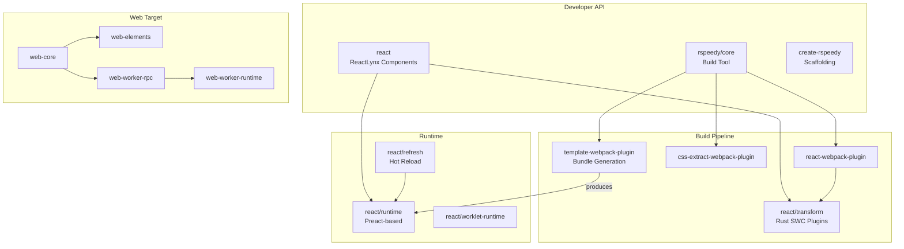

# Project Exploration: Lynx Stack

## Overview

Lynx Stack is the core JavaScript toolchain of the Lynx family. It contains ReactLynx (the React-like component framework for Lynx), Rspeedy (the build tool powered by Rspack), Lynx for Web (web rendering target), and numerous webpack plugins and utilities. This is where developers interact most directly -- writing components in ReactLynx JSX/TSX and building them with Rspeedy.

The repository is a pnpm monorepo workspace with a Rust workspace nested inside for the SWC-based transform plugin. It combines TypeScript packages for the runtime, build tools, and web platform with a Rust crate for high-performance JSX transformation.

## Repository

- **Location:** `/home/darkvoid/Boxxed/@formulas/src.rust/src.lynxfamily/lynx-stack`
- **Remote:** https://github.com/lynx-family/lynx-stack
- **Primary Language:** TypeScript, Rust
- **License:** Apache 2.0

## Directory Structure

```
lynx-stack/
  packages/
    react/                       # ReactLynx - React-like component framework
      components/                # Built-in component types
      etc/                       # API extractor configs
      refresh/                   # Hot refresh runtime
      runtime/                   # ReactLynx runtime (Preact-based)
      transform/                 # Rust/SWC JSX transform plugin
        src/                     # Rust source (swc_plugin_*)
          swc_plugin_compat/     # Compatibility transforms
          swc_plugin_css_scope/  # CSS scoping
          swc_plugin_define_dce/ # Dead code elimination
          swc_plugin_directive_dce/ # Directive-based DCE
          swc_plugin_dynamic_import/ # Dynamic import handling
          swc_plugin_extract_str/   # String extraction
          swc_plugin_inject/     # Code injection
          swc_plugin_refresh/    # Hot refresh transform
          swc_plugin_shake/      # Tree shaking
          swc_plugin_snapshot/   # Snapshot optimization
          swc_plugin_worklet/    # Worklet extraction
        Cargo.toml               # Rust crate config
      types/                     # TypeScript type definitions
      worklet-runtime/           # Worklet runtime code
    rspeedy/                     # Build tool (Rspack wrapper)
      core/                      # Core build configuration
      create-rspeedy/            # Project scaffolding CLI
      plugin-qrcode/             # QR code dev server plugin
      plugin-react/              # React integration plugin
      plugin-react-alias/        # React alias resolution
      websocket/                 # Dev server WebSocket
    web-platform/                # Lynx for Web (browser rendering)
      web-constants/             # Shared constants
      web-core/                  # Core web runtime
      web-elements/              # Web element implementations
      web-elements-compat/       # Compatibility layer
      web-elements-reactive/     # Reactive web elements
      web-explorer/              # Web explorer app
      web-mainthread-apis/       # Main thread API bindings
      web-style-transformer/     # CSS style transformation
      web-tests/                 # Web platform tests
      web-worker-rpc/            # Worker RPC communication
      web-worker-runtime/        # Web worker runtime
    webpack/                     # Webpack plugins
      chunk-loading-webpack-plugin/
      css-extract-webpack-plugin/
      react-refresh-webpack-plugin/
      react-webpack-plugin/
      runtime-wrapper-webpack-plugin/
      template-webpack-plugin/   # Template bundle generation
      web-webpack-plugin/
      webpack-dev-transport/
      webpack-runtime-globals/
    tools/                       # Shared tooling
      canary-release/            # Canary release tooling
      css-serializer/            # CSS serialization
      vitest-setup/              # Test setup
    third-party/
      tailwind-preset/           # Tailwind CSS preset for Lynx
  examples/                      # Example apps
  Cargo.toml                     # Rust workspace root
  Cargo.lock                     # Rust dependency lockfile
  pnpm-workspace.yaml            # pnpm workspace config
  biome.jsonc                    # Biome linter/formatter
  eslint.config.js               # ESLint config
  rust-toolchain                 # Rust toolchain version
```

## Architecture

### Package Dependency Graph



### Component Breakdown

#### ReactLynx (`packages/react/`)
- **Purpose:** The developer-facing React-like framework for building Lynx components
- **Runtime:** Based on Preact for a lightweight virtual DOM
- **Transform:** Rust-based SWC plugin for JSX compilation, CSS scoping, tree shaking, worklet extraction
- **Types:** Full TypeScript type definitions for all Lynx elements

#### Rspeedy (`packages/rspeedy/`)
- **Purpose:** Build tool wrapping Rspack (Rust-based webpack alternative) with Lynx-specific configuration
- **Features:** Dev server with QR code, hot refresh, template bundle output
- **Scaffolding:** `create-rspeedy` CLI for new project generation

#### Web Platform (`packages/web-platform/`)
- **Purpose:** Renders Lynx components in a web browser using standard DOM
- **Architecture:** Uses web workers for the runtime with RPC communication to the main thread
- **Inspired by:** React Native for Web

#### Webpack Plugins (`packages/webpack/`)
- **Purpose:** Collection of webpack/rspack plugins for the Lynx build pipeline
- **Key Plugin:** `template-webpack-plugin` generates the binary template bundles consumed by the C++ engine

### Rust Transform Plugin (`packages/react/transform/`)

The Rust crate provides high-performance SWC transforms:

| Plugin | Purpose |
|--------|---------|
| `swc_plugin_compat` | Compatibility transforms for older targets |
| `swc_plugin_css_scope` | CSS module scoping |
| `swc_plugin_define_dce` | Dead code elimination via define |
| `swc_plugin_directive_dce` | Directive-based dead code elimination |
| `swc_plugin_dynamic_import` | Dynamic import handling |
| `swc_plugin_extract_str` | String literal extraction |
| `swc_plugin_inject` | Code injection |
| `swc_plugin_refresh` | Hot refresh transform |
| `swc_plugin_shake` | Tree shaking |
| `swc_plugin_snapshot` | Component snapshot optimization |
| `swc_plugin_worklet` | Worklet code extraction for main-thread execution |

**Rust Dependencies:** swc_core 0.109.2, napi 2.7.0, serde, regex, sha-1, convert_case

## Entry Points

### Build Entry (Rspeedy)
- **File:** `packages/rspeedy/core/`
- **Flow:** Developer runs `rspeedy build` -> Rspack processes sources -> SWC transforms JSX -> Template plugin produces bundle

### Runtime Entry (ReactLynx)
- **File:** `packages/react/runtime/`
- **Flow:** Template bundle loaded by engine -> Runtime bootstraps -> Virtual DOM reconciliation -> Native updates dispatched

### Web Entry
- **File:** `packages/web-platform/web-core/`
- **Flow:** Web bundle loaded in browser -> Web worker started -> Worker runtime executes components -> RPC to main thread -> DOM updates

## External Dependencies

| Dependency | Version | Purpose |
|------------|---------|---------|
| swc_core | 0.109.2 | JavaScript/TypeScript AST transformation |
| napi | 2.7.0 | Node.js native addon interface (Rust) |
| serde | 1.0.217 | Rust serialization |
| Rspack | (via rspeedy) | Fast webpack-compatible bundler |
| Preact | (via runtime) | Lightweight virtual DOM |
| Biome | (config) | Linting and formatting |

## Key Insights

- The transform plugin is the only Rust code in lynx-stack, but it is performance-critical -- SWC-powered transforms achieve sub-second build times
- The web platform uses a worker-based architecture mirroring Lynx's native multi-threaded model
- Template webpack plugin is the bridge between the JS world and the C++ engine's template assembler
- The worklet system allows running JS on the main thread for gesture/animation responses, extracted at build time by the Rust plugin
- Tailwind CSS is supported via a custom preset in third-party packages
