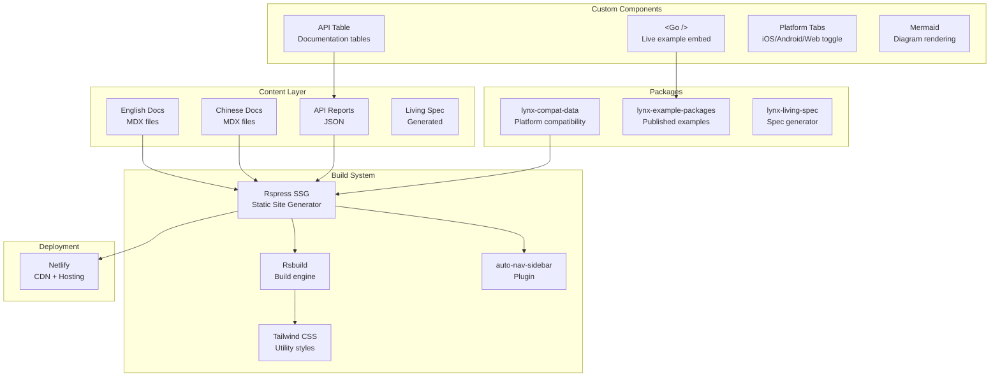

# Project Exploration: Lynx Website

## Overview

Lynx Website is the official documentation site for the Lynx framework, hosted at [lynxjs.org](https://lynxjs.org). Built with Rspress (an Rsbuild-based static site generator), it provides comprehensive bilingual documentation (English and Chinese), API references, guides, tutorials, blog posts, and live interactive examples powered by Lynx Web Platform.

The site is a pnpm monorepo with the main documentation site and supporting packages for compatibility data, living specifications, and example integrations.

## Repository

- **Location:** `/home/darkvoid/Boxxed/@formulas/src.rust/src.lynxfamily/lynx-website`
- **Remote:** https://github.com/lynx-family/lynx-website
- **Primary Language:** TypeScript, MDX
- **License:** Apache 2.0
- **Deployed to:** Netlify (lynxjs.org)

## Directory Structure

```
lynx-website/
  docs/
    en/                          # English documentation
      api/                       # API reference docs
      blog/                      # Blog posts
      guide/                     # User guides and tutorials
      react/                     # ReactLynx documentation
      rspeedy/                   # Rspeedy build tool docs
    zh/                          # Chinese documentation (mirrors en/)
      api/
      blog/
      guide/
      internal/                  # Internal docs (zh-only)
      react/
      rspeedy/
    public/                      # Static assets
      assets/                    # Images, icons
      living-spec/               # Lynx specification docs
      vscode-icons/              # VS Code icon assets
  packages/
    lynx-compat-data/            # Browser/platform compatibility data
    lynx-living-spec/            # Lynx specification generator
    lynx-example-packages/       # Published example package aggregator
  src/
    components/                  # Custom React components
      go/                        # <Go /> - live example embed component
      Mermaid/                   # Mermaid diagram renderer
      api-table/                 # API documentation table
      api-table-explorer/        # Interactive API explorer
      platform-tabs/             # Platform-specific content tabs
      home-comps/                # Homepage components
      html-viewer/               # HTML preview component
      ...
    styles/                      # Global CSS styles
  theme/                         # Custom Rspress theme overrides
    index.tsx                    # Theme entry point
    index.scss                   # Theme styles
    AfterNavTitle.tsx             # Navigation customization
    BeforeSidebar.tsx             # Sidebar customization
    subsite-ui.tsx               # Sub-site UI component
  api-reports/                   # Generated API documentation data
    rspeedy.json                 # Rspeedy API report
    react-rsbuild-plugin.json    # React plugin API report
    qrcode-rsbuild-plugin.json   # QR code plugin API report
  scripts/
    lynx-example.js              # Example data preparation script
    lynx-living-spec.js          # Living spec generation script
  rspress.config.ts              # Main Rspress configuration
  shared-route-config.ts         # Shared sidebar/route configuration
  netlify.toml                   # Netlify deployment config
  tailwind.config.js             # Tailwind CSS configuration
  postcss.config.cjs             # PostCSS configuration
  i18n.json                      # Internationalization config
  cspell.json                    # Spell checking config
```

## Architecture



## Key Components

### Rspress Configuration (rspress.config.ts)

The site uses Rspress with several custom plugins:

1. **rspeedyApiPlugin:** Transforms API sidebar navigation based on generated API reports for Rspeedy, React Rsbuild Plugin, and QR Code Plugin
2. **sharedSidebarPlugin:** Maps shared documentation sections across different route paths to avoid content duplication
3. **pluginOpenGraph:** Generates Open Graph meta tags for social sharing
4. **pluginSvgr:** SVG component support
5. **pluginAutoNavSidebar:** Auto-generates navigation and sidebar from file structure

### The `<Go />` Component

The most architecturally interesting component -- it embeds live, interactive Lynx examples directly into documentation pages. Examples from lynx-examples are published to npm, consumed as dependencies, and rendered using Lynx Web Platform within the documentation.

### Internationalization

Full bilingual support (en/zh) with:
- Mirrored directory structure under `docs/en/` and `docs/zh/`
- Locale-specific sidebar and navigation
- **zhlint** for Chinese text formatting validation
- **cspell** for English spell checking

### Theme Customization

Custom Rspress theme with:
- Custom sidebar badges
- Semi UI integration for rich components
- External link styling
- Hero text animations on homepage
- Custom navigation elements

### Dependencies

**Key runtime dependencies:**
- Rspress 1.43.0-canary (SSG framework)
- React 18.2.0
- Radix UI (accessible component primitives)
- Semi UI (design system from ByteDance/Douyin)
- Tailwind CSS 3.4.x
- Mermaid 11.4.x (diagram rendering)
- SWR (data fetching/caching)

**Key dev dependencies:**
- Prettier for formatting
- Husky + lint-staged for pre-commit hooks
- cspell for spell checking
- zhlint for Chinese text linting

## Quality Assurance

The project has extensive quality tooling:
- **Prettier** for code formatting
- **cspell** for English spelling in documentation
- **zhlint** for Chinese text quality (spacing, punctuation)
- **lint-staged** + **husky** for pre-commit validation
- **Dead link checking** enabled in Rspress markdown config
- **SSG strict mode** for build-time error detection

## Role in the Lynx Ecosystem

Lynx Website is the public face of the Lynx project. It:
- Hosts all official documentation at lynxjs.org
- Provides live, runnable examples embedded in docs (via `<Go />` + Lynx Web Platform)
- Publishes API references auto-generated from the lynx-stack packages
- Maintains a living specification for the Lynx rendering model
- Tracks platform compatibility data across Lynx versions

## Key Insights

- The site is bilingual (English + Chinese) reflecting Lynx's origin at ByteDance
- Live examples are rendered using Lynx's own web platform -- dogfooding the framework in its documentation
- API documentation is auto-generated from JSON reports, not manually written
- The living specification concept means the spec evolves alongside the implementation
- Netlify handles deployment with configuration in `netlify.toml`
- The `lynx-compat-data` package tracks which CSS properties and APIs are supported on which platforms/versions, similar to MDN's browser-compat-data
- Chinese-only `internal/` docs section exists under `zh/`, suggesting internal ByteDance documentation not yet translated
