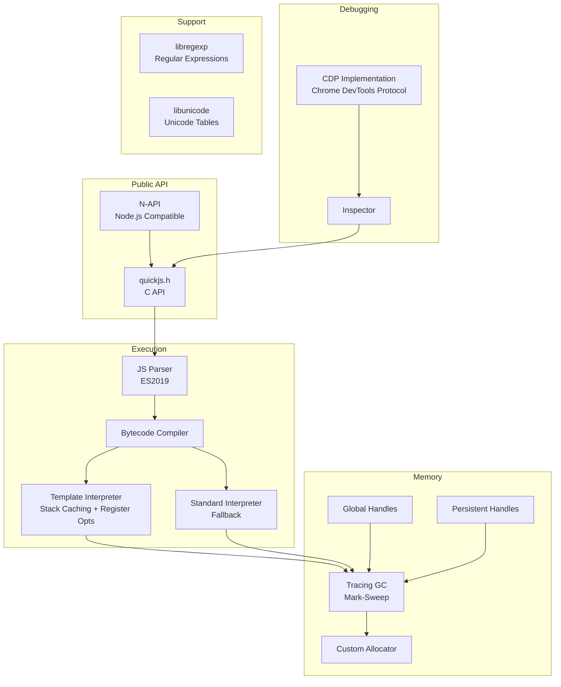

# Project Exploration: PrimJS

## Overview

PrimJS is a lightweight, high-performance JavaScript engine designed specifically for the Lynx cross-platform framework. It is a deeply modified fork of QuickJS with three major enhancements: a template interpreter with stack caching and register optimizations, a tracing garbage collector replacing QuickJS's reference counting, and full Chrome DevTools Protocol (CDP) debugging support.

PrimJS fully supports ES2019 and outperforms vanilla QuickJS by approximately 28% on the Octane benchmark suite (3735 vs 2904). It is the default JS runtime for Lynx, providing the execution environment for component logic, event handlers, and worklets.

## Repository

- **Location:** `/home/darkvoid/Boxxed/@formulas/src.rust/src.lynxfamily/primjs`
- **Remote:** https://github.com/lynx-family/primjs
- **Primary Language:** C, C++
- **License:** Apache 2.0 (with QuickJS, Node.js, V8 license acknowledgments)

## Directory Structure

```
primjs/
  include/                 # Public C API headers
    quickjs.h              # Main JS engine API
    quickjs-libc.h         # Standard library bindings
    quickjs-tag.h          # Value tagging
    allocator.h            # Memory allocator interface
    cutils.h               # C utilities
    global-handles.h       # Global handle management
    persistent-handle.h    # Persistent handle API
    trace-gc.h             # Tracing GC interface
    libregexp.h            # Regular expression engine
    libunicode.h           # Unicode support
    list.h                 # Linked list utilities
    base_export.h          # Export macros
  src/                     # Implementation source
    basic/                 # Core QuickJS implementation (modified)
    gc/                    # Tracing garbage collector
    inspector/             # Chrome DevTools Protocol implementation
    interpreter/           # Template interpreter (optimized bytecode execution)
    napi/                  # Node-API (N-API) compatibility layer
    BUILD.gn               # GN build file
  Android/                 # Android-specific build configs
  docs/                    # Documentation
    benchmark.md           # Performance benchmarks
    debugger.md            # CDP debugger documentation
    gc.md                  # GC design documentation
    template_interpreter.md # Interpreter design
  patches/                 # Patches for dependencies
  CMakeLists.txt           # CMake build (alternative)
  BUILD.gn                 # GN root build file
  config.gni               # Build configuration
  DEPS                     # Habitat dependencies
  Primjs.gni               # GN import for embedding
  PrimJS.podspec           # CocoaPods spec for iOS
```

## Architecture

### Engine Architecture



### Component Breakdown

#### Template Interpreter (`src/interpreter/`)
- **Purpose:** Optimized bytecode interpreter using stack caching and register-based optimizations
- **Benefit:** ~28% performance improvement over QuickJS's standard interpreter
- **Enabled via:** GN arg `enable_primjs_snapshot = true`

#### Tracing GC (`src/gc/`)
- **Purpose:** Replaces QuickJS's reference counting with a mark-sweep tracing garbage collector
- **Benefits:** Better performance, improved memory analyzability, eliminates reference cycle leaks
- **Enabled via:** GN arg `enable_tracing_gc = true`

#### Inspector (`src/inspector/`)
- **Purpose:** Full Chrome DevTools Protocol implementation for debugging
- **Features:** Breakpoints, stepping, console, profiling, heap snapshots
- **Integration:** Connects via debug-router to lynx-devtool

#### N-API (`src/napi/`)
- **Purpose:** Node-API compatibility layer allowing Node.js native addons to work with PrimJS
- **Use case:** Enables code sharing between server-side Node.js and client-side PrimJS

## Entry Points

### Standalone (`qjs` binary)
- **Build:** `gn gen out/Default && ninja -C out/Default qjs_exe`
- **Usage:** `./out/Default/qjs test.js`

### Embedded in Lynx
- **Integration:** Via `Primjs.gni` GN import in the lynx core build
- **API:** `quickjs.h` C API consumed by lynx/core/runtime/

## External Dependencies

| Dependency | Purpose |
|------------|---------|
| QuickJS | Base engine (heavily modified fork) |
| GN/Ninja | Build system |
| Python 3 | Build scripts and test runner |

## Key Insights

- PrimJS is not just a "patched QuickJS" -- the template interpreter and tracing GC are fundamental architectural changes
- The tracing GC eliminates the entire class of reference cycle memory leaks that plague QuickJS
- Stack caching in the template interpreter reduces memory traffic by keeping hot values in CPU registers
- Full CDP support means developers get Chrome DevTools-quality debugging for mobile Lynx apps
- The N-API layer is strategic -- it allows the same native modules to work in both Node.js (build time) and PrimJS (runtime)
- Build configuration is highly parameterized via GN args, allowing different feature combinations per platform
