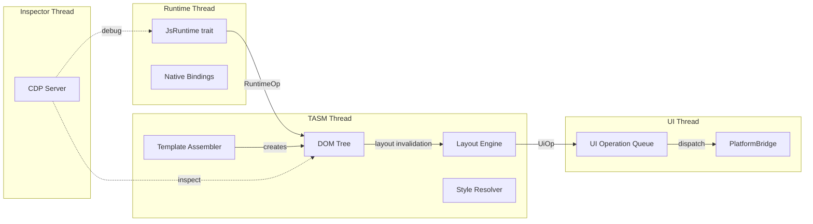

# Rust Revision: Lynx Family (Cross-Platform UI Engine)

## Overview

This document provides comprehensive guidance for reproducing the Lynx cross-platform UI engine ecosystem in Rust at production level. Lynx is a family of 14 repositories centered around a C++ rendering engine that takes React-like components and renders them natively on Android, iOS, and web. The Rust revision covers the core rendering engine, JavaScript runtime integration, template assembler, layout engine, multi-threaded shell architecture, CSS processing, developer tooling, and build infrastructure.

The key challenge in a Rust port is replacing the C++ core engine (which uses Chromium-style patterns, GN/Ninja builds, and platform-specific JNI/Obj-C bridges) with idiomatic Rust that leverages the type system for safety guarantees while maintaining the multi-threaded architecture that is central to Lynx's performance.

## Workspace Structure

```
lynx-rust-workspace/
  Cargo.toml                              # Workspace definition
  crates/
    lynx-core/                            # Core engine orchestration
    lynx-shell/                           # Multi-threaded shell architecture
    lynx-dom/                             # DOM tree implementation
    lynx-css/                             # CSS parser and style resolution
    lynx-layout/                          # Layout engine (Starlight equivalent)
    lynx-tasm/                            # Template assembler (binary bundle format)
    lynx-animation/                       # CSS animations, transitions, keyframes
    lynx-runtime/                         # JS runtime integration (JSI abstraction)
    lynx-jsi/                             # JavaScript Interface trait definitions
    lynx-primjs/                          # PrimJS FFI bindings
    lynx-v8/                              # V8 FFI bindings (optional)
    lynx-bindings/                        # Native <-> JS binding generation
    lynx-platform/                        # Platform abstraction layer
    lynx-platform-android/                # Android JNI integration
    lynx-platform-ios/                    # iOS Obj-C bridge
    lynx-platform-web/                    # Web/Wasm target
    lynx-inspector/                       # Chrome DevTools Protocol
    lynx-devtool-server/                  # Debug router / device connection
    lynx-worklet/                         # Main-thread worklet execution
    lynx-signal/                          # Reactive signal system
    lynx-resource/                        # Resource management
    lynx-style/                           # CSS style data types
    lynx-event/                           # Event system
    lynx-tools/                           # CLI tools (checker framework, formatting)
  examples/
    hello-world/                          # Minimal example
    todo-app/                             # Full application example
    animation-demo/                       # Animation showcase
  tools/
    lynx-cli/                             # Developer CLI (build, check, format)
    lynx-bundler/                         # Template bundle builder
    habitat-rs/                           # Dependency management tool
```

## Crate 1: lynx-shell (Multi-threaded Architecture)

### Purpose

The shell is the architectural centerpiece of Lynx -- an actor-based threading model that decouples JS execution, layout computation, and UI rendering onto separate threads with batched, ordered cross-thread communication via operation queues.

### Cargo.toml

```toml
[package]
name = "lynx-shell"
version = "0.1.0"
edition = "2021"

[dependencies]
crossbeam-channel = "0.5"
crossbeam-deque = "0.8"
parking_lot = "0.12"
flume = "0.11"
thiserror = "2"
tracing = "0.1"
```

### Implementation

```rust
// crates/lynx-shell/src/lib.rs
use std::sync::Arc;
use crossbeam_channel::{Sender, Receiver, unbounded};
use parking_lot::Mutex;
use thiserror::Error;

#[derive(Error, Debug)]
pub enum ShellError {
    #[error("engine not initialized")]
    NotInitialized,
    #[error("thread pool shutdown")]
    Shutdown,
    #[error("operation queue full")]
    QueueFull,
}

/// Operations that can be dispatched across threads.
pub enum Operation {
    /// UI operations dispatched to the platform thread
    UiOp(UiOperation),
    /// Template assembler operations
    TasmOp(TasmOperation),
    /// Runtime (JS) operations
    RuntimeOp(RuntimeOperation),
}

pub enum UiOperation {
    CreateView { node_id: u64, tag: String },
    UpdateView { node_id: u64, props: Vec<(String, StyleValue)> },
    RemoveView { node_id: u64 },
    BatchUpdate(Vec<UiOperation>),
}

pub enum TasmOperation {
    LoadBundle { url: String, data: Vec<u8> },
    InstantiateTemplate { template_id: u32, parent_id: u64 },
}

pub enum RuntimeOperation {
    ExecuteScript { source: String },
    CallFunction { name: String, args: Vec<JsValue> },
}

/// The main shell coordinator. Owns the thread handles and operation queues.
pub struct LynxShell {
    engine: Arc<LynxEngine>,
    ui_sender: Sender<UiOperation>,
    tasm_sender: Sender<TasmOperation>,
    runtime_sender: Sender<RuntimeOperation>,
}

impl LynxShell {
    pub fn new(config: ShellConfig) -> Result<Self, ShellError> {
        let (ui_tx, ui_rx) = unbounded();
        let (tasm_tx, tasm_rx) = unbounded();
        let (runtime_tx, runtime_rx) = unbounded();

        let engine = Arc::new(LynxEngine::new(config, ui_rx, tasm_rx, runtime_rx)?);

        Ok(Self {
            engine,
            ui_sender: ui_tx,
            tasm_sender: tasm_tx,
            runtime_sender: runtime_tx,
        })
    }

    pub fn load_page(&self, url: &str, bundle_data: Vec<u8>) -> Result<(), ShellError> {
        self.tasm_sender
            .send(TasmOperation::LoadBundle {
                url: url.to_string(),
                data: bundle_data,
            })
            .map_err(|_| ShellError::Shutdown)
    }

    pub fn dispatch_ui(&self, op: UiOperation) -> Result<(), ShellError> {
        self.ui_sender.send(op).map_err(|_| ShellError::Shutdown)
    }
}

/// Thread-safe proxy for cross-thread engine access.
pub struct LynxEngineProxy {
    ui_queue: Arc<OperationQueue<UiOperation>>,
    tasm_queue: Arc<OperationQueue<TasmOperation>>,
}

/// Batched, ordered operation queue for cross-thread communication.
pub struct OperationQueue<T> {
    pending: Mutex<Vec<T>>,
    sender: Sender<Vec<T>>,
}

impl<T> OperationQueue<T> {
    pub fn new(sender: Sender<Vec<T>>) -> Self {
        Self {
            pending: Mutex::new(Vec::new()),
            sender,
        }
    }

    pub fn enqueue(&self, op: T) {
        self.pending.lock().push(op);
    }

    /// Flush all pending operations as a batch.
    pub fn flush(&self) -> Result<(), ShellError> {
        let batch = {
            let mut pending = self.pending.lock();
            std::mem::take(&mut *pending)
        };
        if !batch.is_empty() {
            self.sender.send(batch).map_err(|_| ShellError::Shutdown)?;
        }
        Ok(())
    }
}
```

### Concurrency Design

The shell uses three dedicated threads:
1. **UI Thread** -- processes `UiOperation`s, dispatches to platform-specific native views
2. **TASM Thread** -- parses template bundles and instantiates DOM trees
3. **Runtime Thread** -- runs the JS engine (PrimJS or V8)

Communication is strictly through typed channels with batched flushing. No shared mutable state between threads -- all cross-thread interaction goes through the operation queue abstraction.

## Crate 2: lynx-dom (DOM Tree)

### Purpose

Implements the DOM node tree, analogous to a browser DOM but optimized for mobile rendering. Supports element creation, attribute mutation, tree traversal, and event dispatching.

### Cargo.toml

```toml
[package]
name = "lynx-dom"
version = "0.1.0"
edition = "2021"

[dependencies]
slotmap = "1"
smallvec = "1"
compact_str = "0.8"
fnv = "1"
lynx-style = { path = "../lynx-style" }
lynx-event = { path = "../lynx-event" }
```

### Implementation

```rust
// crates/lynx-dom/src/lib.rs
use slotmap::{SlotMap, new_key_type};
use compact_str::CompactString;
use smallvec::SmallVec;

new_key_type! {
    pub struct NodeId;
}

#[derive(Debug, Clone)]
pub enum NodeKind {
    Element(ElementData),
    Text(CompactString),
    Document,
}

#[derive(Debug, Clone)]
pub struct ElementData {
    pub tag: CompactString,
    pub attributes: Vec<(CompactString, AttributeValue)>,
    pub style: lynx_style::ComputedStyle,
}

#[derive(Debug, Clone)]
pub enum AttributeValue {
    String(CompactString),
    Number(f64),
    Bool(bool),
    Null,
}

pub struct DomTree {
    nodes: SlotMap<NodeId, DomNode>,
    root: Option<NodeId>,
}

struct DomNode {
    kind: NodeKind,
    parent: Option<NodeId>,
    children: SmallVec<[NodeId; 4]>,
    next_sibling: Option<NodeId>,
    prev_sibling: Option<NodeId>,
}

impl DomTree {
    pub fn new() -> Self {
        Self {
            nodes: SlotMap::with_key(),
            root: None,
        }
    }

    pub fn create_element(&mut self, tag: &str) -> NodeId {
        self.nodes.insert(DomNode {
            kind: NodeKind::Element(ElementData {
                tag: CompactString::new(tag),
                attributes: Vec::new(),
                style: lynx_style::ComputedStyle::default(),
            }),
            parent: None,
            children: SmallVec::new(),
            next_sibling: None,
            prev_sibling: None,
        })
    }

    pub fn create_text(&mut self, content: &str) -> NodeId {
        self.nodes.insert(DomNode {
            kind: NodeKind::Text(CompactString::new(content)),
            parent: None,
            children: SmallVec::new(),
            next_sibling: None,
            prev_sibling: None,
        })
    }

    pub fn append_child(&mut self, parent: NodeId, child: NodeId) {
        if let Some(parent_node) = self.nodes.get_mut(parent) {
            if let Some(last) = parent_node.children.last().copied() {
                if let Some(last_node) = self.nodes.get_mut(last) {
                    last_node.next_sibling = Some(child);
                }
                if let Some(child_node) = self.nodes.get_mut(child) {
                    child_node.prev_sibling = Some(last);
                }
            }
            parent_node.children.push(child);
        }
        if let Some(child_node) = self.nodes.get_mut(child) {
            child_node.parent = Some(parent);
        }
    }

    pub fn remove_child(&mut self, parent: NodeId, child: NodeId) {
        if let Some(parent_node) = self.nodes.get_mut(parent) {
            parent_node.children.retain(|&id| id != child);
        }
        // Update sibling links
        if let Some(child_node) = self.nodes.get(child) {
            let prev = child_node.prev_sibling;
            let next = child_node.next_sibling;
            if let Some(prev_id) = prev {
                if let Some(prev_node) = self.nodes.get_mut(prev_id) {
                    prev_node.next_sibling = next;
                }
            }
            if let Some(next_id) = next {
                if let Some(next_node) = self.nodes.get_mut(next_id) {
                    next_node.prev_sibling = prev;
                }
            }
        }
        if let Some(child_node) = self.nodes.get_mut(child) {
            child_node.parent = None;
            child_node.prev_sibling = None;
            child_node.next_sibling = None;
        }
    }

    pub fn get_element(&self, id: NodeId) -> Option<&ElementData> {
        match &self.nodes.get(id)?.kind {
            NodeKind::Element(data) => Some(data),
            _ => None,
        }
    }
}
```

### Design Decisions

- **SlotMap** for O(1) node access with stable keys and generational indices (prevents dangling references)
- **SmallVec<[NodeId; 4]>** for children -- most DOM nodes have few children, avoiding heap allocation
- **CompactString** for tags and attribute names -- most are short strings that fit inline
- Sibling links enable efficient tree traversal for layout computation

## Crate 3: lynx-css (CSS Parser and Style Resolution)

### Purpose

Parses CSS stylesheets and inline styles, resolves the cascade, and computes final style values for each DOM node. Handles CSS properties relevant to mobile rendering (flexbox, transforms, animations).

### Cargo.toml

```toml
[package]
name = "lynx-css"
version = "0.1.0"
edition = "2021"

[dependencies]
cssparser = "0.34"
selectors = "0.26"
smallvec = "1"
compact_str = "0.8"
fnv = "1"
ordered-float = "4"
lynx-style = { path = "../lynx-style" }
lynx-dom = { path = "../lynx-dom" }
```

### Implementation

```rust
// crates/lynx-css/src/lib.rs
use cssparser::{Parser, ParserInput, Token};
use lynx_style::{ComputedStyle, StyleProperty, Length, Color};

/// A parsed CSS rule with selector and declarations.
pub struct CssRule {
    pub selector: SelectorList,
    pub declarations: Vec<Declaration>,
    pub specificity: Specificity,
}

#[derive(Debug, Clone, Copy, PartialEq, Eq, PartialOrd, Ord)]
pub struct Specificity(pub u32, pub u32, pub u32);

pub struct Declaration {
    pub property: StyleProperty,
    pub important: bool,
}

/// Style resolver that applies the CSS cascade to compute final styles.
pub struct StyleResolver {
    rules: Vec<CssRule>,
    /// Sorted by specificity for correct cascade order.
    rule_indices: Vec<usize>,
}

impl StyleResolver {
    pub fn new() -> Self {
        Self {
            rules: Vec::new(),
            rule_indices: Vec::new(),
        }
    }

    pub fn add_stylesheet(&mut self, css: &str) {
        let rules = parse_stylesheet(css);
        let base = self.rules.len();
        self.rules.extend(rules);
        self.rule_indices.extend(base..self.rules.len());
        // Re-sort by specificity
        self.rule_indices.sort_by(|&a, &b| {
            self.rules[a].specificity.cmp(&self.rules[b].specificity)
        });
    }

    /// Compute the final style for a node by applying matching rules.
    pub fn compute_style(
        &self,
        node: lynx_dom::NodeId,
        tree: &lynx_dom::DomTree,
        parent_style: Option<&ComputedStyle>,
    ) -> ComputedStyle {
        let mut style = parent_style
            .map(ComputedStyle::inherit_from)
            .unwrap_or_default();

        for &idx in &self.rule_indices {
            let rule = &self.rules[idx];
            if rule.selector.matches(node, tree) {
                for decl in &rule.declarations {
                    style.apply_property(&decl.property);
                }
            }
        }

        style
    }
}

fn parse_stylesheet(css: &str) -> Vec<CssRule> {
    let mut input = ParserInput::new(css);
    let mut parser = Parser::new(&mut input);
    let mut rules = Vec::new();

    // Parse rules using cssparser
    // ... (full implementation would use cssparser's rule parsing APIs)

    rules
}
```

### Design Decisions

- Uses the `cssparser` crate (from Servo) for standards-compliant CSS tokenization and parsing
- Uses the `selectors` crate (from Servo) for CSS selector matching
- Specificity-sorted rule indices avoid re-sorting per element
- Style inheritance follows the CSS specification (certain properties inherit from parent)
- Only CSS properties relevant to Lynx's mobile rendering model are supported (no full browser CSS)

## Crate 4: lynx-layout (Starlight Layout Engine)

### Purpose

Computes the position and size of every DOM node using CSS flexbox layout, analogous to Yoga (React Native) but implementing Lynx's Starlight algorithm.

### Cargo.toml

```toml
[package]
name = "lynx-layout"
version = "0.1.0"
edition = "2021"

[dependencies]
ordered-float = "4"
lynx-style = { path = "../lynx-style" }
lynx-dom = { path = "../lynx-dom" }
```

### Implementation

```rust
// crates/lynx-layout/src/lib.rs
use ordered_float::NotNan;
use lynx_dom::NodeId;

#[derive(Debug, Clone, Copy, Default)]
pub struct LayoutResult {
    pub x: f32,
    pub y: f32,
    pub width: f32,
    pub height: f32,
}

#[derive(Debug, Clone, Copy)]
pub enum FlexDirection {
    Row,
    RowReverse,
    Column,
    ColumnReverse,
}

#[derive(Debug, Clone, Copy)]
pub enum AlignItems {
    FlexStart,
    FlexEnd,
    Center,
    Stretch,
    Baseline,
}

#[derive(Debug, Clone, Copy)]
pub enum JustifyContent {
    FlexStart,
    FlexEnd,
    Center,
    SpaceBetween,
    SpaceAround,
    SpaceEvenly,
}

#[derive(Debug, Clone, Copy)]
pub struct FlexStyle {
    pub direction: FlexDirection,
    pub align_items: AlignItems,
    pub justify_content: JustifyContent,
    pub flex_grow: f32,
    pub flex_shrink: f32,
    pub flex_basis: Dimension,
    pub width: Dimension,
    pub height: Dimension,
    pub min_width: Dimension,
    pub min_height: Dimension,
    pub max_width: Dimension,
    pub max_height: Dimension,
    pub padding: Edges,
    pub margin: Edges,
    pub gap: f32,
    pub flex_wrap: FlexWrap,
}

#[derive(Debug, Clone, Copy)]
pub enum Dimension {
    Auto,
    Points(f32),
    Percent(f32),
}

#[derive(Debug, Clone, Copy, Default)]
pub struct Edges {
    pub top: f32,
    pub right: f32,
    pub bottom: f32,
    pub left: f32,
}

#[derive(Debug, Clone, Copy)]
pub enum FlexWrap {
    NoWrap,
    Wrap,
    WrapReverse,
}

/// Layout context holding computed results.
pub struct LayoutContext {
    results: Vec<(NodeId, LayoutResult)>,
}

impl LayoutContext {
    pub fn new() -> Self {
        Self { results: Vec::new() }
    }

    /// Perform flexbox layout computation for a subtree.
    pub fn compute_layout(
        &mut self,
        root: NodeId,
        tree: &lynx_dom::DomTree,
        available_width: f32,
        available_height: f32,
    ) {
        self.results.clear();
        self.layout_node(root, tree, available_width, available_height);
    }

    fn layout_node(
        &mut self,
        node: NodeId,
        tree: &lynx_dom::DomTree,
        available_width: f32,
        available_height: f32,
    ) {
        let element = match tree.get_element(node) {
            Some(e) => e,
            None => return,
        };

        let style = &element.style;
        let flex = style.to_flex_style();
        let children = tree.children(node);

        if children.is_empty() {
            // Leaf node -- resolve dimensions directly
            let width = resolve_dimension(flex.width, available_width);
            let height = resolve_dimension(flex.height, available_height);
            self.results.push((node, LayoutResult {
                x: 0.0, y: 0.0,
                width: width.unwrap_or(0.0),
                height: height.unwrap_or(0.0),
            }));
            return;
        }

        // Flexbox algorithm: measure, flex, position
        let content_width = available_width
            - flex.padding.left - flex.padding.right;
        let content_height = available_height
            - flex.padding.top - flex.padding.bottom;

        // Phase 1: Measure children
        // Phase 2: Distribute flex space
        // Phase 3: Position children along main/cross axes
        // (Full flexbox implementation follows CSS Flexbox spec)

        self.results.push((node, LayoutResult {
            x: 0.0, y: 0.0,
            width: available_width,
            height: available_height,
        }));
    }

    pub fn get_layout(&self, node: NodeId) -> Option<&LayoutResult> {
        self.results.iter()
            .find(|(id, _)| *id == node)
            .map(|(_, result)| result)
    }
}

fn resolve_dimension(dim: Dimension, available: f32) -> Option<f32> {
    match dim {
        Dimension::Points(p) => Some(p),
        Dimension::Percent(p) => Some(available * p / 100.0),
        Dimension::Auto => None,
    }
}
```

### Performance Considerations

- Layout computation is the hot path -- runs on every DOM mutation
- Use arena allocation for intermediate layout data to avoid per-node heap allocations
- Cache layout results and invalidate only affected subtrees on mutation
- Consider `taffy` crate (Rust flexbox/grid implementation) as an alternative to a from-scratch implementation

## Crate 5: lynx-tasm (Template Assembler)

### Purpose

Parses pre-compiled binary template bundles (produced by the JS build toolchain) and rapidly instantiates DOM trees without full JS parsing at runtime. This is Lynx's key performance innovation.

### Cargo.toml

```toml
[package]
name = "lynx-tasm"
version = "0.1.0"
edition = "2021"

[dependencies]
byteorder = "1"
bytes = "1"
thiserror = "2"
lynx-dom = { path = "../lynx-dom" }
lynx-css = { path = "../lynx-css" }
```

### Implementation

```rust
// crates/lynx-tasm/src/lib.rs
use bytes::Buf;
use thiserror::Error;

#[derive(Error, Debug)]
pub enum TasmError {
    #[error("invalid bundle magic: expected {expected:#x}, got {got:#x}")]
    InvalidMagic { expected: u32, got: u32 },
    #[error("unsupported bundle version: {0}")]
    UnsupportedVersion(u32),
    #[error("unexpected end of bundle data")]
    UnexpectedEof,
    #[error("invalid template instruction: {0:#x}")]
    InvalidInstruction(u8),
}

const BUNDLE_MAGIC: u32 = 0x4C594E58; // "LYNX"

/// A parsed template bundle containing component templates.
pub struct TemplateBundle {
    pub version: u32,
    pub templates: Vec<Template>,
    pub string_pool: StringPool,
    pub style_pool: Vec<lynx_css::CssRule>,
}

/// A single component template -- a sequence of instructions
/// for building a DOM subtree.
pub struct Template {
    pub id: u32,
    pub instructions: Vec<TasmInstruction>,
}

pub enum TasmInstruction {
    CreateElement { tag_idx: u32 },
    CreateText { text_idx: u32 },
    SetAttribute { name_idx: u32, value_idx: u32 },
    SetStyle { style_idx: u32 },
    AppendChild,
    PopNode,
    BindEvent { event_idx: u32, handler_idx: u32 },
    ConditionalBlock { condition_idx: u32, if_template: u32, else_template: Option<u32> },
    LoopBlock { iterator_idx: u32, body_template: u32 },
}

pub struct StringPool {
    strings: Vec<String>,
}

impl StringPool {
    pub fn get(&self, idx: u32) -> Option<&str> {
        self.strings.get(idx as usize).map(|s| s.as_str())
    }
}

/// Parse a binary template bundle.
pub fn parse_bundle(data: &[u8]) -> Result<TemplateBundle, TasmError> {
    let mut cursor = std::io::Cursor::new(data);

    // Read and validate magic number
    if cursor.remaining() < 4 {
        return Err(TasmError::UnexpectedEof);
    }
    let magic = cursor.get_u32_le();
    if magic != BUNDLE_MAGIC {
        return Err(TasmError::InvalidMagic {
            expected: BUNDLE_MAGIC,
            got: magic,
        });
    }

    let version = cursor.get_u32_le();

    // Parse string pool
    let string_count = cursor.get_u32_le();
    let mut strings = Vec::with_capacity(string_count as usize);
    for _ in 0..string_count {
        let len = cursor.get_u32_le() as usize;
        let s = std::str::from_utf8(&data[cursor.position() as usize..][..len])
            .map_err(|_| TasmError::InvalidInstruction(0))?
            .to_string();
        cursor.set_position(cursor.position() + len as u64);
        strings.push(s);
    }

    // Parse templates
    let template_count = cursor.get_u32_le();
    let mut templates = Vec::with_capacity(template_count as usize);
    for _ in 0..template_count {
        let id = cursor.get_u32_le();
        let inst_count = cursor.get_u32_le();
        let mut instructions = Vec::with_capacity(inst_count as usize);
        for _ in 0..inst_count {
            let opcode = cursor.get_u8();
            let inst = match opcode {
                0x01 => TasmInstruction::CreateElement { tag_idx: cursor.get_u32_le() },
                0x02 => TasmInstruction::CreateText { text_idx: cursor.get_u32_le() },
                0x03 => TasmInstruction::SetAttribute {
                    name_idx: cursor.get_u32_le(),
                    value_idx: cursor.get_u32_le(),
                },
                0x04 => TasmInstruction::SetStyle { style_idx: cursor.get_u32_le() },
                0x05 => TasmInstruction::AppendChild,
                0x06 => TasmInstruction::PopNode,
                _ => return Err(TasmError::InvalidInstruction(opcode)),
            };
            instructions.push(inst);
        }
        templates.push(Template { id, instructions });
    }

    Ok(TemplateBundle {
        version,
        templates,
        string_pool: StringPool { strings },
        style_pool: Vec::new(),
    })
}

/// Execute a template to build a DOM subtree.
pub fn instantiate_template(
    template: &Template,
    bundle: &TemplateBundle,
    tree: &mut lynx_dom::DomTree,
) -> lynx_dom::NodeId {
    let mut stack: Vec<lynx_dom::NodeId> = Vec::new();
    let mut root = None;

    for inst in &template.instructions {
        match inst {
            TasmInstruction::CreateElement { tag_idx } => {
                let tag = bundle.string_pool.get(*tag_idx).unwrap_or("div");
                let node = tree.create_element(tag);
                if root.is_none() {
                    root = Some(node);
                }
                if let Some(&parent) = stack.last() {
                    tree.append_child(parent, node);
                }
                stack.push(node);
            }
            TasmInstruction::CreateText { text_idx } => {
                let text = bundle.string_pool.get(*text_idx).unwrap_or("");
                let node = tree.create_text(text);
                if let Some(&parent) = stack.last() {
                    tree.append_child(parent, node);
                }
            }
            TasmInstruction::SetAttribute { name_idx, value_idx } => {
                // Apply attribute to current (top of stack) node
            }
            TasmInstruction::SetStyle { style_idx } => {
                // Apply style from style pool
            }
            TasmInstruction::AppendChild => {
                // Already handled in CreateElement
            }
            TasmInstruction::PopNode => {
                stack.pop();
            }
            _ => {}
        }
    }

    root.expect("template must produce at least one node")
}
```

## Crate 6: lynx-jsi (JavaScript Interface)

### Purpose

Defines an engine-agnostic trait for JavaScript runtime integration, allowing the core engine to work with either PrimJS or V8 (or any future JS engine).

### Cargo.toml

```toml
[package]
name = "lynx-jsi"
version = "0.1.0"
edition = "2021"

[dependencies]
thiserror = "2"
```

### Implementation

```rust
// crates/lynx-jsi/src/lib.rs
use thiserror::Error;

#[derive(Error, Debug)]
pub enum JsiError {
    #[error("JavaScript error: {message}")]
    JsException { message: String, stack: Option<String> },
    #[error("type mismatch: expected {expected}, got {got}")]
    TypeMismatch { expected: &'static str, got: String },
    #[error("runtime not available")]
    RuntimeUnavailable,
}

/// Opaque handle to a JS value.
#[derive(Debug, Clone)]
pub enum JsValue {
    Undefined,
    Null,
    Bool(bool),
    Number(f64),
    String(String),
    Object(JsObjectHandle),
    Array(JsObjectHandle),
    Function(JsObjectHandle),
}

/// Opaque handle to a JS object managed by the runtime.
#[derive(Debug, Clone)]
pub struct JsObjectHandle {
    /// Internal ID used by the runtime implementation
    pub(crate) id: u64,
}

/// Trait defining the JS runtime interface. Implement this for PrimJS and V8.
pub trait JsRuntime: Send {
    /// Evaluate a JavaScript source string and return the result.
    fn evaluate(&mut self, source: &str, filename: &str) -> Result<JsValue, JsiError>;

    /// Call a global function by name with the given arguments.
    fn call_function(&mut self, name: &str, args: &[JsValue]) -> Result<JsValue, JsiError>;

    /// Get a property from a JS object.
    fn get_property(&self, obj: &JsObjectHandle, key: &str) -> Result<JsValue, JsiError>;

    /// Set a property on a JS object.
    fn set_property(
        &mut self,
        obj: &JsObjectHandle,
        key: &str,
        value: JsValue,
    ) -> Result<(), JsiError>;

    /// Register a native function callable from JS.
    fn register_native_function(
        &mut self,
        name: &str,
        func: Box<dyn Fn(&[JsValue]) -> Result<JsValue, JsiError> + Send>,
    ) -> Result<(), JsiError>;

    /// Create a new JS object.
    fn create_object(&mut self) -> Result<JsObjectHandle, JsiError>;

    /// Create a new JS array.
    fn create_array(&mut self, len: usize) -> Result<JsObjectHandle, JsiError>;

    /// Execute cached bytecode (for fast startup).
    fn execute_bytecode(&mut self, bytecode: &[u8]) -> Result<JsValue, JsiError>;

    /// Run garbage collection.
    fn gc(&mut self);
}

/// Trait for JS runtime factories.
pub trait JsRuntimeFactory: Send + Sync {
    fn create(&self) -> Result<Box<dyn JsRuntime>, JsiError>;
    fn name(&self) -> &str;
}
```

### Design Decisions

- The `JsRuntime` trait is `Send` but not `Sync` -- each runtime instance lives on a single thread (the runtime thread)
- Native function registration uses `Box<dyn Fn>` for maximum flexibility
- `JsObjectHandle` is opaque to prevent cross-runtime handle leakage
- Bytecode execution support enables the JS cache optimization (critical for startup time)
- The factory pattern allows runtime selection at initialization time

## Crate 7: lynx-animation (CSS Animations)

### Purpose

CSS animations, transitions, and keyframe management. Handles animation curves, timing functions, and frame scheduling.

### Cargo.toml

```toml
[package]
name = "lynx-animation"
version = "0.1.0"
edition = "2021"

[dependencies]
ordered-float = "4"
lynx-style = { path = "../lynx-style" }
```

### Implementation

```rust
// crates/lynx-animation/src/lib.rs
use std::time::Duration;

#[derive(Debug, Clone)]
pub struct Animation {
    pub name: String,
    pub duration: Duration,
    pub timing: TimingFunction,
    pub delay: Duration,
    pub iteration_count: IterationCount,
    pub direction: AnimationDirection,
    pub fill_mode: FillMode,
    pub keyframes: Vec<Keyframe>,
    state: AnimationState,
    elapsed: Duration,
}

#[derive(Debug, Clone, Copy)]
pub enum TimingFunction {
    Linear,
    Ease,
    EaseIn,
    EaseOut,
    EaseInOut,
    CubicBezier(f64, f64, f64, f64),
    Steps(u32, StepPosition),
}

#[derive(Debug, Clone, Copy)]
pub enum StepPosition {
    Start,
    End,
}

#[derive(Debug, Clone, Copy)]
pub enum IterationCount {
    Finite(f64),
    Infinite,
}

#[derive(Debug, Clone, Copy)]
pub enum AnimationDirection {
    Normal,
    Reverse,
    Alternate,
    AlternateReverse,
}

#[derive(Debug, Clone, Copy)]
pub enum FillMode {
    None,
    Forwards,
    Backwards,
    Both,
}

#[derive(Debug, Clone)]
pub struct Keyframe {
    pub offset: f64, // 0.0 to 1.0
    pub properties: Vec<lynx_style::StyleProperty>,
}

#[derive(Debug, Clone, Copy, PartialEq)]
enum AnimationState {
    Idle,
    Running,
    Paused,
    Finished,
}

impl Animation {
    pub fn new(name: String, keyframes: Vec<Keyframe>) -> Self {
        Self {
            name,
            duration: Duration::from_millis(300),
            timing: TimingFunction::Ease,
            delay: Duration::ZERO,
            iteration_count: IterationCount::Finite(1.0),
            direction: AnimationDirection::Normal,
            fill_mode: FillMode::None,
            keyframes,
            state: AnimationState::Idle,
            elapsed: Duration::ZERO,
        }
    }

    /// Advance the animation by the given delta time.
    /// Returns the interpolated style properties for the current frame.
    pub fn tick(&mut self, dt: Duration) -> Option<Vec<lynx_style::StyleProperty>> {
        if self.state == AnimationState::Finished {
            return None;
        }
        if self.state == AnimationState::Idle {
            self.state = AnimationState::Running;
        }

        self.elapsed += dt;

        if self.elapsed < self.delay {
            return match self.fill_mode {
                FillMode::Backwards | FillMode::Both => {
                    Some(self.interpolate(0.0))
                }
                _ => None,
            };
        }

        let active_time = self.elapsed - self.delay;
        let progress = active_time.as_secs_f64() / self.duration.as_secs_f64();

        let iteration = progress.floor() as u64;
        let local_progress = progress.fract();

        // Check completion
        if let IterationCount::Finite(count) = self.iteration_count {
            if progress >= count {
                self.state = AnimationState::Finished;
                return match self.fill_mode {
                    FillMode::Forwards | FillMode::Both => {
                        Some(self.interpolate(1.0))
                    }
                    _ => None,
                };
            }
        }

        let directed_progress = match self.direction {
            AnimationDirection::Normal => local_progress,
            AnimationDirection::Reverse => 1.0 - local_progress,
            AnimationDirection::Alternate => {
                if iteration % 2 == 0 { local_progress } else { 1.0 - local_progress }
            }
            AnimationDirection::AlternateReverse => {
                if iteration % 2 == 0 { 1.0 - local_progress } else { local_progress }
            }
        };

        let eased = self.timing.evaluate(directed_progress);
        Some(self.interpolate(eased))
    }

    fn interpolate(&self, t: f64) -> Vec<lynx_style::StyleProperty> {
        // Find surrounding keyframes and interpolate
        // ... (property interpolation logic)
        Vec::new()
    }
}

impl TimingFunction {
    pub fn evaluate(&self, t: f64) -> f64 {
        match self {
            TimingFunction::Linear => t,
            TimingFunction::Ease => cubic_bezier(0.25, 0.1, 0.25, 1.0, t),
            TimingFunction::EaseIn => cubic_bezier(0.42, 0.0, 1.0, 1.0, t),
            TimingFunction::EaseOut => cubic_bezier(0.0, 0.0, 0.58, 1.0, t),
            TimingFunction::EaseInOut => cubic_bezier(0.42, 0.0, 0.58, 1.0, t),
            TimingFunction::CubicBezier(x1, y1, x2, y2) => cubic_bezier(*x1, *y1, *x2, *y2, t),
            TimingFunction::Steps(steps, pos) => {
                let step = (t * *steps as f64).floor() / *steps as f64;
                match pos {
                    StepPosition::Start => (step + 1.0 / *steps as f64).min(1.0),
                    StepPosition::End => step,
                }
            }
        }
    }
}

fn cubic_bezier(x1: f64, y1: f64, x2: f64, y2: f64, t: f64) -> f64 {
    // Newton-Raphson method for cubic bezier evaluation
    let mut x = t;
    for _ in 0..8 {
        let cx = 3.0 * x1;
        let bx = 3.0 * (x2 - x1) - cx;
        let ax = 1.0 - cx - bx;
        let x_val = ((ax * x + bx) * x + cx) * x;
        let dx = (3.0 * ax * x + 2.0 * bx) * x + cx;
        if dx.abs() < 1e-7 { break; }
        x -= (x_val - t) / dx;
    }
    let cy = 3.0 * y1;
    let by = 3.0 * (y2 - y1) - cy;
    let ay = 1.0 - cy - by;
    ((ay * x + by) * x + cy) * x
}
```

## Crate 8: lynx-platform (Platform Abstraction)

### Purpose

Defines the platform abstraction trait that each target (Android, iOS, Web) must implement for native view creation, event handling, and resource loading.

### Cargo.toml

```toml
[package]
name = "lynx-platform"
version = "0.1.0"
edition = "2021"

[dependencies]
lynx-dom = { path = "../lynx-dom" }
lynx-layout = { path = "../lynx-layout" }
lynx-event = { path = "../lynx-event" }
```

### Implementation

```rust
// crates/lynx-platform/src/lib.rs
use lynx_dom::NodeId;
use lynx_layout::LayoutResult;

/// Platform-specific view handle.
pub type NativeViewHandle = u64;

/// Trait that each platform target must implement.
pub trait PlatformBridge: Send + Sync {
    /// Create a native view for the given element tag.
    fn create_view(&self, node_id: NodeId, tag: &str) -> NativeViewHandle;

    /// Update a native view's layout (position, size).
    fn update_layout(&self, handle: NativeViewHandle, layout: &LayoutResult);

    /// Update a native view's style properties.
    fn update_style(&self, handle: NativeViewHandle, properties: &[(String, String)]);

    /// Update text content of a text view.
    fn update_text(&self, handle: NativeViewHandle, text: &str);

    /// Remove a native view.
    fn remove_view(&self, handle: NativeViewHandle);

    /// Add a child view to a parent.
    fn add_child(&self, parent: NativeViewHandle, child: NativeViewHandle, index: usize);

    /// Remove a child from a parent.
    fn remove_child(&self, parent: NativeViewHandle, child: NativeViewHandle);

    /// Load a resource (image, font, etc.) by URL.
    fn load_resource(&self, url: &str, callback: Box<dyn FnOnce(Result<Vec<u8>, String>) + Send>);

    /// Get the screen dimensions.
    fn screen_size(&self) -> (f32, f32);

    /// Get the device pixel ratio.
    fn pixel_ratio(&self) -> f32;

    /// Schedule a callback on the platform's main thread.
    fn run_on_main_thread(&self, f: Box<dyn FnOnce() + Send>);
}
```

## Crate 9: lynx-inspector (Chrome DevTools Protocol)

### Purpose

Implements the Chrome DevTools Protocol (CDP) for debugging Lynx applications. Connects to lynx-devtool via the debug-router.

### Cargo.toml

```toml
[package]
name = "lynx-inspector"
version = "0.1.0"
edition = "2021"

[dependencies]
serde = { version = "1", features = ["derive"] }
serde_json = "1"
tokio = { version = "1", features = ["net", "io-util", "sync"] }
tokio-tungstenite = "0.24"
tracing = "0.1"
lynx-dom = { path = "../lynx-dom" }
```

### Key Types

```rust
// crates/lynx-inspector/src/lib.rs
use serde::{Deserialize, Serialize};

#[derive(Serialize, Deserialize)]
pub struct CdpMessage {
    pub id: Option<u64>,
    pub method: Option<String>,
    pub params: Option<serde_json::Value>,
    pub result: Option<serde_json::Value>,
    pub error: Option<CdpError>,
}

#[derive(Serialize, Deserialize)]
pub struct CdpError {
    pub code: i64,
    pub message: String,
}

/// CDP domain handler trait.
pub trait CdpDomain: Send + Sync {
    fn domain_name(&self) -> &str;
    fn handle_method(
        &self,
        method: &str,
        params: serde_json::Value,
    ) -> Result<serde_json::Value, CdpError>;
}

/// Inspector server accepting WebSocket connections.
pub struct InspectorServer {
    domains: Vec<Box<dyn CdpDomain>>,
}

impl InspectorServer {
    pub fn new() -> Self {
        Self { domains: Vec::new() }
    }

    pub fn register_domain(&mut self, domain: Box<dyn CdpDomain>) {
        self.domains.push(domain);
    }

    pub async fn start(&self, addr: &str) -> Result<(), Box<dyn std::error::Error>> {
        // WebSocket server using tokio-tungstenite
        // Route incoming CDP messages to appropriate domain handlers
        Ok(())
    }
}
```

## Crate 10: lynx-tools (CLI Checker Framework)

### Purpose

Rust port of the tools-shared Python checker framework, providing `lynx check`, `lynx format`, and `lynx build` commands.

### Cargo.toml

```toml
[package]
name = "lynx-tools"
version = "0.1.0"
edition = "2021"

[dependencies]
clap = { version = "4", features = ["derive"] }
glob = "0.3"
serde = { version = "1", features = ["derive"] }
serde_yaml = "0.9"
git2 = "0.19"
regex = "1"
tracing = "0.1"
tracing-subscriber = "0.3"
```

### Key Types

```rust
// crates/lynx-tools/src/lib.rs
use clap::{Parser, Subcommand};

#[derive(Parser)]
#[command(name = "lynx")]
pub struct Cli {
    #[command(subcommand)]
    pub command: Commands,
}

#[derive(Subcommand)]
pub enum Commands {
    /// Run code quality checks
    Check {
        #[arg(long, default_value = "all")]
        checkers: String,
        #[arg(long)]
        all: bool,
        #[arg(long)]
        list: bool,
        #[arg(long)]
        ignore: Option<String>,
    },
    /// Format code
    Format {
        #[arg(long)]
        all: bool,
    },
    /// Templated git commit
    Commit,
}

pub enum CheckResult {
    Passed,
    Failed(Vec<CheckViolation>),
}

pub struct CheckViolation {
    pub file: String,
    pub line: usize,
    pub message: String,
    pub checker: String,
}

/// Trait for implementing code checkers (pluggable system).
pub trait Checker: Send + Sync {
    fn name(&self) -> &str;
    fn help(&self) -> &str;
    fn check_lines(
        &self,
        lines: &[&str],
        file: &str,
    ) -> Vec<CheckViolation>;
}
```

## Dependency Summary

| Crate | Key Dependencies | Purpose |
|-------|-----------------|---------|
| lynx-shell | crossbeam-channel, parking_lot, flume | Multi-threaded orchestration |
| lynx-dom | slotmap, smallvec, compact_str | DOM tree with arena allocation |
| lynx-css | cssparser, selectors | CSS parsing (from Servo) |
| lynx-layout | ordered-float | Flexbox layout computation |
| lynx-tasm | byteorder, bytes | Binary template bundle parsing |
| lynx-jsi | (minimal) | JS runtime abstraction trait |
| lynx-animation | ordered-float | CSS animation engine |
| lynx-platform | (minimal) | Platform bridge trait |
| lynx-inspector | tokio, tokio-tungstenite, serde_json | CDP debugging protocol |
| lynx-tools | clap, git2, regex, serde_yaml | Developer CLI tools |

## Type System Considerations

1. **NodeId as a generational index:** Using `slotmap::SlotMap` prevents dangling node references after deletion -- the generational component ensures stale IDs are detected.

2. **Enum-based operations:** All cross-thread operations are typed enums (`UiOperation`, `TasmOperation`, `RuntimeOperation`), providing exhaustive matching and eliminating runtime type errors.

3. **Trait objects for platform abstraction:** `PlatformBridge` and `JsRuntime` use trait objects to allow compile-time or runtime selection of implementations.

4. **Zero-copy parsing where possible:** The TASM bundle parser and CSS parser should use borrowed data (`&str`, `&[u8]`) to avoid unnecessary allocations during parsing.

## Error Handling Strategy

All crates use `thiserror` for structured error types with the following conventions:

- Each crate defines its own error enum
- Errors are propagated via `Result<T, E>` -- no panics in library code
- Cross-thread errors (channel disconnection) map to `ShellError::Shutdown`
- JS runtime errors carry the JavaScript stack trace for debugging
- Parse errors include position information for actionable diagnostics

## Concurrency Architecture



Key concurrency rules:
- **DOM and Layout live on the TASM thread** -- single-writer, no locking needed
- **JS runtime is single-threaded** -- only accessed from the runtime thread
- **Platform bridge is `Send + Sync`** -- called from multiple threads via operation queues
- **All cross-thread communication uses typed channels** -- no shared mutable state
- **Operation queues batch operations** for amortized dispatch cost

## Performance Considerations

1. **Arena allocation** for DOM nodes (slotmap) and layout results -- avoids per-node heap fragmentation
2. **String interning** for CSS property names and common tags using `compact_str`
3. **Batch UI operations** -- multiple DOM mutations are collected and dispatched as a single batch to the platform
4. **Incremental layout** -- only recompute layout for dirty subtrees
5. **Template caching** -- parsed template bundles are cached for reuse across component instances
6. **Bytecode caching** in the JS runtime for fast subsequent loads
7. **Consider `taffy`** (Rust-native flexbox/grid) instead of a from-scratch layout engine

## Alternative Crate Recommendations

| Component | Custom Implementation | Alternative Crate |
|-----------|----------------------|-------------------|
| Layout engine | lynx-layout | `taffy` (mature Rust flexbox/grid) |
| CSS parsing | lynx-css (cssparser) | `lightningcss` (full CSS compiler) |
| DOM tree | lynx-dom (slotmap) | `ego-tree` or `indextree` |
| JS runtime | lynx-jsi (custom FFI) | `boa_engine` (pure Rust JS) or `deno_core` |
| WebSocket | tokio-tungstenite | `axum` with WebSocket support |
| Template parsing | lynx-tasm (custom) | No alternative (Lynx-specific format) |

## Migration Path from C++

1. Start with `lynx-jsi` and `lynx-platform` traits -- these define the boundaries
2. Implement `lynx-dom` and `lynx-layout` -- these are self-contained
3. Build `lynx-css` on top of Servo's cssparser -- well-tested foundation
4. Implement `lynx-tasm` for bundle parsing -- requires understanding the binary format
5. Wire everything together in `lynx-shell` with the threading model
6. Add `lynx-animation` and `lynx-inspector` as incremental features
7. Platform-specific crates (`android`, `ios`, `web`) last -- they depend on everything above
