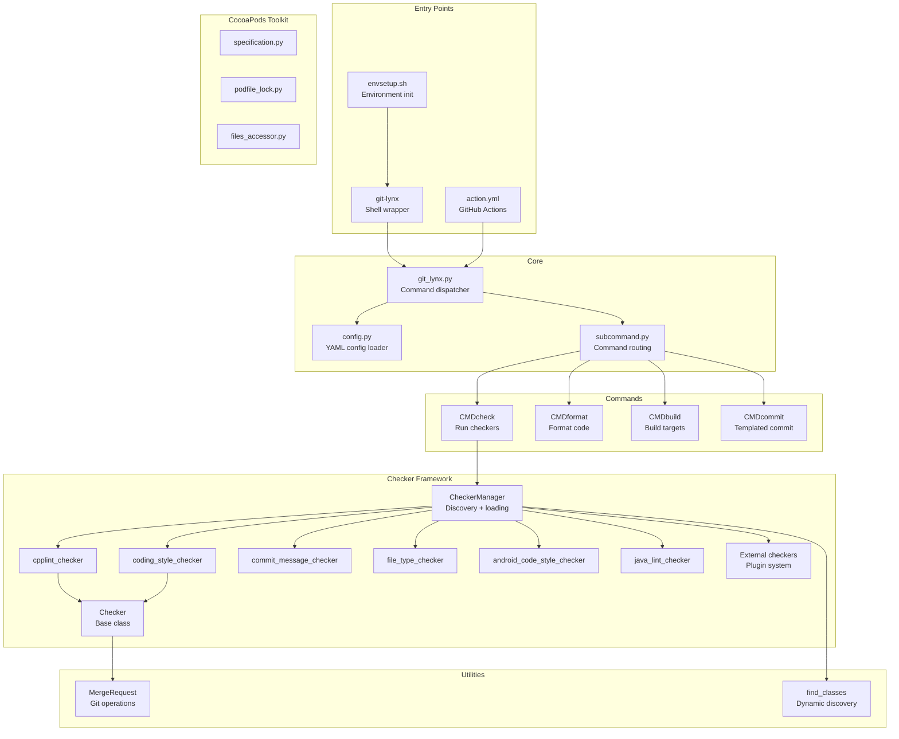

# Project Exploration: Tools Shared

## Overview

Tools Shared is the shared CI/CD tooling, code quality checking, and formatting infrastructure for all Lynx family repositories. It provides a `git lynx` subcommand that wraps code style checking, commit message validation, file type enforcement, C++ linting (cpplint), Java linting, and code formatting. It also includes a CocoaPods integration toolkit for iOS builds and a GitHub Actions composite action for CI pipeline integration.

The tool operates as a git subcommand extension -- after sourcing `envsetup.sh`, developers gain `git lynx check`, `git lynx format`, `git lynx build`, and `git lynx commit` commands.

## Repository

- **Location:** `/home/darkvoid/Boxxed/@formulas/src.rust/src.lynxfamily/tools-shared`
- **Remote:** https://github.com/lynx-family/tools-shared
- **Primary Language:** Python, Bash
- **License:** Apache 2.0

## Directory Structure

```
tools-shared/
  checkers/
    __init__.py
    checker.py                  # Base Checker class and CheckResult
    checker_manager.py          # Dynamic checker discovery and loading
    android_code_style_checker.py   # Android-specific style rules
    coding_style_checker.py     # General coding style rules
    commit_message_checker.py   # Commit message format validation
    commit_message_helper.py    # Commit message parsing utilities
    cpplint.py                  # C++ lint rules (Google style)
    cpplint_checker.py          # cpplint integration checker
    default_config.py           # Default checker configuration
    file_type_checker.py        # File extension/type validation
    format_file_filter.py       # File filtering for formatting
    java_lint_checker.py        # Java lint rules
    code_format_helper.py       # Formatting command generation
    process_header_path_helper.py  # C++ header path validation
  cocoapods/
    __init__.py
    README.md
    attr_types.py               # CocoaPods attribute type definitions
    files_accessor.py           # Pod file access patterns
    pod.py                      # Pod representation
    podfile_lock.py             # Podfile.lock parser
    precompiled_header.py       # PCH generation
    sources.py                  # Pod source management
    specification.py            # Podspec parser
    utils.py                    # CocoaPods utilities
  docs/
    COMMIT_MESSAGE_FORMAT.md    # Commit message convention docs
    README_CONFIGURATION.md     # Configuration reference
  git_templates/
    normal                      # Commit message template
  test/
    git_lynx_unittests.py       # Unit tests for git lynx
  utils/
    __init__.py
    find_classes.py             # Dynamic class discovery utility
    merge_request.py            # Git diff/change tracking
  dependencies/
    DEPS                        # Habitat dependency file
  git_lynx.py                   # Main entry point for git lynx subcommand
  git-lynx                      # Shell wrapper for git subcommand
  config.py                     # Configuration loading (YAML merge)
  subcommand.py                 # Command dispatcher
  envsetup.py                   # Python environment setup
  envsetup.sh                   # Shell environment setup (adds git lynx)
  envsetup.template.sh          # Template for envsetup customization
  format.sh                     # Standalone formatting script
  setup.py                      # Python package setup
  gen_ios_pkg.py                # iOS package generation
  geniospkg                     # iOS package generation wrapper
  hab                           # Habitat CLI wrapper
  action.yml                    # GitHub Actions composite action definition
```

## Architecture



## Key Components

### Checker Framework

The checker system uses a plugin-based architecture:

1. **`Checker` base class** (`checker.py`): Defines the interface with `check_changed_lines()` and `check_changed_files()` methods. Includes diff parsing logic that extracts changed lines with file/line-number tracking.

2. **`CheckerManager`** (`checker_manager.py`): Dynamically discovers all `Checker` subclasses in the `checkers/` package using `find_classes()`. Also supports loading external checkers from a configurable path, enabling each Lynx repository to define custom checks.

3. **Built-in checkers:**
   - `cpplint_checker`: Google C++ style linting
   - `coding_style_checker`: General code style rules
   - `commit_message_checker`: Enforces commit message format (label, summary, issue fields)
   - `file_type_checker`: Validates allowed file types
   - `android_code_style_checker`: Android-specific style rules
   - `java_lint_checker`: Java code style rules

4. **External checker plugin system:** Repositories can define their own checkers in a configured directory, which are dynamically loaded and merged with built-in checkers.

### Configuration System

- Default configuration lives in `checkers/default_config.py`
- Repositories can override defaults by placing a `.tools_shared` YAML file in their root
- Configuration is deeply merged (dict values merge recursively, other values override)
- PyYAML is installed on-demand if not present

### Git Integration

The `MergeRequest` utility class wraps git operations:
- `GetLastCommitFiles()`: Files changed in the last commit
- `GetChangedFiles()`: Files changed since the base branch
- `GetAllFiles()`: All tracked files
- `GetLastCommitLines()` / `GetChangedLines()`: Diff output for line-level checking
- `GetCommitLog()`: Commit messages for SkipChecks parsing

### SkipChecks System

Developers can add `SkipChecks: checker-name1, checker-name2` to their commit message to skip specific checks both locally (via `git lynx check`) and in CI pipelines.

### GitHub Actions Integration

The `action.yml` composite action:
1. Installs Python dependencies (requests, PyYAML)
2. Syncs dependencies via Habitat (`tools/hab sync`)
3. Sources environment (`tools/envsetup.sh`)
4. Runs specified checkers (all or specific, on all files or changed files only)

### CocoaPods Toolkit

A separate Python library for iOS build infrastructure:
- Parses `.podspec` files and `Podfile.lock`
- Generates precompiled headers
- Manages pod source paths and file accessors
- Used by the iOS build pipeline to package Lynx as a CocoaPod

## Configuration

Configuration is loaded from `.tools_shared` (YAML) in the repository root:

```yaml
checker-config:
  cpplint:
    enabled: true
    filters: [...]
  coding-style:
    enabled: true
    max_line_length: 120
  # ...
external_checker_path: "path/to/custom/checkers"
```

## Role in the Lynx Ecosystem

Tools Shared is the quality enforcement backbone. Every Lynx repository:
1. Depends on tools-shared via Habitat (`./hab sync`)
2. Sources `envsetup.sh` to get `git lynx` commands
3. Runs `git lynx check` in CI (via the GitHub Actions composite action)
4. Uses `git lynx format` for code formatting
5. Follows commit message conventions enforced by `commit_message_checker`

This ensures consistent code quality, style, and commit conventions across all 14+ repositories in the Lynx organization.

## Key Insights

- The checker framework is fully pluggable -- each Lynx repo can add custom checkers
- Diff parsing in `Checker.run()` is sophisticated, tracking file names and line numbers through unified diff format
- The tool handles both "last commit" checking (pre-merge) and "all files" checking (full scan)
- CocoaPods integration code suggests significant iOS build complexity
- The SkipChecks pattern in commit messages creates a self-documenting audit trail for when checks are bypassed
- Habitat is used to manage tools-shared as a dependency of other Lynx repos, creating a centralized tooling distribution
- The `git lynx build` command integrates with CI build scripts located in each repo's `tools/ci/` directory
