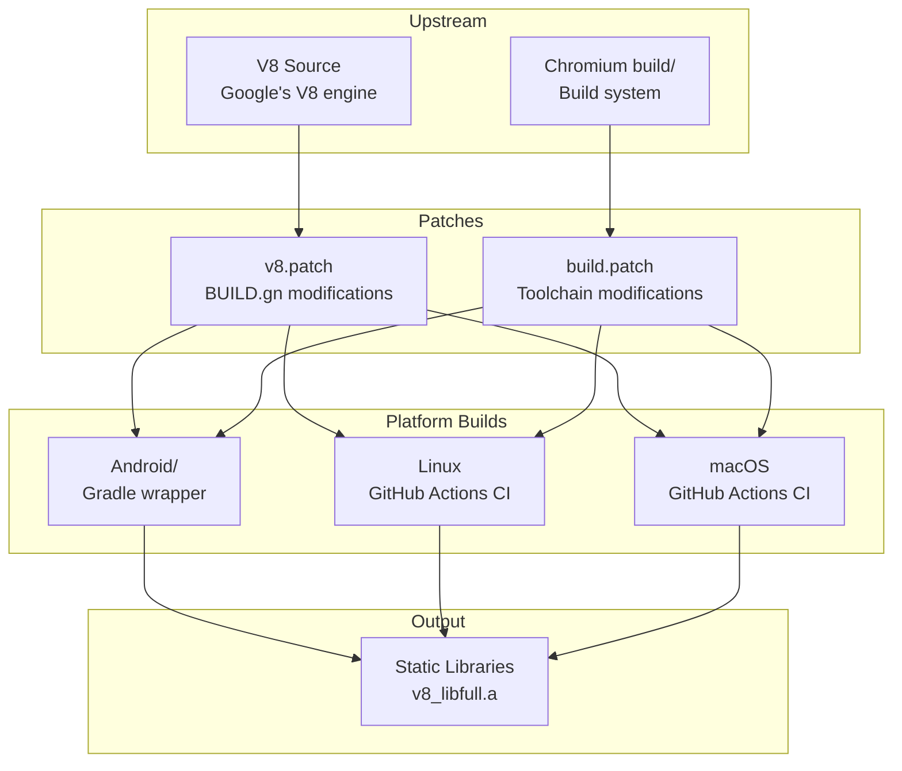

# Project Exploration: V8 Build

## Overview

V8 Build hosts the build scripts, patches, and CI workflows for producing custom V8 JavaScript engine binaries tailored for Lynx integration. While Lynx primarily uses PrimJS (a QuickJS fork) as its default JavaScript engine, V8 is supported as an alternative higher-performance runtime. This repository handles the non-trivial task of patching V8's build system to produce static libraries suitable for embedding in Lynx's native layer.

## Repository

- **Location:** `/home/darkvoid/Boxxed/@formulas/src.rust/src.lynxfamily/v8-build`
- **Remote:** https://github.com/lynx-family/v8-build
- **Primary Language:** GN build definitions, Gradle, Patch files
- **License:** Apache 2.0

## Directory Structure

```
v8-build/
  Android/
    .gitignore
    build.gradle            # Android Gradle build (AGP 7.2.0)
    gradle.properties       # Gradle configuration
    gradlew                 # Gradle wrapper (Unix)
    gradlew.bat             # Gradle wrapper (Windows)
    settings.gradle         # Gradle settings
  v8.patch                  # Patches to V8's BUILD.gn
  build.patch               # Patches to Chromium's build/ system
  README.md
  LICENSE
  NOTICE
  SECURITY.md
```

## Architecture



## Key Components

### V8 Patch (v8.patch)

The V8 patch makes three critical changes to V8's `BUILD.gn`:

1. **`v8_libbase`: `v8_component` -> `v8_source_set`**: Changes the base library from a shared component to a static source set, ensuring all symbols are compiled into the final binary rather than being in a separate shared library.

2. **`v8_libplatform`: `v8_component` -> `v8_source_set`**: Same treatment for the platform abstraction layer -- forces static linking.

3. **Output name `v8_libfull`**: Renames the final combined library to `v8_libfull`, making it clear this is a monolithic static build of V8 containing all components.

The net effect: instead of V8 producing multiple shared libraries (`.so`/`.dylib` files), this produces a single static archive that Lynx can link into its native binary.

### Build Patch (build.patch)

The build patch modifies Chromium's build system at two points:

1. **Android runtime library configuration**: When `use_custom_libcxx` is false, explicitly links against `c++_shared` or `c++_static` plus `c++abi` and `unwind`. This ensures proper C++ standard library linkage on Android without Chromium's custom libc++ build.

2. **Hash style for ARM targets**: Adds `-Wl,--hash-style=sysv` for both `arm` and `arm64` architectures. This ensures the produced binaries use the SysV hash style, which is more compatible with older Android dynamic linkers.

### Android Build Configuration

A standard Gradle project (AGP 7.2.0) that wraps the GN/Ninja build output for Android consumption. The Gradle wrapper enables the V8 static library to be packaged as an Android library (AAR) for distribution.

### CI Workflows

GitHub Actions workflows (referenced in README but stored in `.github/workflows/`) build V8 for three platforms:
- **Android:** Cross-compilation for ARM, ARM64, x86, x86_64
- **Linux:** Native x86_64 build
- **macOS:** Native ARM64 and x86_64 builds

## Build Process

The typical build flow is:

1. Check out V8 source at a specific version
2. Check out Chromium's `build/` directory
3. Apply `v8.patch` to V8's BUILD.gn
4. Apply `build.patch` to the build system
5. Run GN to generate Ninja files
6. Run Ninja to compile
7. Package the resulting `v8_libfull` static library

## Role in the Lynx Ecosystem

V8 Build provides the alternative high-performance JS engine option for Lynx. While PrimJS (the default) is lighter and more embeddable, V8 offers:
- JIT compilation (vs. PrimJS's interpreter + template interpreter)
- Higher raw JavaScript execution performance
- Better compatibility with complex JavaScript libraries
- WebAssembly support

The Lynx core engine's JSI (JavaScript Interface) abstraction layer allows switching between PrimJS and V8 at build time, and this repository provides the V8 side of that equation.

## Key Insights

- The patches are minimal and surgical -- only 3 changes to V8's BUILD.gn and 2 to the build system
- The static linking strategy (source_set instead of component) is critical for mobile embedding where shared library management is complex
- The `v8_libfull` naming convention suggests this is a complete, monolithic V8 build with no external V8 dependencies
- The SysV hash style patch for ARM targets indicates compatibility concerns with older Android versions (pre-API 23)
- This repository is primarily a CI/CD artifact -- the actual V8 source code lives upstream, with only patches and build configuration here
- The Android Gradle integration suggests V8 binaries may be distributed as Maven artifacts for Android developers
