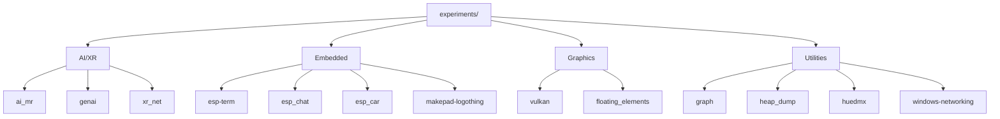

# Experiments - Experimental Projects Collection

## Overview

The experiments directory contains a collection of prototype and experimental projects exploring various domains: AI/mixed reality, embedded systems (ESP32), XR networking, Vulkan rendering, and UI experiments. These serve as proof-of-concepts and technology explorations that may feed into the main Makepad ecosystem.

## Directory Structure

```
experiments/
├── Cargo.toml                  # Workspace: genai, xr_net members
├── LICENSE
│
├── ai_mr/                      # AI + Mixed Reality experiments
├── bigfish/                    # Unknown/experimental project
├── genai/                      # Generative AI experiments
├── xr_net/                     # XR (Extended Reality) networking
├── vulkan/                     # Vulkan rendering experiments
├── graph/                      # Graph data structure experiments
├── heap_dump/                  # Heap/memory analysis tools
├── huedmx/                     # Hue DMX lighting control
├── floating_elements/          # Floating UI element experiments
├── windows-networking/         # Windows networking experiments
│
├── embedded/                   # Embedded Rust projects (ESP32)
│   ├── esp-term/               # ESP32 terminal emulator
│   ├── esp_chat/               # ESP32 chat application
│   ├── esp_car/                # ESP32 RC car controller
│   └── makepad-logothing/      # Logo display on embedded hardware
│
└── image_viewer/               # Image viewer experiments
```

## Architecture



## Key Experimental Areas

### Embedded (ESP32)
Exploration of running Makepad-connected applications on embedded hardware, particularly ESP32 microcontrollers. Projects include a terminal emulator, chat app, and RC car controller -- demonstrating that the Makepad ecosystem can extend beyond traditional desktop/mobile/web targets.

### XR Networking (`xr_net`)
Networking layer for XR (Extended Reality) applications, exploring multiplayer/shared experiences in VR/AR environments. Part of the workspace alongside `genai`.

### Generative AI (`genai`)
Experiments with generative AI integration, exploring how LLM and other generative models can be integrated into the Makepad application framework.

### Vulkan Rendering
Exploring Vulkan as an alternative rendering backend, which could complement or replace OpenGL on platforms where Vulkan provides better performance.

### HueDMX
An interesting side project controlling Philips Hue lights and DMX lighting fixtures, demonstrating Makepad's potential for IoT/hardware control interfaces.

## Key Insights

- The workspace only formally includes `genai` and `xr_net` as members; other projects are standalone
- Embedded projects show ambition to run Makepad-adjacent code on microcontrollers
- The collection reveals Makepad's exploration of XR/VR as a target platform
- Many projects are incomplete prototypes serving as proof-of-concept explorations
- The `profile.small` build profile is defined at workspace level, suggesting WASM deployment experimentation
