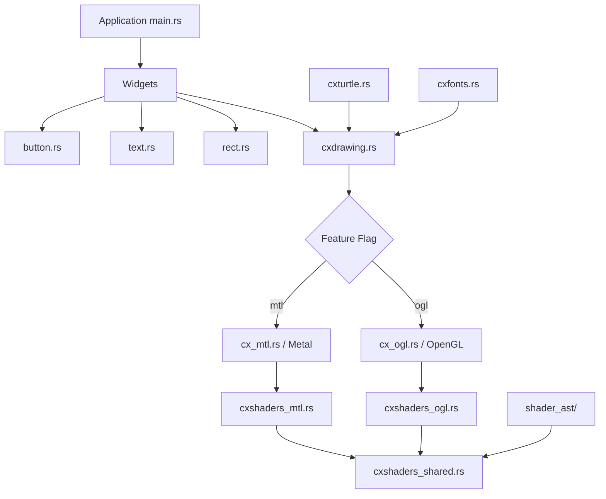

# GLUI - Legacy UI System (Makepad Predecessor)

## Overview

GLUI is the predecessor to the Makepad UI toolkit. It is an early-stage Rust UI system that renders via OpenGL or Metal, featuring a custom shader AST system and a "turtle-based" layout engine. This project represents the architectural foundations that later evolved into Makepad's more mature rendering pipeline.

GLUI is no longer actively developed but is preserved as historical reference showing the evolution of Makepad's design.

## Repository Structure

```
glui/
├── Cargo.toml                         # Package: glwindow v0.1.0
├── LICENSE
├── README.md
├── ubuntu_regular_256.font            # Embedded font data
├── shader_ast/                        # Shader AST proc-macro
│   ├── Cargo.toml
│   ├── src/
│   │   └── lib.rs                     # Shader AST derive macros
│   └── shader_ast_impl/
│       ├── Cargo.toml
│       └── src/
│           └── lib.rs                 # Implementation details
├── src/
│   ├── main.rs                        # Application entry point
│   ├── cx_ogl.rs                      # OpenGL context/rendering backend
│   ├── cx_mtl.rs                      # Metal context/rendering backend
│   ├── cxdrawing.rs                   # Drawing command abstraction
│   ├── cxshaders_ogl.rs              # OpenGL shader compilation
│   ├── cxshaders_mtl.rs              # Metal shader compilation
│   ├── cxshaders_shared.rs           # Shared shader infrastructure
│   ├── cxtextures_ogl.rs             # OpenGL texture management
│   ├── cxtextures_mtl.rs             # Metal texture management
│   ├── cxturtle.rs                    # Turtle-based layout engine
│   ├── cxfonts.rs                     # Font loading and rendering
│   ├── shader.rs                      # Shader abstractions
│   ├── button.rs                      # Button widget
│   ├── text.rs                        # Text rendering widget
│   ├── rect.rs                        # Rectangle primitives
│   └── math.rs                        # Math utilities (vectors, matrices)
```

## Architecture



### Key Design Elements

#### Turtle Layout (`cxturtle.rs`)
The layout system uses a "turtle graphics" metaphor where a cursor (the turtle) walks through the UI tree, placing elements as it goes. This was the precursor to Makepad's `Walk` layout system.

#### Dual Backend via Feature Flags
The project uses Cargo feature flags to select the rendering backend at compile time:
- `mtl` (default) - Metal rendering on macOS
- `ogl` - OpenGL rendering

#### Shader AST System (`shader_ast/`)
A proc-macro crate that allows shaders to be defined as Rust structs, then compiled to either Metal Shading Language or GLSL at compile time. This concept evolved into Makepad's more sophisticated shader pipeline.

## Dependencies

| Dependency | Version | Purpose |
|------------|---------|---------|
| glutin | 0.19 | OpenGL context creation |
| gl | 0.11 | OpenGL bindings |
| metal | 0.14 | Metal API bindings |
| cocoa | 0.18 | macOS window management |
| winit | 0.18 | Cross-platform windowing |
| rand | 0.3 | Random number generation |
| objc | 0.2.3 | Objective-C interop |

## Comparison with Makepad

| Aspect | GLUI | Makepad |
|--------|------|---------|
| Backends | OpenGL + Metal | OpenGL + Metal + DirectX + WebGL |
| Layout | Turtle cursor | Walk system |
| Shaders | Proc-macro AST | MPSL DSL + runtime compilation |
| Hot reload | No | Yes (via Stitch Wasm) |
| Platforms | macOS only | All major platforms |
| Font handling | Basic bitmap | SDF + rustybuzz shaping |
| Widget set | Button, Text, Rect | Full widget library |

## Key Insights

- Shows the evolutionary path from a basic GPU UI prototype to the full Makepad framework
- The turtle layout concept persists in Makepad as the `Walk` system
- Shader AST via proc-macros was replaced by MPSL (Makepad Shader/Style Language) for runtime flexibility
- Feature-flag based backend selection was replaced by `cfg(target_os)` in Makepad for automatic platform detection
- The dual OpenGL/Metal architecture established the pattern used by Makepad's broader platform abstraction
