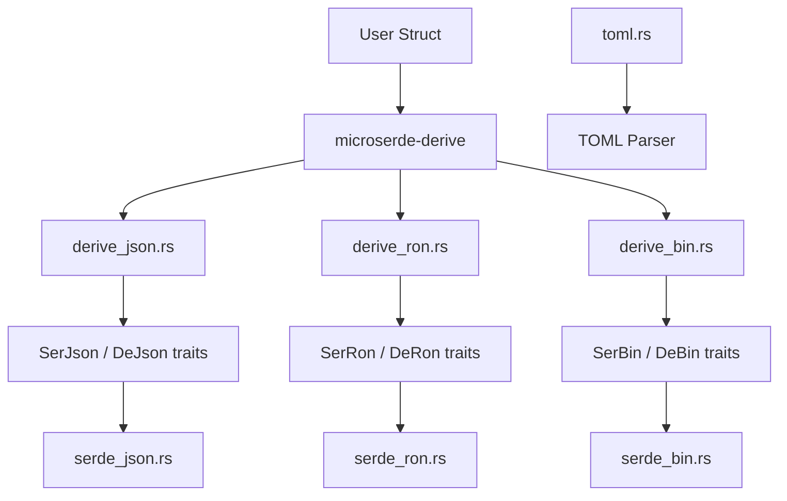

# Microserde - Minimal Serialization Library

## Overview

Microserde is a lightweight serialization/deserialization library created by Makepad as a minimal alternative to serde. It supports JSON, RON (Rusty Object Notation), binary, and TOML formats. The library includes derive macros for automatic implementation generation, keeping compile times and binary sizes small -- critical for the Makepad ecosystem's WASM targets.

## Repository Structure

```
microserde/
├── Cargo.toml                      # Package: microserde v0.1.0
├── LICENSE
├── README.md
├── src/
│   ├── lib.rs                      # Re-exports all modules + derive macros
│   ├── serde_json.rs               # JSON serialization/deserialization
│   ├── serde_ron.rs                # RON serialization/deserialization
│   ├── serde_bin.rs                # Binary serialization/deserialization
│   └── toml.rs                     # TOML serialization/deserialization
├── derive/
│   ├── Cargo.toml                  # Package: microserde-derive v0.1
│   └── src/
│       ├── lib.rs                  # Proc-macro entry points
│       ├── derive_json.rs          # JSON derive implementation
│       ├── derive_ron.rs           # RON derive implementation
│       ├── derive_bin.rs           # Binary derive implementation
│       └── macro_lib.rs            # Shared macro utilities
└── example/                        # Usage examples
```

## Architecture



### Component Breakdown

#### Core Library (`src/`)
- **serde_json.rs** - JSON parser and serializer. Hand-written recursive descent parser, no external dependencies.
- **serde_ron.rs** - RON format support. Similar structure to JSON but with Rust-native syntax.
- **serde_bin.rs** - Compact binary format. Variable-length encoding for integers, direct byte serialization.
- **toml.rs** - TOML parser. Handles tables, arrays, strings, numbers, booleans, dates.

#### Derive Macros (`derive/`)
- **derive_json.rs** - Generates `SerJson`/`DeJson` implementations for structs and enums
- **derive_ron.rs** - Generates `SerRon`/`DeRon` implementations
- **derive_bin.rs** - Generates `SerBin`/`DeBin` implementations
- **macro_lib.rs** - Shared token parsing utilities for the proc-macro implementations

## Key Design Decisions

- **No serde dependency** - Completely independent of the serde ecosystem, eliminating compile-time overhead
- **Self-contained parsers** - Each format has its own hand-written parser with no external parser dependencies
- **Proc-macro based** - Derive macros generate code at compile time, no runtime reflection
- **Minimal API surface** - Each format exposes simple `serialize`/`deserialize` trait methods

## Dependencies

| Dependency | Version | Purpose |
|------------|---------|---------|
| microserde-derive | 0.1 | Proc-macro derive support (workspace) |

Zero external runtime dependencies.

## Key Insights

- Designed for environments where serde's compile time and binary size are unacceptable (WASM targets)
- Supports four serialization formats, each with independent implementations
- The binary format is particularly useful for hot-reload data transfer in Makepad
- RON support is native to Rust ecosystem conventions, used extensively in Makepad configuration
- No schema validation or complex features -- trades completeness for simplicity and speed
