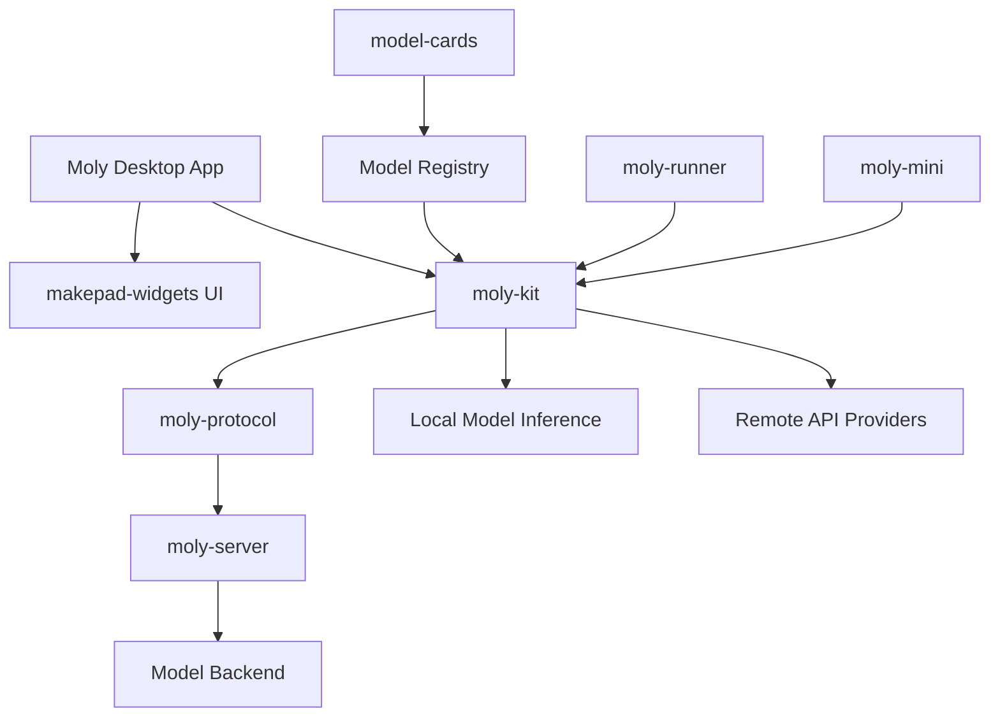
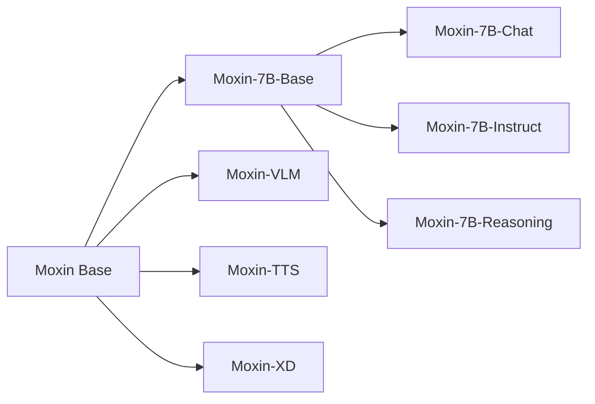

# Moxin Organization - AI/ML Ecosystem

## Overview

The Moxin Organization develops open-source AI/ML tools and models. The collection includes the Moxin family of language models (LLM, VLM, TTS, XD), Moly (a desktop AI chat application built with Makepad), model distribution infrastructure, and supporting deployment tools. This is the AI/ML arm of the broader Makepad/Robius ecosystem.

## Directory Structure

```
src.Moxin-Org/
├── Moxin-LLM/                      # Moxin 7B parameter language model family
│   ├── scripts/                     # Training and evaluation scripts
│   ├── requirements.txt             # Python dependencies
│   ├── README.md                    # Model documentation
│   └── LICENSE
│
├── Moxin-VLM/                      # Vision-Language Model
│   ├── prismatic/                   # Model architecture
│   ├── scripts/                     # Training scripts
│   ├── pyproject.toml               # Python package config
│   └── Makefile                     # Build targets
│
├── Moxin-TTS/                      # Text-to-Speech model
│   ├── README.md
│   └── LICENSE
│
├── Moxin-XD/                       # Cross-modal/image generation
│   ├── configs/                     # Model configurations
│   ├── dataset_examples/            # Example training data
│   ├── train_text_to_image.py       # Training script
│   ├── inference.py                 # Inference script
│   └── scripts/
│
├── moly/                            # Desktop AI chat application (Makepad)
│   ├── Cargo.toml                   # Workspace: moly v0.2.1
│   ├── moly-kit/                    # Core chat kit library
│   │   ├── Cargo.toml
│   │   ├── src/
│   │   └── resources/
│   ├── moly-runner/                 # CLI runner
│   │   ├── Cargo.toml
│   │   └── src/
│   ├── moly-mini/                   # Lightweight variant
│   ├── moly-sync/                   # Sync utilities
│   ├── src/                         # Main application source
│   └── book/                        # Documentation
│
├── moly-server/                     # Model serving backend
│   ├── Cargo.toml
│   ├── Dockerfile                   # Docker deployment
│   ├── moly-protocol/               # Protocol definitions
│   └── moly-server/                 # Server implementation
│
├── model-cards/                     # Model registry/catalog
│   ├── index.json                   # Model index
│   ├── embedding.json               # Embedding models
│   ├── model_cli.py                 # CLI for model management
│   ├── sync-model.py                # Model sync tool
│   └── gaianet/                     # GaiaNet integration
│
├── moxin-web/                       # Moxin website (Makepad-based)
│   ├── Cargo.toml                   # makepad-widgets dependency
│   └── src/
│       ├── app.rs                   # Main application
│       ├── birds.rs                 # Animated birds widget
│       ├── particles.rs             # Particle effects
│       └── my_widget.rs             # Custom widgets
│
├── moxin-llm-web/                   # LLM web interface (Astro/JS)
│   ├── astro.config.ts
│   ├── package.json
│   └── public/
│
├── mofa/                            # MoFA framework
│   ├── python/                      # Python implementation
│   ├── MoFA_Academy/                # Educational materials
│   ├── MoFA_stage/                  # Staging tools
│   └── Gosim_2024_Hackathon/        # Hackathon projects
│
├── mofa-docker-stack/               # Docker deployment infrastructure
│   ├── aarch64-runner/              # ARM64 runner
│   ├── binder/                      # Service binding
│   ├── docs/                        # Documentation
│   └── examples/                    # Deployment examples
│
└── Ominix-SD.cpp/                   # Stable Diffusion (C++ / ggml)
    ├── CMakeLists.txt               # CMake build
    ├── clip.hpp                     # CLIP model
    ├── control.hpp                  # ControlNet support
    ├── denoiser.hpp                 # Denoiser implementation
    └── Dockerfile
```

## Architecture

### Moly Application Architecture



### Model Family



## Key Projects

### Moly - AI Chat Desktop Application

Moly is the flagship application, built entirely with Makepad. Key features:
- Download and manage local LLM models
- Chat interface with streaming responses
- Multiple model provider support
- Rust edition 2024, requires Rust 1.85+

**Key Dependencies:**
| Dependency | Purpose |
|------------|---------|
| makepad-widgets | UI framework (custom Makepad fork) |
| moly-protocol | Client-server protocol definitions |
| moly-kit | Core chat functionality |
| reqwest | HTTP client for model downloads |
| serde/serde_json | Serialization |
| robius-open | URI opening for links |

### Moxin Models

The Moxin-7B family consists of 7-billion parameter models trained for different tasks:

| Model | Benchmark Average | Purpose |
|-------|-------------------|---------|
| Moxin-7B-Base | 70.55 | General language model |
| Moxin-7B-Chat | - | Conversational AI (DPO tuned) |
| Moxin-7B-Instruct | - | Instruction following |
| Moxin-7B-Reasoning | - | Math and logical reasoning |

### Moxin-Web

A Makepad-built website showcasing the Moxin project with animated widgets (particles, birds) demonstrating Makepad's GPU rendering capabilities.

### Ominix-SD.cpp

C++ Stable Diffusion implementation using ggml (the same tensor library behind llama.cpp). Includes CLIP, ControlNet, and various samplers.

## Key Insights

- Moly demonstrates Makepad's viability for production desktop applications with complex UI
- The model-cards system provides a decentralized model registry (similar to Hugging Face model cards)
- MoFA (Model-oriented Framework for Agents) is a framework for building AI agent systems
- The Docker stack enables cloud deployment of the model serving infrastructure
- moly-kit is designed as a reusable library, allowing different frontends (desktop, mini, CLI runner)
- The organization bridges the Makepad UI toolkit with the AI/ML ecosystem
