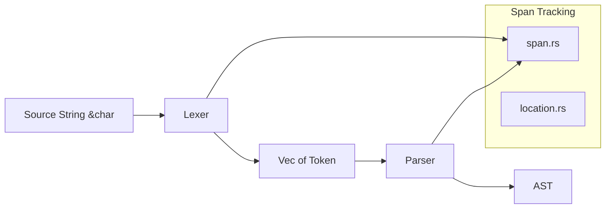
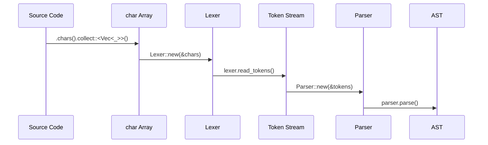

# Makepad MPSL Parser - Shader Language Parser

## Overview

The Makepad MPSL Parser (originally named `glsl-parser`) is a shader language parser written in Rust. It parses GLSL-compatible syntax as defined by the WebGL 1 specification. This parser is a key component in the Makepad rendering pipeline, translating shader source code into an Abstract Syntax Tree (AST) that can then be compiled to platform-specific shader formats (Metal, HLSL, GLSL, WebGL).

## Repository Structure

```
makepad-mpsl-parser/
├── Cargo.toml                    # Package: glsl-parser v0.1.0
├── README.md                     # Usage documentation
├── src/
│   ├── lib.rs                    # Public API
│   ├── lexer.rs                  # Tokenizer / lexical analysis
│   ├── token.rs                  # Token type definitions
│   ├── char.rs                   # Character classification utilities
│   ├── parser.rs                 # Recursive descent parser
│   ├── ast.rs                    # Abstract Syntax Tree node types
│   ├── span.rs                   # Source span tracking
│   └── location.rs              # Source location tracking
└── tests/                        # Parser test cases
```

## Architecture



### Processing Pipeline



### Component Breakdown

#### Lexer (`lexer.rs`)
- Takes source as `&[char]` for O(1) span lookup
- Produces a flat `Vec<Token>` stream
- Handles GLSL keywords, operators, literals, identifiers
- Character classification via `char.rs`

#### Token (`token.rs`)
- Token type enumeration (keywords, operators, literals, identifiers)
- Identifiers represented as spans into the source string (zero-copy)

#### Parser (`parser.rs`)
- Recursive descent parser consuming `&[Token]`
- Produces AST nodes for declarations, statements, expressions
- Handles GLSL-specific constructs: uniform, varying, attribute, precision qualifiers

#### AST (`ast.rs`)
- Tree structure representing the full shader program
- Nodes for: function declarations, variable declarations, type specifiers, expressions, statements
- Preserves source locations for error reporting

#### Span/Location (`span.rs`, `location.rs`)
- Source position tracking throughout the pipeline
- Enables meaningful error messages with line/column information

## Usage

```rust
let chars = source.chars().collect::<Vec<_>>();
let mut lexer = Lexer::new(&chars);
let tokens = lexer.read_tokens().unwrap();
let mut parser = Parser::new(&tokens);
let ast = parser.parse().unwrap();
```

## Dependencies

Zero external dependencies -- entirely self-contained.

## Key Insights

- Uses `&[char]` instead of `&str` for O(1) span indexing, a design trade-off favoring parse speed over memory
- Zero-dependency design aligns with Makepad's philosophy of minimal external dependencies
- The parser targets WebGL 1 GLSL specification, which is the common subset across all Makepad platforms
- This is the entry point for Makepad's cross-platform shader compilation pipeline
- TODO items from README: symbol table maintenance, left-hand-side checking in assignments, `invariant` keyword support
