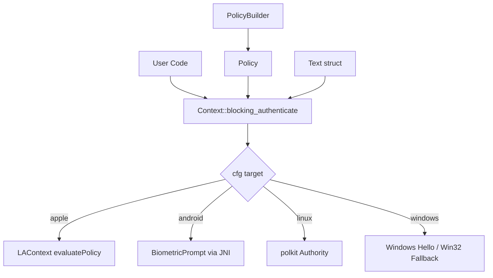
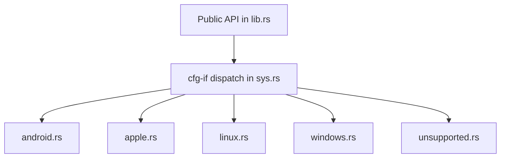

# Robius Platform Libraries

## Overview

Project Robius provides a suite of cross-platform Rust libraries that abstract native OS APIs for common application needs: authentication (biometrics/passwords), secure keychain storage, URI opening, and URL scheme handling. Each library follows the same pattern: a unified Rust API backed by platform-specific implementations for macOS, iOS, Android, Linux, and Windows.

These libraries are designed to be used by Makepad applications (like Robrix and Moly) but are framework-agnostic and can be used with any Rust application.

---

## 1. robius-authentication

**Source:** `/home/darkvoid/Boxxed/@formulas/src.rust/src.Makerpad/robius-authentication/`
**Repository:** https://github.com/project-robius/robius-authentication

### Purpose

Multi-platform native authentication abstractions: biometrics (fingerprint, face recognition), password prompts, and companion device authentication.

### Structure

```
robius-authentication/
├── Cargo.toml                          # v0.1.1
├── build.rs                            # Android Java compilation
├── README.md
├── assets/                             # Android Java source files
├── examples/
├── src/
│   ├── lib.rs                          # Public API: Context, Policy, Text
│   ├── error.rs                        # Error types
│   ├── text.rs                         # Platform-specific prompt text
│   └── sys.rs                          # Platform dispatch
│       ├── sys/
│       │   ├── android.rs              # Android BiometricPrompt (JNI)
│       │   │   └── callback.rs         # Android callback handling
│       │   ├── apple.rs                # Apple LocalAuthentication (TouchID/FaceID)
│       │   ├── linux.rs                # polkit-based authentication
│       │   ├── windows.rs              # Windows Hello + fallback
│       │   │   └── fallback.rs         # Win32 credential prompt
│       │   └── unsupported.rs          # Stub for unsupported platforms
```

### Architecture



### Key API

```rust
// Policy defines what authentication methods are acceptable
let policy = PolicyBuilder::new()
    .biometrics(Some(BiometricStrength::Strong))
    .password(true)
    .build()
    .unwrap();

// Context executes authentication
Context::new(())
    .blocking_authenticate(text, &policy)
    .expect("auth failed");
```

### Platform Dependencies

| Platform | Backend | Dependency |
|----------|---------|------------|
| Apple | LocalAuthentication | objc2, objc2-local-authentication |
| Android | BiometricPrompt | jni, robius-android-env |
| Linux | polkit | polkit, gio |
| Windows | Windows Hello | windows crate (WinRT + Win32 fallback) |

### Features

- `async` - Non-blocking async authentication APIs via tokio

---

## 2. robius-keychain

**Source:** `/home/darkvoid/Boxxed/@formulas/src.rust/src.Makerpad/robius-keychain/`
**Repository:** https://github.com/project-robius/robius-keychain

### Purpose

Secure credential storage across platforms using native keychain APIs.

### Structure

```
robius-keychain/
├── Cargo.toml                          # v0.1.0
├── README.md
├── examples/
├── src/
│   ├── lib.rs                          # Public API: KeychainItemBuilder, Identifier
│   ├── error.rs                        # Error types
│   └── sys.rs                          # Platform dispatch
│       ├── sys/
│       │   ├── android.rs              # File-based with serde_json
│       │   ├── apple.rs                # Security.framework Keychain
│       │   ├── linux.rs                # libsecret (GNOME Keyring)
│       │   ├── windows.rs              # Win32 Credential Manager
│       │   └── unsupported.rs          # Stub
```

### Key API

```rust
// Store a secret
let id = KeychainItemBuilder::new("my_app", &secret)
    .username("user")
    .store()?;

// Load it back
let secret = id.load()?.expect("not found");

// Update
id.update(UpdateOptions::new().secret("new_secret"))?;
```

### Platform Backends

| Platform | Backend |
|----------|---------|
| Apple | Security.framework (Keychain Services) |
| Android | File-based JSON storage via robius-directories |
| Linux | libsecret (GNOME Keyring / KWallet) |
| Windows | Win32 Credential Manager |

---

## 3. robius-open

**Source:** `/home/darkvoid/Boxxed/@formulas/src.rust/src.Makerpad/robius-open/`
**Repository:** https://github.com/project-robius/robius-open

### Purpose

Open URIs (URLs, tel:, mailto:, file://) using the platform's default handler.

### Structure

```
robius-open/
├── Cargo.toml                          # v0.2.0
├── README.md
├── examples/
├── src/
│   ├── lib.rs                          # Public API: Uri
│   ├── error.rs                        # Error types
│   └── sys.rs                          # Platform dispatch
│       ├── sys/
│       │   ├── android.rs              # Intent.ACTION_VIEW via JNI
│       │   ├── ios.rs                  # UIApplication openURL
│       │   ├── macos.rs                # NSWorkspace openURL
│       │   ├── linux.rs                # xdg-open subprocess
│       │   ├── windows.rs              # Windows Launcher API
│       │   └── unsupported.rs          # Stub
```

### Key API

```rust
Uri::new("http://www.google.com").open()?;

Uri::new("tel:+61 123 456 789")
    .open_with_completion(|success| {
        log!("Opened? {success}");
    })?;
```

### Platform Backends

| Platform | Mechanism |
|----------|-----------|
| macOS | NSWorkspace::openURL |
| iOS | UIApplication::openURL |
| Android | Intent.ACTION_VIEW via JNI |
| Linux | xdg-open subprocess |
| Windows | Windows.System.Launcher |

---

## 4. robius-url-handler

**Source:** `/home/darkvoid/Boxxed/@formulas/src.rust/src.Makerpad/robius-url-handler/`
**Repository:** https://github.com/project-robius/robius-url-handler

### Purpose

Register application URL scheme handlers so the app can be launched when a user opens a matching URL (deep linking).

### Structure

```
robius-url-handler/
├── Cargo.toml                          # v0.1.0
├── README.md
├── examples/
├── src/
│   ├── lib.rs                          # Public API: register_handler
│   └── sys.rs                          # Platform dispatch
│       ├── sys/
│       │   ├── macos.rs                # NSAppleEventManager
│       │   │   ├── delegate.rs         # Apple event delegate
│       │   │   └── objc2.rs            # Custom objc2 bindings
│       │   └── unsupported.rs          # Linux/Windows: CLI args parsing
```

### Key Concepts

- **macOS**: Registers an Apple Event handler for URL events via `NSAppleEventManager`. When the app is already running, the handler is called directly.
- **Linux/Windows**: URLs are passed via command-line arguments. A configurable argument parser extracts the URL.
- Compile-time registration (e.g., Info.plist for macOS, AndroidManifest for Android) must be done separately.

---

## 5. android-build

**Source:** `/home/darkvoid/Boxxed/@formulas/src.rust/src.Makerpad/android-build/`
**Repository:** https://github.com/project-robius/android-build

### Purpose

Build-time dependency for compiling Java source files as part of a Rust Cargo build script. Used by robius-authentication and other crates that need Java/Android integration.

### Structure

```
android-build/
├── Cargo.toml                          # v0.1.2
├── README.md
├── src/
│   ├── lib.rs                          # Public API: JavaBuild, JavaRun, Dexer
│   ├── java_build.rs                   # javac wrapper
│   ├── java_run.rs                     # java wrapper
│   ├── dexer.rs                        # d8 (DEX compiler) wrapper
│   └── env_paths/
│       ├── mod.rs                      # Environment path resolution
│       ├── find_android_sdk.rs         # Android SDK location
│       └── find_java.rs               # Java SDK location
```

### Key Tools

- **JavaBuild** - Wraps `javac` to compile Java sources
- **JavaRun** - Wraps `java` to run Java programs
- **Dexer** - Wraps Android's `d8` tool to convert `.class` files to `.dex` format

Automatically resolves `ANDROID_HOME`, `JAVA_HOME`, and related environment variables.

---

## Common Architectural Pattern

All Robius platform libraries follow the same pattern:



Each platform module implements the same trait or function signatures, selected at compile time via `cfg(target_os)` or `cfg(target_vendor)`.

## Key Insights

- All libraries use `cfg-if` for compile-time platform dispatch -- no runtime overhead
- Apple platforms use the modern `objc2` crate for Objective-C interop (replacing older `objc` bindings)
- Android integration requires JNI and a Java companion layer compiled via `android-build`
- Windows implementations often have multiple backends (UWP/WinRT + Win32 fallback)
- Linux support varies: polkit for auth, libsecret for keychain, xdg-open for URIs
- Each library is independently versioned and published to crates.io
- The `unsupported.rs` module provides compile-time errors or no-op stubs for unrecognized targets
