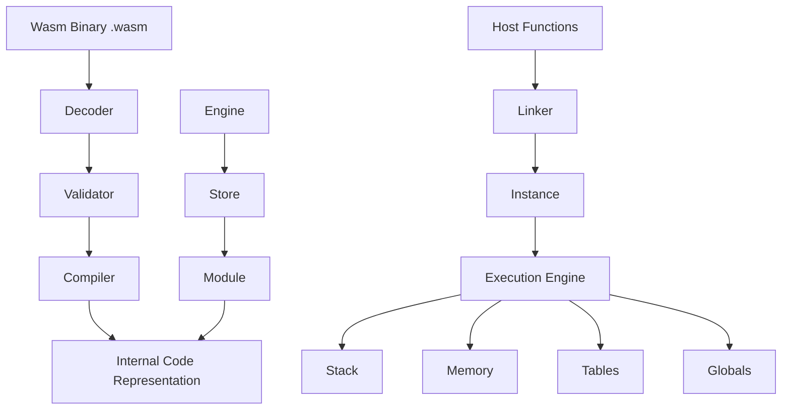
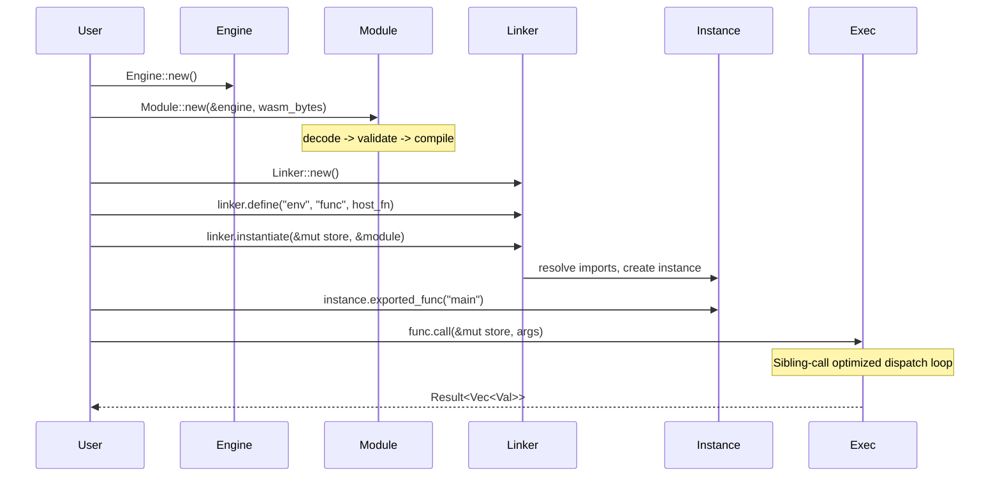

# Stitch - Fast WebAssembly Interpreter

## Overview

Stitch is an experimental WebAssembly (Wasm) interpreter written in Rust, designed to be very fast and lightweight. It achieves its speed by relying on sibling call optimization -- a restricted form of tail calls where the callee has the same signature as the caller. While Rust does not guarantee tail call optimization, LLVM automatically optimizes sibling calls on 64-bit platforms under certain constraints.

Stitch is used within the Makepad ecosystem for hot-reloading support, enabling live code changes via Wasm modules without recompiling the full application.

## Repository Structure

```
stitch/
├── Cargo.toml                    # Package: makepad-stitch
├── README.md                     # Performance benchmarks, usage notes
├── LICENSE
├── src/
│   ├── lib.rs                    # Public API: Engine, Store, Module, Linker, etc.
│   ├── engine.rs                 # Engine configuration and creation
│   ├── store.rs                  # Wasm store (holds runtime state)
│   ├── module.rs                 # Wasm module parsing and representation
│   ├── instance.rs               # Module instantiation
│   ├── linker.rs                 # Import resolution / linking
│   ├── decode.rs                 # Wasm binary format decoder
│   ├── validate.rs               # Wasm validation
│   ├── compile.rs                # Compilation from Wasm to internal representation
│   ├── exec.rs                   # Execution engine (core interpreter loop)
│   ├── ops.rs                    # Wasm opcode implementations
│   ├── code.rs                   # Internal code representation
│   ├── stack.rs                  # Operand stack
│   ├── func.rs                   # Function types and instances
│   ├── func_ref.rs               # Function references
│   ├── into_func.rs              # Host function conversion
│   ├── global.rs                 # Global variable handling
│   ├── mem.rs                    # Linear memory management
│   ├── table.rs                  # Table handling
│   ├── data.rs                   # Data segment handling
│   ├── elem.rs                   # Element segment handling
│   ├── val.rs                    # Wasm value types
│   ├── ref_.rs                   # Reference types
│   ├── extern_.rs                # External value types
│   ├── extern_ref.rs             # External references
│   ├── extern_val.rs             # External values
│   ├── error.rs                  # Error types
│   ├── trap.rs                   # Trap handling
│   ├── config.rs                 # Configuration options
│   ├── limits.rs                 # Resource limits
│   ├── const_expr.rs             # Constant expression evaluation
│   ├── aliasable_box.rs          # Aliasable box utility
│   └── downcast.rs               # Type downcasting
├── benches/
│   └── benches.rs                # Criterion benchmarks
├── coremark/                     # CoreMark benchmark suite
├── tests/                        # Wasm spec test suite
└── fuzz/                         # Fuzzing harness
```

## Architecture

### High-Level Component Diagram



### Execution Flow



## Core Concepts

### Sibling Call Optimization

The key performance trick: the interpreter dispatch loop is structured so that each opcode handler calls the next handler as a sibling call (same signature). LLVM optimizes these into jumps rather than function calls, eliminating stack frame overhead. This gives near-JIT performance for an interpreter.

### Public API

The API follows the Wasmtime-style pattern:

- **Engine** - Shared compilation configuration
- **Store** - Per-instance runtime state (memory, globals, etc.)
- **Module** - Compiled Wasm module
- **Linker** - Import resolution, instantiation
- **Instance** - Runtime module instance with exports
- **Func** - Callable Wasm or host function

### Performance (CoreMark)

| Engine   | Mac   | Linux | Windows |
|----------|-------|-------|---------|
| Stitch   | 2950  | 1684  | 4592    |
| Wasm3    | 2911  | 1734  | 3951    |
| Wasmi    | 788   | 645   | 1574    |
| Wasmtime | 12807 | 13724 | 34796   |

Stitch matches or exceeds Wasm3 (the fastest C-based Wasm interpreter) while being significantly faster than Wasmi (the other Rust-based interpreter). Only the JIT-based Wasmtime is faster.

## Dependencies

| Dependency | Version | Purpose |
|------------|---------|---------|
| criterion  | 0.5.1   | Benchmarking (dev) |
| wast       | 200.0.0 | Wasm spec test parsing (dev) |

Notably, Stitch has **zero runtime dependencies** -- it is entirely self-contained.

## Key Insights

- Zero-dependency runtime makes it ideal for embedding
- Sibling call optimization is the key performance innovation, but relies on LLVM behavior that is not formally guaranteed
- API design mirrors Wasmtime's ergonomic interface
- Used in Makepad for hot-reloading: compile changed code to Wasm, interpret it with Stitch
- Includes comprehensive test suite via Wasm spec tests and fuzzing
- 34 source files implementing a complete Wasm interpreter in pure Rust
