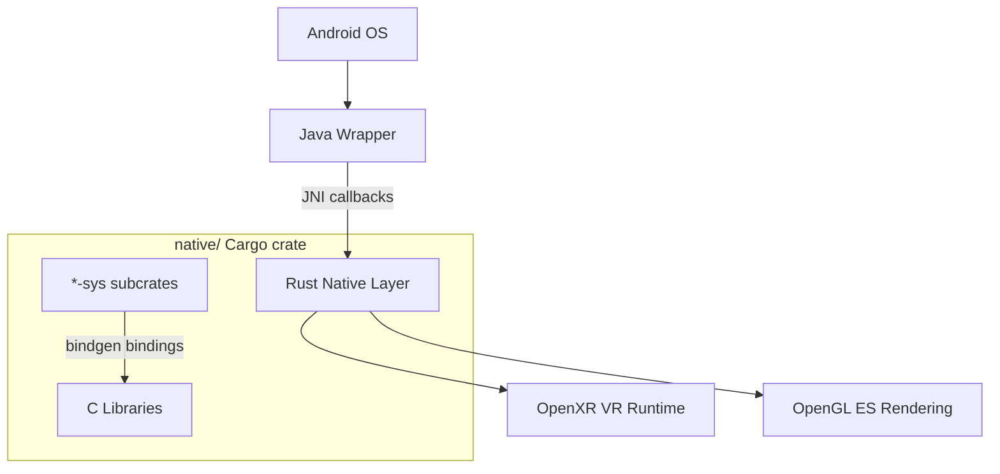

# VR/Quest Projects - hello_quest & rustquest

## Overview

Two companion projects for building minimal Oculus Quest VR applications without Android Studio or Gradle. `hello_quest` is the original C implementation, and `rustquest` is a complete Rust port. Both render a simple colored cube and demonstrate the absolute minimum required to get VR rendering working on the Quest platform.

---

## 1. hello_quest

**Source:** `/home/darkvoid/Boxxed/@formulas/src.rust/src.Makerpad/hello_quest/`

### Purpose

A minimal example project for Linux that renders a colored cube to the Oculus Quest. Based on the `VrCubeWorld_NativeActivity` sample from the Oculus Quest SDK, stripped down to the bare essentials (under 1000 lines of C).

### Structure

```
hello_quest/
├── README.md               # Detailed build instructions
├── build.sh                # Build script (replaces Android Studio)
├── install.sh              # APK installation script
├── start.sh                # Launch app on device
├── stop.sh                 # Stop app on device
└── src/
    └── main/               # C source code
```

### Key Design Decisions
- Deliberately removed: multithreading, multiviews, multisampling, clamp-to-border textures, instancing
- Uses Android SDK build tools directly via shell scripts
- No Gradle, no Android Studio dependency

---

## 2. rustquest

**Source:** `/home/darkvoid/Boxxed/@formulas/src.rust/src.Makerpad/rustquest/`

### Purpose

A complete Rust port of hello_quest. Renders a colored cube controlled by head pose tracking, entirely written in Rust with minimal Java glue code.

### Structure

```
rustquest/
├── README.md               # Build prerequisites and instructions
├── build.sh                # Build script
├── install.sh              # APK installation
├── start.sh                # Launch on device
├── stop.sh                 # Stop on device
├── debug.keystore          # Debug signing key
├── android/                # Minimal Java wrapper
│   └── ...                 # Thin callbacks forwarding to native layer
└── native/                 # Rust Cargo crate
    └── ...                 # Main crate + *-sys subcrates
```

### Architecture



### Key Details
- **Java layer**: Thin wrapper forwarding OS callbacks to native code via JNI
- **Native layer**: Cargo workspace with `-sys` subcrates for C library bindings
- **Bindings**: Generated with `bindgen`, except VR API utility functions (static inline) which were manually ported to Rust
- **Threading**: Application runs in a dedicated thread; Java callbacks are forwarded via Rust's concurrency primitives
- **Prerequisites**: OpenJDK 8, Android SDK/NDK, Oculus Quest VR API

## Key Insights

- Both projects prove that VR development can be done without heavyweight IDE tooling
- Shell script based build pipeline is viable for Android VR
- Rustquest demonstrates bindgen's limitations with static inline functions (required manual porting)
- The Java layer is intentionally minimal -- just enough to satisfy Android's activity lifecycle
- These projects laid groundwork for Makepad's eventual Quest/XR support ambitions
