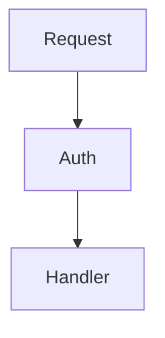
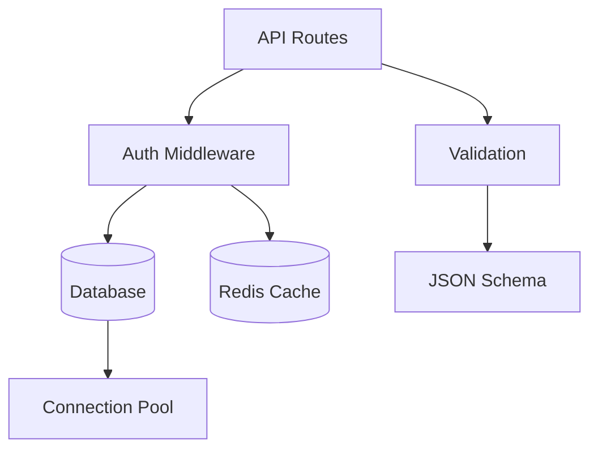
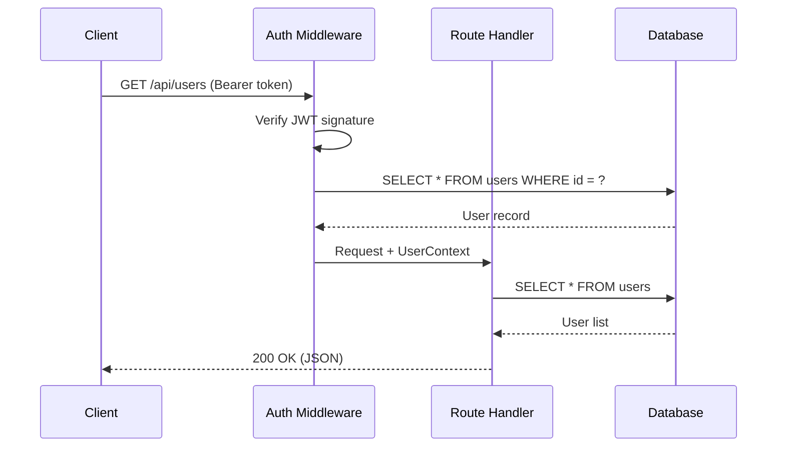
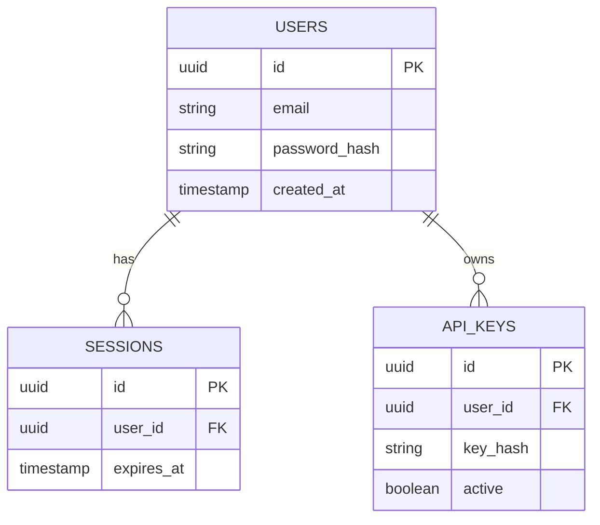
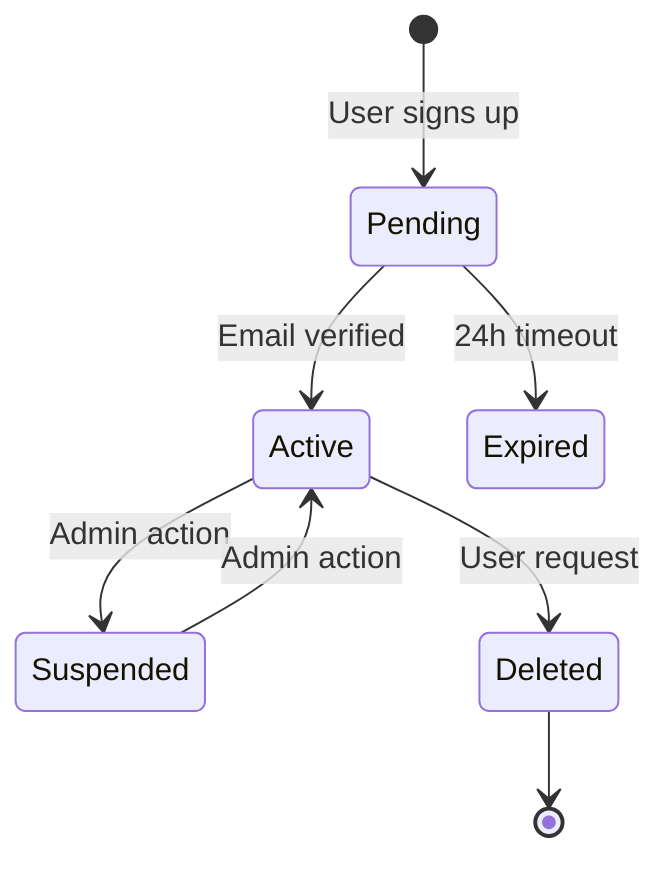

# Build Your Own -- Mermaid Diagram Integration

## What Mermaid Gives You

Mermaid turns text definitions into SVG diagrams. For documentation, the useful diagram types are:

| Diagram Type | Use Case |
|-------------|----------|
| `flowchart` | Module dependencies, data flow, request lifecycle |
| `sequenceDiagram` | API call chains, authentication flows, multi-service interactions |
| `classDiagram` | Type hierarchies, struct relationships |
| `erDiagram` | Database schema relationships |
| `stateDiagram-v2` | State machines, lifecycle stages |
| `gitgraph` | Branch strategies, release flows |

## Integration Architecture

Mermaid diagrams render client-side. The build process passes them through as raw text. The browser loads Mermaid.js and converts them to SVG.

```
Build time:   Markdown ──→ Astro ──→ HTML with <div class="mermaid">raw text</div>
                                      (Mermaid source is preserved, not processed)

Browser time: HTML loads ──→ Mermaid.js loads (CDN) ──→ .mermaid divs become <svg>
```

## Step 1: Add Mermaid Loader Script

Create a reusable component that conditionally loads Mermaid:

```astro
---
// site/src/components/MermaidLoader.astro
// Include this component in layouts that may contain Mermaid diagrams
---
<script is:inline>
(async function() {
  const blocks = document.querySelectorAll('.mermaid');
  if (blocks.length === 0) return;

  const { default: mermaid } = await import(
    'https://cdn.jsdelivr.net/npm/mermaid@11/dist/mermaid.esm.min.mjs'
  );

  function getThemeConfig() {
    const s = getComputedStyle(document.documentElement);
    const isDark = document.documentElement.getAttribute('data-theme') === 'dark';

    return {
      startOnLoad: false,
      securityLevel: 'strict',
      htmlLabels: false,
      theme: 'base',
      themeVariables: {
        // Map your CSS design tokens to Mermaid's theme variables
        primaryColor:       s.getPropertyValue(isDark ? '--bg-muted' : '--bg-strong').trim(),
        primaryTextColor:   s.getPropertyValue('--fg').trim(),
        primaryBorderColor: s.getPropertyValue('--line-strong').trim(),
        lineColor:          s.getPropertyValue('--line-strong').trim(),
        secondaryColor:     s.getPropertyValue('--bg-muted').trim(),
        tertiaryColor:      s.getPropertyValue('--bg').trim(),
        noteBkgColor:       s.getPropertyValue('--bg-muted').trim(),
        noteTextColor:      s.getPropertyValue('--fg').trim(),
        noteBorderColor:    s.getPropertyValue('--line').trim(),
        fontFamily:         "'JetBrains Mono', monospace",
        fontSize:           '14px',
      },
      flowchart: {
        curve: 'linear',
        padding: 15,
      },
      sequence: {
        actorMargin: 50,
        messageMargin: 40,
      },
    };
  }

  // Store original source for re-rendering
  blocks.forEach(block => {
    block.setAttribute('data-mermaid-source', block.textContent);
  });

  async function renderAll() {
    mermaid.initialize(getThemeConfig());
    // Reset blocks to source text before re-rendering
    blocks.forEach(block => {
      const source = block.getAttribute('data-mermaid-source');
      block.removeAttribute('data-processed');
      block.innerHTML = source;
    });
    await mermaid.run({ nodes: blocks });
  }

  await renderAll();

  // Re-render on theme change
  new MutationObserver(() => renderAll()).observe(
    document.documentElement,
    { attributes: true, attributeFilter: ['data-theme'] }
  );
})();
</script>
```

## Step 2: Include in Layout

```astro
---
// site/src/layouts/Base.astro
import MermaidLoader from '../components/MermaidLoader.astro';
---
<!DOCTYPE html>
<html lang="en" data-theme="light">
<head><!-- ... --></head>
<body>
  <!-- ... header, main, footer ... -->
  <MermaidLoader />
</body>
</html>
```

## Step 3: Handle Mermaid in Markdown

When Astro processes a fenced code block with language `mermaid`, it passes through Shiki and gets syntax-highlighted as text. That's not what we want -- we want it rendered as a diagram.

**Solution: Use a remark plugin to convert mermaid code blocks into div elements.**

```typescript
// site/src/plugins/remark-mermaid.ts
import type { Plugin } from 'unified';
import { visit } from 'unist-util-visit';

const remarkMermaid: Plugin = () => {
  return (tree) => {
    visit(tree, 'code', (node, index, parent) => {
      if (node.lang !== 'mermaid' || index === undefined || !parent) return;

      // Replace the code block with an HTML node containing raw mermaid source
      parent.children[index] = {
        type: 'html',
        value: `<div class="mermaid">\n${node.value}\n</div>`,
      } as any;
    });
  };
};

export default remarkMermaid;
```

**Install the dependency:**

```bash
cd site && npm install unist-util-visit
```

**Register the plugin:**

```javascript
// site/astro.config.mjs
import remarkMermaid from './src/plugins/remark-mermaid.ts';

export default defineConfig({
  markdown: {
    remarkPlugins: [remarkMermaid],
    shikiConfig: {
      themes: { light: 'github-light', dark: 'github-dark' },
    },
  },
});
```

Now when the LLM generates:

````markdown

````

Astro outputs:

```html
<div class="mermaid">
flowchart TD
    A[Request] --> B[Auth]
    B --> C[Handler]
</div>
```

And the MermaidLoader script converts it to an SVG at runtime.

## Step 4: Style Mermaid Containers

```css
/* site/src/styles/global.css -- add to your existing file */

.mermaid {
  margin: 1.5rem 0;
  text-align: center;
  min-height: 100px;
}

.mermaid svg {
  max-width: 100%;
  height: auto;
}

/* Loading placeholder before Mermaid.js processes the block */
.mermaid:not([data-processed]) {
  background: var(--bg-muted);
  border: 1px dashed var(--line);
  border-radius: 0.5rem;
  padding: 2rem;
  font-family: 'JetBrains Mono', monospace;
  font-size: 0.75rem;
  color: var(--fg-soft);
  white-space: pre;
  overflow-x: auto;
}
```

## Diagram Types for Documentation

### Flowcharts: Module Dependencies

The most common diagram. Shows how modules connect.

````markdown

````

### Sequence Diagrams: Request Lifecycle

Shows the order of operations for a specific flow.

````markdown

````

### Entity Relationship: Database Schema

Shows table relationships.

````markdown

````

### State Diagrams: Lifecycle

Shows state transitions for entities.

````markdown

````

## LLM Prompt for Generating Diagrams

When asking the LLM to generate Mermaid diagrams, include these instructions in your prompt:

```markdown
## Diagram Generation Rules

Generate Mermaid diagrams using these constraints:

1. Use `flowchart TD` (top-down) for dependency/data flow diagrams
2. Use `sequenceDiagram` for request lifecycle and multi-component interactions
3. Use `erDiagram` for database schema
4. Use `stateDiagram-v2` for lifecycle/state machine diagrams
5. Keep diagrams under 15 nodes -- split complex systems into multiple diagrams
6. Use short, clear labels (2-3 words max per node)
7. Use solid arrows (-->) for direct dependencies
8. Use dotted arrows (-.->)  for optional or async dependencies
9. Use database cylinder notation [(Database)] for data stores
10. Do NOT use HTML in node labels (htmlLabels is false)
11. Do NOT use special characters that need escaping in labels
12. Wrap labels with spaces in square brackets: A[Auth Middleware]
```

## Troubleshooting

### Diagram Not Rendering

1. Check browser console for Mermaid errors -- usually a syntax issue in the diagram source
2. Verify the remark plugin is registered -- inspect the HTML output, the mermaid block should be a `<div class="mermaid">`, not a `<pre class="astro-code">`
3. Check that MermaidLoader is included in the layout

### Theme Colors Wrong

The Mermaid theme reads CSS custom properties at render time. If colors look wrong:
1. Verify your CSS custom properties are defined on `:root` or `[data-theme]`
2. Check that `getComputedStyle` returns non-empty values for your token names
3. The `theme: 'base'` setting is required -- other themes override your custom variables

### Diagram Too Wide

Mermaid SVGs can exceed container width. The CSS `max-width: 100%` on `.mermaid svg` handles this, but very complex diagrams may need to be split into multiple smaller ones.
