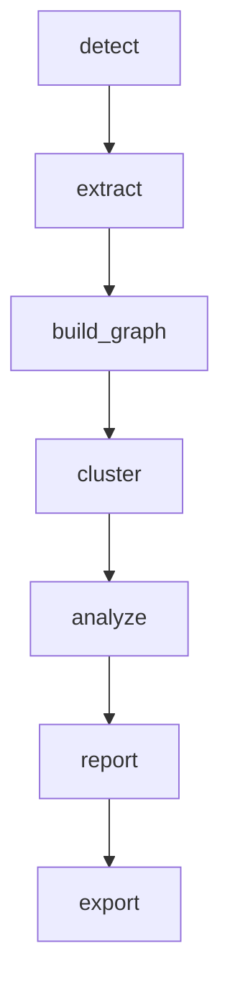

# Documentation Directive

A comprehensive guide for creating high-quality technical documentation from source code. This directive codifies the approach, lessons, and quality standards developed through the Pi, Hermes, and Mastra documentation projects, including the grandfather review process.

## Core Principle: Code Is the Grandfather

Everything downstream — documentation, specs, diagrams — is a descendant of the code. The code is the "grandfather," the root of truth. Every claim in documentation must trace back to an implementation.

This principle has one enforcement mechanism: the **grandfather review**.

## The Grandfather Review

A grandfather review walks back to the source and checks four things:

### 1. Do the Names Match?

Types, structs, functions, config fields, CLI flags — every name in the documentation must match the actual implementation. If the code calls it `build_from_json()`, the docs must not call it `build_graph()`. If the struct has a field called `confidence_score`, the docs must not call it `confidence`.

**How to check:** Grep the codebase for every name mentioned in the docs. Every miss is a bug.

### 2. Do the Numbers Match?

Defaults, counts, timeouts, thresholds, operation totals — every number must match the implementation. If the code sets `_MAX_COMMUNITY_FRACTION = 0.25`, the docs must say "25%," not "30%." If there are 21 supported languages, the docs must not say "20+."

**How to check:** Search for constants, defaults, and configuration values in the source. Compare against every number in the docs.

### 3. Do the Flows Match?

State transitions, pipeline stages, request/response shapes, function call chains — every flow diagram must match the actual execution path. If the pipeline is `detect → extract → build → cluster → analyze → report → export`, the docs must not show `detect → build → extract`.

**How to check:** Trace the actual call graph from the entry point. Walk each `import`, each function call, each return value. Compare against every mermaid diagram and prose flow description.

### 4. Is Anything Missing?

Features the code has that the docs don't mention. Modules that exist but aren't documented. CLI commands that work but aren't listed. Error handling paths, optional parameters, configuration knobs.

**How to check:** List every public function, every CLI command, every struct field. Check that each appears somewhere in the documentation.

### What Grandfather Review Is Not

It is not a peer review (another person reads the docs and says "this makes sense"). It is not a structural review (checking diagrams render, links work). Those catch different bugs. Grandfather review catches the kind where a developer reads the docs, tries to use the API, and gets a 400 because the function actually takes an `actions` array, not a flat field.

## Documentation Quality Standards (Iron Rules)

These standards are non-negotiable. Every document must meet all ten.

### 1. Detailed Sections with Code Snippets

Every concept must be grounded in actual source code. Include real function signatures, class structures, and key logic snippets. No vague hand-waving.

```python
# graphify/cluster.py:59
def cluster(G: nx.Graph) -> dict[int, list[str]]:
    """Run Leiden community detection. Returns {community_id: [node_ids]}."""
```

The snippet must be accurate — the function signature, the return type, and the docstring must match the source. If they don't, the grandfather review will catch it.

### 2. Teach Key Facts, Principles, and Ideas Quickly

Each section should deliver insight density. A reader should learn the core concept within the first paragraph, then get progressively deeper detail. The first sentence of each section should be its thesis.

**Good:** "Graphify detects communities using Leiden algorithm with Louvain fallback. Communities larger than 25% of the graph are split recursively."

**Bad:** "In this section, we will discuss the community detection features of Graphify and how they work."

### 3. Clear Articulation

Non-overly-complex sentences. Clearly articulated ideas and processes. Every section should flow logically from one idea to the next. Use mermaid diagrams to show process flows. Use tables for structured comparisons.

Each sentence should carry one idea. If a sentence has three commas and two semicolons, split it.

### 4. Mermaid Diagrams

Use mermaid flowcharts, sequence diagrams, and class diagrams to illustrate architecture, data flow, and lifecycle. **Minimum 2 diagrams per document.** Diagrams should stand alone as learning aids — a reader who only looks at the diagrams should still understand the system structure.



Diagrams must pass the grandfather review: every box, arrow, and label must match the actual implementation.

### 5. Good Visual Assets

Tables for comparisons, ASCII art for quick structure overviews, mermaid for complex flows. Every visual should add information that prose cannot convey as efficiently.

| Asset Type | Use When |
|-----------|----------|
| Mermaid flowchart | Showing pipeline stages or state machines |
| Mermaid sequence | Showing request/response or multi-party interactions |
| Table | Comparing options, listing modules, showing schemas |
| ASCII art | Quick directory trees, simple layered architectures |
| Code blocks | Function signatures, configuration examples, output samples |

### 6. Generated HTML

All markdown must build to HTML with the shared `build.py`. Well-aligned headers, text, and menu structure. Modeled after the [markdown.engineering/learn-claude-code](https://www.markdown.engineering/learn-claude-code) style:

- **Organized units:** Each page covers one coherent topic
- **Insightful headers:** Headers that tell you what you'll learn, not just "Overview"
- **Clear navigation:** Prev/next links, breadcrumbs, index page
- **Well-aligned sections:** Consistent heading hierarchy (H1 = page title, H2 = sections, H3 = subsections)
- **Menu structure:** Index page groups documents by category (Foundation, Deep Dives, Cross-Cutting)

### 7. Cross-References

Every document should link to related documents. No orphan pages. If a concept is explained in detail in another document, link to it. Use relative markdown links that auto-convert to HTML links during build.

### 8. Source Path References

Include actual file paths from the source codebase so readers can verify claims. Every section that describes implementation details should reference the source file and line number where the implementation lives.

```
Source: `graphify/extract.py:66` — LanguageConfig dataclass
```

### 9. Aha Moments

Every document must surface the **"Aha!" moments** — the clever design decisions, non-obvious tradeoffs, and "wait, that's smart" insights that make the code worth reading. These are what transform documentation from a reference manual into genuine understanding.

An Aha moment answers: *Why did the author build it this way instead of the obvious way?*

**Good examples:**
- "Member calls are intentionally NOT resolved cross-file. `obj.log()` is excluded because common method names appear everywhere — only bare function names are resolved."
- "The AST walk doesn't try to resolve external imports during parsing. Unresolved callees go into a `raw_calls` list and are resolved all at once in pass 2, keeping the walker language-agnostic."
- "Normalized IDs let AST and LLM extractions merge: the AST produces `auth_digest_auth` while the LLM might produce `Auth-Digest-Auth`. Without normalization, every LLM edge would be dropped as dangling."

**Bad examples:**
- "The function processes the input and returns the output." (not an insight)
- "This is how the code works." (describes mechanics, not motivation)

Aha moments should appear as short callout paragraphs, typically prefixed with **"Aha:"** or **"Key insight:"**. Each document should have at least one.

### 10. Navigation: Index + Prev/Next Buttons

Every generated HTML page must have a consistent navigation bar with these elements:

- **Brand** (left): `~/{project}/docs`
- **Breadcrumbs** (right): last 3 pages before current, muted
- **Index button** (right): pill-styled button linking back to `index.html`
- **← prev button** (right): pill-styled button linking to the previous page (hidden on first page)
- **next → button** (right): accent-colored pill button linking to the next page (hidden on last page)
- **Theme button** (right): pill-styled toggle for dark/light

All buttons use the `.nav-btn` class. The next button uses `.nav-btn-next` with an accent border to draw attention. The build script (`build.py`) handles this automatically via the `HTML_TEMPLATE`.

### Phase 4: Generate HTML

Run `python3 build.py <project>` to generate HTML. Verify:

- All pages render correctly
- Mermaid diagrams display
- Dark/light theme works
- Navigation bar shows index button, prev/next buttons with correct targets
- Index page lists all documents

## Documentation Structure

Every documentation project follows this structure:

```
project/
├── spec.md                     ← Project tracker: source location, task status, quality rules
├── markdown/                   ← Source documentation
│   ├── README.md               ← Index / table of contents
│   ├── 00-overview.md          ← What the project is, philosophy, architecture at a glance
│   ├── 01-architecture.md      ← Module/package dependency graph, layers, communication
│   ├── 02-XX.md                ← Core module deep dives (one per major module)
│   ├── ...
│   ├── NN-data-flow.md         ← End-to-end flows with sequence diagrams
│   └── NN-cross-cutting.md     ← Cross-cutting concerns
├── html/                       ← Generated HTML
│   ├── index.html              ← Auto-generated index + navigation
│   ├── styles.css              ← Shared CSS (dark/light, responsive)
│   └── *.html                  ← Generated from markdown
└── build.py                    ← Shared Markdown → HTML script
```

### Document Ordering Convention

| Range | Category | Purpose |
|-------|----------|---------|
| 00 | Overview | What it is, why it exists, quick architecture |
| 01 | Architecture | Full dependency graph, layer diagram, module map |
| 02-08 | Module Deep Dives | One per major module/package, ordered by dependency |
| 09-11 | Cross-Cutting | Tool systems, data flow, patterns that span modules |
| 12+ | Deep Dives | Specialized topics, comparisons, advanced internals |

## The Spec File

Every project has a `spec.md` that serves as the project tracker. It must contain:

1. **Source codebase location** — exact path, language, version, author, license
2. **What the project is** — one paragraph, precise, no marketing language
3. **Documentation goal** — numbered list of what a reader should understand
4. **Documentation structure** — directory tree showing every planned file
5. **Tasks** — phased table with status (TODO / DONE) for every document
6. **Build system** — how to generate HTML, dependencies, usage
7. **Quality requirements** — the Iron Rules (all eight, verbatim)
8. **Expected outcome** — what a reader can do after reading the docs
9. **Resume point** — how to continue work if interrupted

## Process: Creating Documentation for a New Project

### Phase 1: Read the Code

1. Read `Cargo.toml` / `package.json` / `pyproject.toml` for project metadata
2. Read the entry point (`main.rs`, `__main__.py`, `index.ts`)
3. Read `lib.rs` / `__init__.py` for the public API surface
4. Read every source file to understand types, functions, flows
5. Read existing README, ARCHITECTURE, CHANGELOG if they exist
6. Read test files for expected behavior and edge cases

### Phase 2: Create the Spec

Write `spec.md` with all sections listed above. This is the contract for the documentation — every document listed in the spec must be written, and every quality requirement must be met.

### Phase 3: Write the Markdown

Write documents in order (00 → 01 → 02 → ...). Each document must:

- Start with a one-line summary of what the module/topic does
- Include at least 2 mermaid diagrams
- Include code snippets from the actual source (with file path references)
- Include at least one Aha moment — a non-obvious design decision or clever insight
- Link to related documents
- End with a section pointing to the next logical document

### Phase 4: Generate HTML

Run `python3 build.py <project>` to generate HTML. Verify:

- All pages render correctly
- Mermaid diagrams display
- Dark/light theme works
- Navigation (prev/next) works
- Index page lists all documents

### Phase 5: Grandfather Review

Run a grandfather review against every document. Check all four dimensions:

1. **Names** — grep every name in the docs against the source
2. **Numbers** — verify every constant, default, count
3. **Flows** — trace every pipeline, state machine, call chain
4. **Coverage** — list every public API surface and verify it's documented

Fix every discrepancy. There is no "close enough."

## Lessons from Previous Projects

### From Pi Documentation

1. **Extension documentation explodes in volume.** Pi has 30+ extensions, each documented in its own file. Plan for this from the start.
2. **Package deep dives are the most valuable documents.** Overview and architecture are table stakes — the deep dives are where developers actually learn.
3. **Mermaid sequence diagrams are worth more than flowcharts for understanding multi-party interactions.** Use them for any flow involving more than two components.
4. **Cross-reference links prevent orphan pages.** Every document should link to at least 2 other documents.

### From Hermes Documentation

1. **Gateway/adapter documentation requires per-platform detail.** Generic "it supports 10+ platforms" is useless — document each adapter's authentication, message format, and limitations.
2. **Self-improvement loops need flow diagrams.** GEPA-based evolution, RL training traces — these are hard to understand from prose alone.
3. **Cost tracking matters.** If the system uses LLM tokens, document the pricing, usage tracking, and cost estimation approach.

### From Mastra Documentation

1. **Comparison documents add enormous value.** Mastra vs Pi vs Hermes comparison was one of the most insightful documents.
2. **Ecosystem documentation (plugins, integrations, examples) takes as long as core documentation.** Budget time accordingly.
3. **Tool suspension/approval flows need state machine diagrams.** These are complex enough that prose alone is insufficient.

### From the Grandfather Review Process

1. **LLM-generated documentation sounds plausible but is often factually wrong.** The LLM will confidently describe a function that takes two arguments when it actually takes three. Only the grandfather review catches this.
2. **Numbers are the most common error.** Defaults, counts, thresholds — these change frequently in code and the docs silently become wrong.
3. **Missing features are harder to catch than wrong descriptions.** You can grep for wrong names, but you can't grep for features the docs don't mention. Walk the full public API surface explicitly.
4. **The review must be done against the current source, not the README or ARCHITECTURE.md.** Those files are also descendants of the code and may themselves be stale.

### From Graphify Documentation

1. **Aha moments are the highest-signal content.** Readers care less about "what function X does" and more about "why the author deferred cross-file resolution instead of doing it inline." These insights are what make documentation worth reading vs. just reading the code.
2. **Tree-sitter's `LanguageConfig` pattern deserves its own deep dive.** The fact that 21 languages share one AST walker via a config dataclass is a genuine architectural insight — it explains how the project scales to new languages without proportional code growth.
3. **Relationships form at three scales (intra-file, cross-file, semantic), each with different confidence.** This is the core mental model for understanding any graphify output. Documents that explain it clearly prevent hours of confusion.
4. **Network diagrams showing actual node/edge examples are worth more than abstract architecture diagrams.** A diagram showing `DigestAuth --uses--> Response` teaches more than a box labeled "Cross-file Resolver."

## Build System

All documentation projects share a single build script:

```bash
cd documentation && python3 build.py          # build all projects
python3 build.py graphify                      # build one project
```

**Script:** `documentation/build.py`
**Dependencies:** None (Python 3.12+ stdlib only)
**Features:**
- Converts markdown to HTML with tables, code blocks, headings, lists, links, blockquotes
- Extracts titles from frontmatter or first `#` heading
- Generates index pages with all document links
- Embeds Mermaid client-side loader (CDN, conditional)
- Embeds dark/light theme toggle with `localStorage` persistence
- Generates prev/next navigation between pages
- Copies shared `styles.css` on first run
- Idempotent (safe to re-run)

## Checklist: Before Marking a Document Complete

- [ ] Every function name matches the source code
- [ ] Every default value matches the source code
- [ ] Every pipeline/flow matches the actual execution order
- [ ] Every public API surface is mentioned somewhere
- [ ] At least 2 mermaid diagrams per document
- [ ] At least 3 code snippets per document (with file path references)
- [ ] At least 1 Aha moment — a non-obvious design decision or clever insight
- [ ] Links to at least 2 related documents
- [ ] First paragraph states the core concept clearly
- [ ] No sentences with more than 30 words
- [ ] HTML builds and renders correctly
- [ ] Index page lists the document
- [ ] Nav bar: index button, ← prev, next →, theme toggle all present and correct
- [ ] Spec.md task is marked DONE
