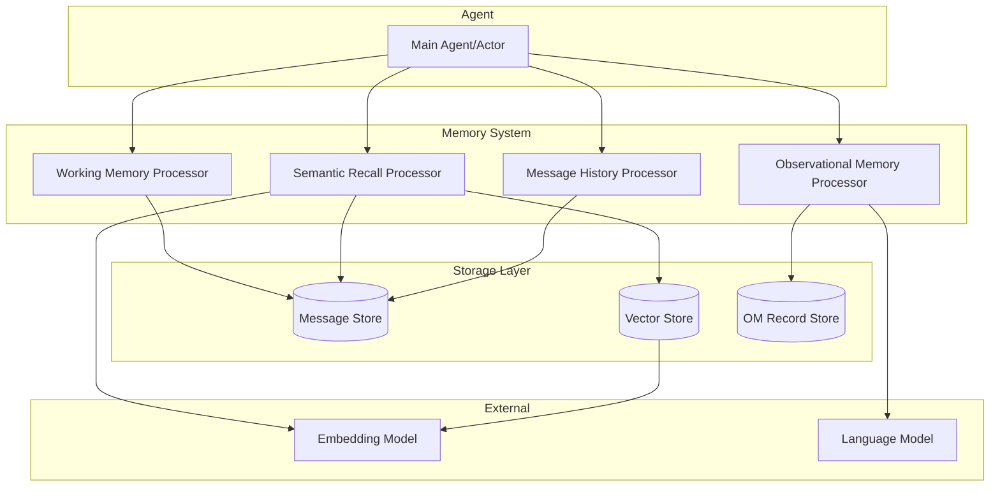
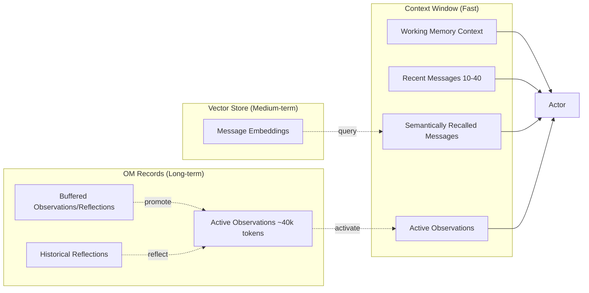
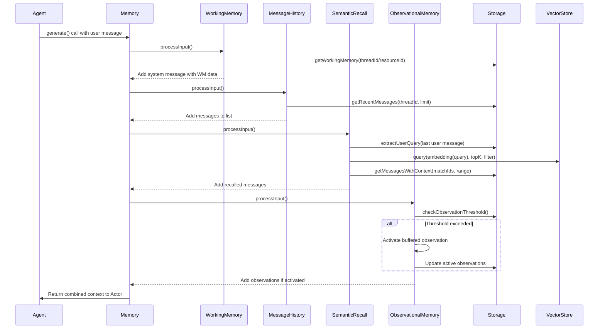
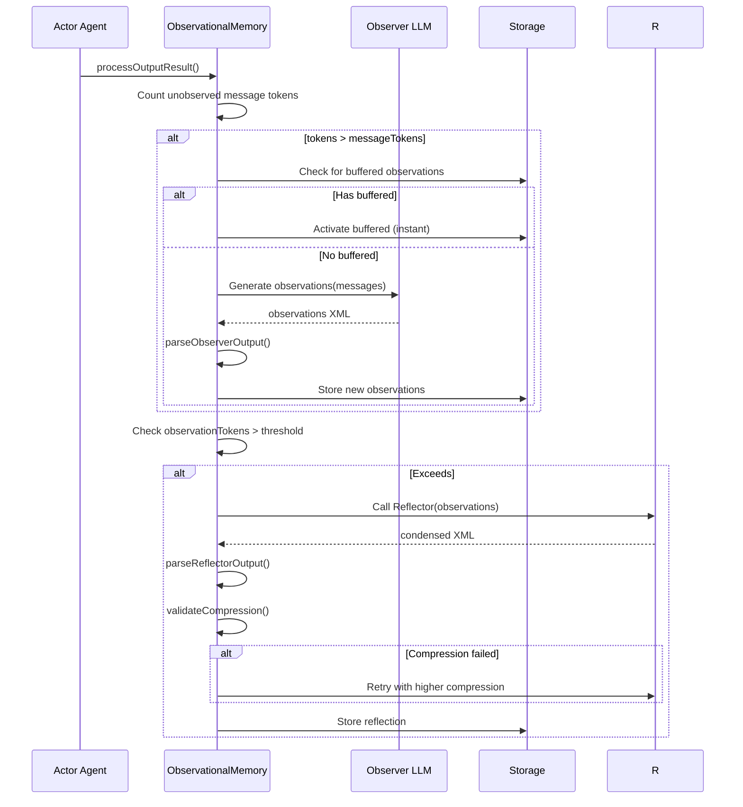

# Mastra Memory System Exploration

## Overview

Mastra is an AI agent framework that includes a sophisticated memory system designed to enable agents to maintain context across long conversations. This exploration focuses specifically on the memory subsystem, which implements three distinct but complementary memory mechanisms:

1. **Working Memory** - Structured, persistent storage for user facts, preferences, and conversation-relevant data
2. **Semantic Recall** - RAG-based retrieval of relevant past messages using vector embeddings
3. **Observational Memory** - A three-agent system (Actor, Observer, Reflector) that automatically compresses conversation history into dense observations

The memory system is designed around a processor architecture where each memory type can be composed as input/output processors that transform messages before they reach the LLM and after responses are generated.

## Repository

- **Location:** `/home/darkvoid/Boxxed/@formulas/src.rust/src.llamacpp/src.AICoders/src.Mastra/mastra`
- **Remote:** https://github.com/mastra-ai/mastra
- **Primary Language:** TypeScript
- **License:** Apache 2.0 (inferred from standard Mastra licensing)

## Directory Structure

```
packages/
├── core/
│   ├── src/
│   │   ├── memory/
│   │   │   ├── memory.ts              # Abstract base class MastraMemory
│   │   │   ├── types.ts               # Type definitions for MemoryConfig, WorkingMemory, etc.
│   │   │   ├── processor-caching.test.ts
│   │   │   ├── working-memory-utils.ts
│   │   │   └── index.ts
│   │   └── processors/
│   │       └── memory/
│   │           ├── working-memory.ts  # WorkingMemory processor
│   │           ├── semantic-recall.ts # SemanticRecall processor
│   │           ├── message-history.ts # MessageHistory processor
│   │           └── embedding-cache.ts # Global LRU cache for embeddings
├── memory/
│   ├── src/
│   │   ├── index.ts                   # Main Memory class export
│   │   ├── processors/
│   │   │   └── observational-memory/
│   │   │       ├── observational-memory.ts  # Main OM processor
│   │   │       ├── observer-agent.ts        # Observer agent prompts/parsing
│   │   │       ├── reflector-agent.ts       # Reflector agent prompts/parsing
│   │   │       ├── token-counter.ts         # Token estimation utilities
│   │   │       └── types.ts                 # OM-specific types
│   │   └── tools/
│   │       └── working-memory.ts      # updateWorkingMemory tool implementation
```

## Architecture

### High-Level Diagram



### Three-Layer Memory Architecture



## Component Breakdown

### Memory Config (`packages/core/src/memory/types.ts`)

**Purpose:** Central configuration interface for all memory behaviors

**Key Types:**
- `MemoryConfig` - Main configuration with options for:
  - `lastMessages` - Number of recent messages to include (default: 10)
  - `semanticRecall` - RAG retrieval configuration
  - `workingMemory` - Structured data storage config
  - `observationalMemory` - Three-agent compression system
  - `generateTitle` - Auto thread title generation

- `WorkingMemory` - Three variants:
  - `TemplateWorkingMemory` - Markdown template-based
  - `SchemaWorkingMemory` - Zod/JSON schema-based with merge semantics
  - `WorkingMemoryNone` - Disabled

- `SemanticRecall` - Vector search config:
  - `topK` - Number of similar messages to retrieve
  - `messageRange` - Context messages before/after each match
  - `scope` - 'thread' or 'resource' level search
  - `threshold` - Minimum similarity score (0-1)
  - `indexConfig` - Vector index optimization (HNSW, IVFFlat)

- `ObservationalMemoryOptions` - Three-agent system:
  - `observation` - Observer agent config (trigger at ~30k tokens)
  - `reflection` - Reflector agent config (trigger at ~40k tokens)
  - `scope` - 'thread' or 'resource' level observations
  - `shareTokenBudget` - Allow messages/observations to share budget

### Working Memory Processor (`packages/core/src/processors/memory/working-memory.ts`)

**Purpose:** Inject structured working memory as system message, provide update tool

**Key Implementation Details:**

```typescript
// Scope determination
const scope = this.options.scope || 'resource';

// Thread-scoped: stored on thread.metadata.workingMemory
if (scope === 'thread' && threadId) {
  const thread = await storage.getThreadById({ threadId });
  workingMemoryData = thread?.metadata?.workingMemory;
}

// Resource-scoped: stored on resource.workingMemory
if (scope === 'resource' && resourceId) {
  const resource = await storage.getResourceById({ resourceId });
  workingMemoryData = resource?.workingMemory;
}
```

**Tool Instructions Generated:**
- For template-based: "Update memory with Markdown, replace entirely"
- For schema-based: "Update memory with JSON, merge semantics apply"
- For read-only: "Memory is context-only, cannot update"

**Deep Merge Logic** (`packages/memory/src/tools/working-memory.ts`):
```typescript
function deepMergeWorkingMemory(existing, update) {
  // null = delete property
  // arrays = replace entirely (not merge)
  // objects = recursive merge
  // primitives = overwrite
}
```

### Semantic Recall Processor (`packages/core/src/processors/memory/semantic-recall.ts`)

**Purpose:** Retrieve relevant past messages using vector similarity search

**Algorithm:**

1. **Extract Query:** Find last user message text from input
2. **Generate Embedding:** Call embedder with query text
   - Uses global `LRUCache` for caching (key: `${indexName}:${contentHash}`)
   - Hash computed via xxhash-wasm for speed
3. **Vector Query:** Search vector store with filter:
   ```typescript
   filter: scope === 'resource'
     ? { resource_id: resourceId }
     : { thread_id: threadId }
   ```
4. **Retrieve Context:** For each match, fetch surrounding messages:
   ```typescript
   include: results.map(r => ({
     id: r.metadata?.message_id,
     withPreviousMessages: messageRange.before,
     withNextMessages: messageRange.after,
   }))
   ```
5. **Format Cross-Thread:** If resource scope and messages from other threads:
   - Format with timestamps and thread attribution
   - Wrap in `<remembered_from_other_conversation>` tags

**Output Processing:**
- Creates embeddings for new messages being saved
- Handles multi-part messages (tool calls, text, etc.)
- Skips system messages (only user/assistant content embedded)

**Index Naming:**
```typescript
function getDefaultIndexName(): string {
  const model = this.embedder.modelId || 'default';
  const sanitized = model.replace(/[^a-zA-Z0-9_]/g, '_');
  return `mastra_memory_${sanitized}`.slice(0, 63);
}
```

### Observational Memory Processor (`packages/memory/src/processors/observational-memory/`)

**Purpose:** Automatic conversation compression using Observer and Reflector agents

**Three-Agent Architecture:**

1. **Actor** - The main agent that sees observations + recent unobserved messages
2. **Observer** - Extracts observations when message history exceeds token threshold
3. **Reflector** - Restructures/compresses observations when they grow too large

#### Observer Agent (`observer-agent.ts`)

**Trigger:** When unobserved messages exceed `messageTokens` threshold (default: 30,000)

**System Prompt Structure:**
```
You are the memory consciousness of an AI assistant. Your observations will be
the ONLY information the assistant has about past interactions with this user.

=== EXTRACTION INSTRUCTIONS ===
- CRITICAL: DISTINGUISH USER ASSERTIONS FROM QUESTIONS
- TEMPORAL ANCHORING with timestamps
- PRESERVE UNUSUAL PHRASING (quote exact words)
- USE PRECISE ACTION VERBS (purchased vs got)
- PRESERVING DETAILS (names, handles, quantities, sequences)
- AVOIDING REPETITIVE OBSERVATIONS (group similar actions)

=== OUTPUT FORMAT ===
<observations>
Date: Dec 4, 2025
* 🔴 (14:30) User prefers direct answers
* 🟡 (14:31) Working on feature X
</observations>

<current-task>What agent is working on</current-task>
<suggested-response>Hint for next message</suggested-response>
```

**Priority Levels:**
- 🔴 High: User facts, preferences, goals achieved
- 🟡 Medium: Project details, tool results
- 🟢 Low: Minor details, uncertain observations

**Temporal Anchoring:**
Each observation includes:
- Start time: When statement was made (from message timestamp)
- End time: Only if relative date reference exists ("this weekend" → "meaning June 17-18")

Example:
```
(June 15, 9:15 AM) User will visit parents this weekend. (meaning June 17-18, 2025)
```

**Degeneracy Detection:**
```typescript
function detectDegenerateRepetition(text: string): boolean {
  // Sample 200-char windows across text
  // If >40% of windows are duplicates → degenerate
  // Also check for lines >50k chars
}
```

#### Reflector Agent (`reflector-agent.ts`)

**Trigger:** When observation tokens exceed `observationTokens` (default: 40,000)

**Key Difference from Observer:**
- Meta-observation: reorganizes existing observations
- Preserves ALL information (reflections become ENTIRE memory)
- Draws connections between observations
- Identifies if agent got off-track

**Compression Levels:**
```typescript
COMPRESSION_GUIDANCE = {
  0: '',  // No guidance (first attempt)
  1: `...aim for 8/10 detail level`,  // Gentle
  2: `...aim for 6/10 detail level`,  // Aggressive
  3: `...aim for 4/10 detail level`,  // Critical (max compression)
}
```

**Output Parsing:**
```typescript
function parseReflectorOutput(output: string): ReflectorResult {
  // Extract <observations> block
  // Extract <current-task> (stored separately in metadata)
  // Extract <suggested-response> (for immediate response hint)
  // Validate compression actually reduced size
}
```

#### Async Buffering System

**Purpose:** Pre-compute observations/reflections in background to avoid blocking

**Two-Stage Process:**

1. **Buffering** (at `bufferTokens` interval, e.g., 20% of threshold):
   - Runs asynchronously in background
   - Content stored but not visible to Actor
   - Multiple chunks can be buffered

2. **Activation** (at full threshold):
   - Instant swap - no LLM call needed
   - Buffered content replaces observed message range
   - Configurable retention ratio (`bufferActivation`)

**Data Parts for UI Streaming:**
```typescript
type DataOmPart =
  | DataOmBufferingStartPart   // Buffering began
  | DataOmBufferingEndPart     // Buffering complete
  | DataOmBufferingFailedPart  // Buffering failed
  | DataOmActivationPart       // Content activated
  | DataOmStatusPart           // Progress update
```

**Status Structure:**
```typescript
{
  windows: {
    active: {
      messages: { tokens: 15000, threshold: 30000 },
      observations: { tokens: 25000, threshold: 40000 }
    },
    buffered: {
      observations: {
        chunks: 2,
        messageTokens: 12000,
        observationTokens: 3000,
        status: 'complete'
      },
      reflection: {
        inputObservationTokens: 35000,
        observationTokens: 8000,
        status: 'running'
      }
    }
  }
}
```

### Message History Processor (`packages/core/src/processors/memory/message-history.ts`)

**Purpose:** Load recent messages from storage for conversation continuity

**Behavior:**
- Loads last N messages (configurable, default: 10)
- Skipped if Observational Memory handles message loading
- Simple retrieval, no transformation

### Token Counter (`packages/memory/src/processors/observational-memory/token-counter.ts`)

**Purpose:** Estimate token counts for threshold comparisons

**Methods:**
```typescript
class TokenCounter {
  count(text: string): number;           // Total tokens
  countForModel(text: string, model: string): number;  // Model-specific
  estimateMessages(messages: MastraDBMessage[]): number;
}
```

## Entry Points

### Memory Class Initialization (`packages/memory/src/index.ts`)

```typescript
const memory = new Memory({
  storage: new LibSQLStore({ /* ... */ }),
  vector: new PgVector({ /* ... */ }),
  embedder: 'openai/text-embedding-3-small',
  options: {
    lastMessages: 10,
    semanticRecall: { topK: 4, messageRange: 2 },
    workingMemory: { enabled: true, template: '...' },
    observationalMemory: {
      observation: { messageTokens: 30000 },
      reflection: { observationTokens: 40000 },
    },
  },
});
```

### Processor Execution Flow

```typescript
// Input processing (before LLM call)
async getInputProcessors(): Promise<InputProcessor[]> {
  // 1. WorkingMemory - adds system message with current WM data
  // 2. MessageHistory - loads recent N messages
  // 3. SemanticRecall - retrieves similar past messages
  // 4. ObservationalMemory - activates observations if needed
}

// Output processing (after LLM response)
async getOutputProcessors(): Promise<OutputProcessor[]> {
  // 1. MessageHistory - saves new messages to storage
  // 2. SemanticRecall - creates embeddings for new messages
  // 3. ObservationalMemory - checks if observation/reflection needed
}
```

## Data Flow

### Input Processing Flow



### Observation Trigger Flow



## External Dependencies

| Dependency | Purpose |
|------------|---------|
| `lru-cache` | Global embedding cache (max: 1000 entries) |
| `xxhash-wasm` | Fast content hashing for cache keys |
| `tiktoken`/token estimators | Token counting for thresholds |
| AI SDK embedders | Vector embeddings for semantic recall |
| Vector stores (PgVector, Pinecone, etc.) | Semantic search backend |

## Configuration

### Memory Config Options

```typescript
interface MemoryConfig {
  readOnly?: boolean;           // Prevent saving new messages
  lastMessages?: number|false;  // Recent messages (default: 10)
  semanticRecall?: boolean | SemanticRecall;
  workingMemory?: WorkingMemory;
  observationalMemory?: boolean | ObservationalMemoryOptions;
  generateTitle?: boolean | { model, instructions };
}
```

### Observational Memory Options

```typescript
interface ObservationalMemoryOptions {
  model?: string;  // Model for both Observer and Reflector

  observation?: {
    messageTokens?: number;      // Trigger threshold (default: 30000)
    bufferTokens?: number|false; // Async buffer interval (default: 0.2)
    bufferActivation?: number;   // Ratio to activate (default: 0.8)
    blockAfter?: number;         // Force sync threshold (default: 1.2x)
    instruction?: string;        // Custom observer instructions
  };

  reflection?: {
    observationTokens?: number;  // Trigger threshold (default: 40000)
    bufferActivation?: number;   // Async reflection ratio
    blockAfter?: number;         // Force sync threshold
    instruction?: string;        // Custom reflector instructions
  };

  scope?: 'thread' | 'resource';
  shareTokenBudget?: boolean;
}
```

## Testing

### Test Files

| File | Purpose |
|------|---------|
| `observational-memory.test.ts` | Core OM functionality |
| `mid-loop-observation.test.ts` | Mid-conversation observation triggers |
| `om-error-and-persistence.test.ts` | Error handling and persistence |
| `standalone-observe.test.ts` | Observer agent in isolation |
| `static-map-cleanup.test.ts` | Memory cleanup and garbage collection |
| `token-counter.test.ts` | Token estimation accuracy |
| `working-memory.test.ts` | WM tool and processor tests |
| `semantic-recall.test.ts` | Vector search and retrieval |

### Mock Models

Integration tests use mock models for deterministic testing:
```typescript
// packages/memory/integration-tests/src/shared/mock-models.ts
export const mockObserverModel = {
  doGenerate: async () => ({ text: '<observations>...</observations>' })
};
```

## Key Insights

1. **Processor Architecture:** Memory types are implemented as composable processors, allowing flexible composition and easy testing in isolation.

2. **Observational Memory is Event-Driven:** Unlike RAG which queries on demand, OM proactively compresses when thresholds are exceeded, keeping context stable for prompt caching.

3. **Thread vs Resource Scope:** All memory types support two scoping levels:
   - `thread`: Isolated per conversation
   - `resource`: Shared across all conversations for a user

4. **Schema-based Working Memory:** Uses deep merge semantics (null = delete, arrays = replace, objects = recursive merge) enabling partial updates.

5. **Async Buffering Prevents Blocking:** Background observation/reflection computation means the Actor never waits for LLM-based compression.

6. **Degeneracy Detection:** Built-in detection for LLM repetition loops (sampling 200-char windows, checking >40% duplicate rate).

7. **Global Embedding Cache:** Shared `LRUCache` across all SemanticRecall instances prevents redundant API calls.

8. **Cross-Thread Message Formatting:** When semantic recall finds messages from other threads, they're formatted with explicit thread attribution.

9. **Token Budget Sharing:** `shareTokenBudget: true` allows messages and observations to share a combined budget, optimizing context usage.

10. **Data Parts for Streaming:** OM emits structured data parts (`data-om-status`, `data-om-buffering-*`) for real-time UI feedback.

## Open Questions

1. **Vector Store Abstraction:** How does the system handle different vector stores (Pinecone vs PgVector) with different index configurations?

2. **Observation Line Truncation:** What happens to observations exceeding `MAX_OBSERVATION_LINE_CHARS` (10,000) - is content loss acceptable?

3. **Resource Implementation:** How is `Resource` stored and retrieved for resource-scoped working memory?

4. **Prompt Caching Interaction:** How does OM's stable context interact with provider-specific prompt caching (Anthropic, Gemini)?

5. **Multi-Thread Batching:** What's the optimal `maxTokensPerBatch` for resource-scoped observation across many threads?
