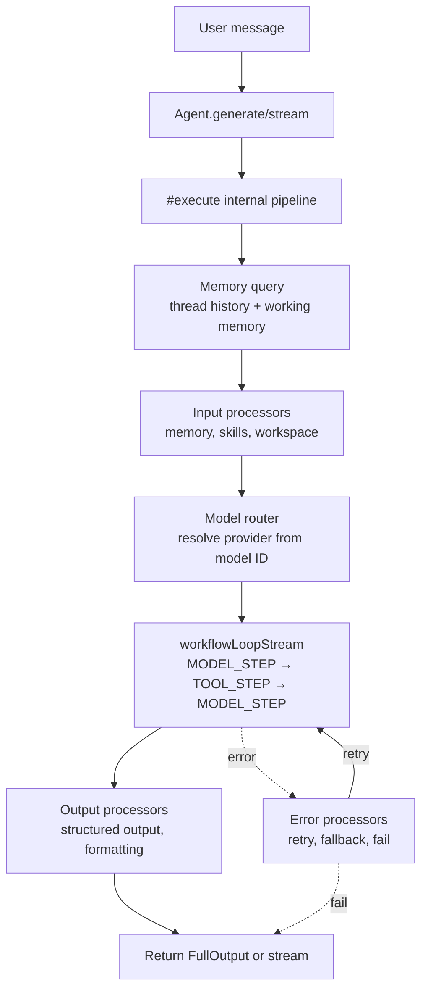
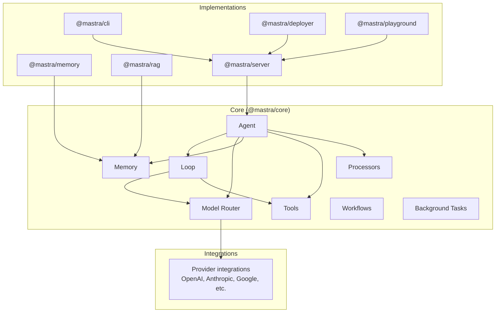

# Mastra -- Overview

## What Mastra Is

Mastra is a **TypeScript-first AI agent framework** built as a pnpm workspace monorepo. It provides a unified model router supporting 200+ providers (OpenAI, Anthropic, Google, local models, and any OpenAI-compatible endpoint), a workflow-based agentic loop with tool execution, built-in memory with semantic recall and working memory, background task execution, and a processor pipeline system for input/output/error transformation. It supports multi-model fallbacks, human-in-the-loop tool approval, sub-agent delegation, and structured output generation.

**Version:** 1.26.0-alpha.7 (`@mastra/core`)
**Author:** Mastra AI
**License:** Apache-2.0
**Runtime:** Node.js (TypeScript, ESM)

## Key Capabilities

- **200+ Model Providers:** Model router with automatic provider detection, OpenAI-compatible gateway support, custom gateway plugins, and embedding model routing
- **Workflow-Based Agent Loop:** The core interaction loop is built on Mastra workflows, enabling suspension, resumption, and streaming at every step
- **Tool System:** Create tools with Zod schemas, human-in-the-loop approval, background async execution, tool suspension and resumption, and provider tool integration
- **Memory System:** Thread-based message history, semantic recall (vector similarity search), working memory (agent-maintained context), and observational memory
- **Processor Pipeline:** Input processors transform messages before the LLM, output processors transform responses after, error processors handle failures -- all pluggable and chainable
- **Background Tasks:** Dispatch tools to run asynchronously, check status later, no blocking the agent loop
- **Sub-Agent Delegation:** Agents can delegate to other agents or workflows with message filtering hooks, iteration limits, and feedback collection
- **Multi-Model Fallbacks:** Automatic failover to backup models on error, configurable retry counts per fallback, dynamic model selection
- **Structured Output:** Generate typed objects with Zod schema validation, streaming object generation
- **Voice Integration:** Built-in voice input/output with default voice adapter
- **Browser Automation:** Browser tools for web scraping and automation
- **Evals & Scoring:** Built-in evaluation framework with scorer sampling

## Architecture at a Glance

```
@mastra/core (foundation)
├── agent/          ← Agent class, message list, trip wire, save queue
├── loop/           ← Workflow-based agentic loop
├── llm/            ← Model router, provider registry, AI SDK adapters
├── memory/         ← Message processors, semantic recall, working memory
├── tools/          ← Tool builder, provider tools, validation
├── processors/     ← Input/output/error processor pipeline + runner
├── workflows/      ← Workflow engine (steps, triggers, outputs)
├── background-tasks/ ← Async task manager and dispatcher
├── storage/        ← Storage ABC and implementations
├── stream/         ← Streaming output management
├── observability/  ← Spans, traces, telemetry
├── error/          ← Error classification and tracking
└── evaluators/     ← Evals and scoring framework

Supporting packages:
├── @mastra/memory      ← Memory implementations
├── @mastra/rag         ← RAG pipeline
├── @mastra/server      ← HTTP server and API
├── @mastra/cli         ← CLI tooling
├── @mastra/deployer    ← Deployment infrastructure
├── @mastra/playground  ← Development UI
└── integrations/       ← Provider-specific integrations
```

## Quick Start

```typescript
import { Agent } from '@mastra/core/agent';
import { Memory } from '@mastra/memory';

const agent = new Agent({
  id: 'my-agent',
  name: 'My Agent',
  instructions: 'You are a helpful assistant',
  model: 'openai/gpt-5',
  tools: { calculator },
  memory: new Memory(),
});

// Generate a response
const result = await agent.generate('What is 2+2?');
console.log(result.text);

// Stream a response
const stream = await agent.stream('Tell me a story');
for await (const chunk of stream.textStream) {
  process.stdout.write(chunk);
}
```

## How It Differs from Pi and Hermes

| Aspect | Pi | Hermes | Mastra |
|--------|-----|--------|--------|
| Language | TypeScript | Python | TypeScript |
| Agent Loop | Async `async run()` | Sync `def run_conversation()` | Workflow-based stream |
| Model Routing | AI package provider | Adapter per provider | Model router with gateway plugins |
| Memory | Message-based compaction | Multi-provider + DAG | Semantic recall + working memory |
| Tool Execution | `Promise.all()` concurrent | `ThreadPoolExecutor` | Workflow steps with suspension |
| Background Tasks | Extension-based | Not native | First-class `BackgroundTaskManager` |
| Processors | Not a concept | Not a concept | Input/output/error pipeline |
| Delegation | Not native | Sub-agent patterns | First-class with hooks |

## Key Design Decisions

**Workflow as Loop:** Instead of a traditional while loop, Mastra's agent loop is built on its workflow engine. This enables suspension (pause mid-conversation), resumption (continue later), and streaming at every step. The tradeoff is complexity -- every loop iteration is a workflow step with its own lifecycle.

**Model Router over Adapters:** Rather than one adapter class per provider (like Hermes), Mastra uses a model router that auto-resolves providers from model IDs (e.g., `openai/gpt-5` → OpenAI SDK). A built-in provider registry maps 200+ models to their SDKs and configurations.

**Processor Pipeline:** Mastra introduces a unique concept -- processors that run before and after every LLM interaction. Input processors can transform, filter, or enrich messages. Output processors can format, validate, or chunk responses. Error processors handle failures with custom recovery logic. This is unlike both Pi and Hermes.

**Background Tasks as First-Class:** Tools can be dispatched to run in the background without blocking the agent loop. The agent can check task status later via a built-in tool. This is different from Hermes (which uses ThreadPoolExecutor for parallel execution) and Pi (which uses Promise.all for concurrent execution).

## Request Lifecycle



## Monorepo Package Map



## Source

`/home/darkvoid/Boxxed/@formulas/src.rust/src.llamacpp/src.AgenticLibraries/src.mastra-ai/mastra/`

## Related Documents

- [01-architecture.md](./01-architecture.md) -- Package map, dependency graph, layers
- [02-agent-core.md](./02-agent-core.md) -- Agent class, generate/stream, execution
- [03-agent-loop.md](./03-agent-loop.md) -- Workflow-based agentic loop deep dive
- [05-model-router.md](./05-model-router.md) -- Provider resolution, OpenAI-compatible, gateway plugins
- [10-comparison.md](./10-comparison.md) -- Mastra vs Pi vs Hermes detailed comparison
