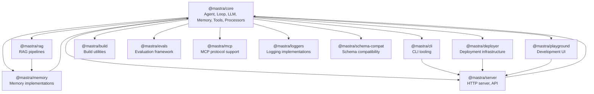
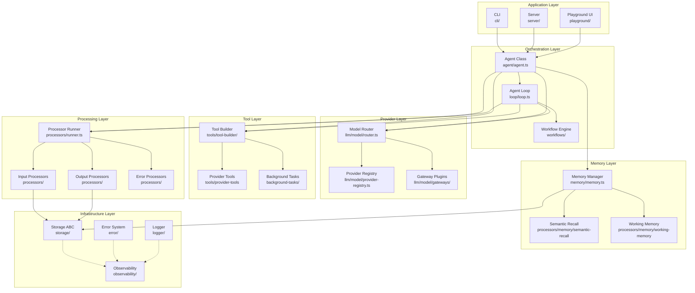
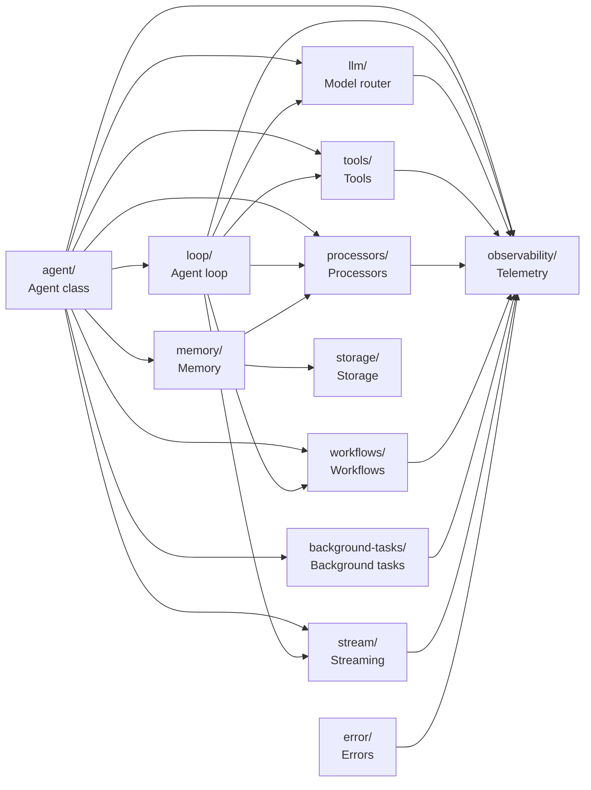

# Mastra -- Architecture

## Package Map

Mastra is organized as a **pnpm workspace monorepo** with `@mastra/core` at the center and supporting packages around it.



## @mastra/core Internal Structure

The core package contains all foundational subsystems. Each subdirectory exports a bounded domain:

```
packages/core/src/
├── agent/              ← Agent class (orchestrator)
├── loop/               ← Agent loop (workflow-based)
├── llm/                ← Model router, provider registry, AI SDK adapters
├── memory/             ← Memory config, message processors
├── tools/              ← Tool builder, validation, provider tools
├── processors/         ← Input/output/error pipeline + runner
├── workflows/          ← Workflow engine (steps, triggers, outputs)
├── background-tasks/   ← Async task manager
├── storage/            ← Storage ABC
├── stream/             ← Streaming output
├── observability/      ← Spans, traces, telemetry
├── error/              ← Error classification
├── evals/              ← Scoring framework
├── voice/              ← Voice I/O
├── browser/            ← Browser automation
├── logger/             ← Logger interface
├── logger/registry.ts  ← Logger registry
├── request-context/    ← Request-scoped context
├── relevance/          ← Relevance scoring
├── tts/                ← Text-to-speech
├── vector/             ← Vector store ABC
├── hooks/              ← Lifecycle hooks
├── channels/           ← Agent channels (WebSocket, etc.)
├── datasets/           ← Dataset management
├── integration/        ← Integration ABC
├── mcp/                ← MCP client
├── server/             ← Server internals
├── test-utils/         ← Testing utilities
├── types/              ← Shared types
├── utils/              ← Shared utilities
├── base.ts             ← MastraBase (all subsystems extend this)
├── index.ts            ← Re-exports everything
└── mastra/             ← Mastra root class (composition)
```

## Layer Architecture



## Dependency Graph



## Key Abstractions

### MastraBase

All major subsystems extend `MastraBase`, which provides:

```typescript
// base.ts
export class MastraBase {
  component: string;       // 'agent', 'llm', 'memory', etc.
  logger: IMastraLogger;   // Shared logger
  mastra?: Mastra;         // Reference to root Mastra instance

  constructor(opts: { component: string }) {
    this.component = opts.component;
    this.logger = new ConsoleLogger({ level: 'debug' });
  }
}
```

### Mastra (Root Class)

The root `Mastra` class composes all subsystems:

```typescript
// mastra/mastra.ts (simplified)
export class Mastra {
  #agents: Record<string, Agent>;
  #workflows: Record<string, AnyWorkflow>;
  #memory?: MastraMemory;
  #storage?: MastraStorage;
  #logger: IMastraLogger;
  #tts?: MastraVoice;
  #browser?: MastraBrowser;

  constructor(config: MastraConfig) {
    this.#agents = config.agents || {};
    this.#workflows = config.workflows || {};
    this.#memory = config.memory;
    this.#storage = config.storage;
    this.#logger = config.logger;
    this.#tts = config.tts;
  }

  getAgent(name: string): Agent { return this.#agents[name]; }
  getWorkflow(name: string): AnyWorkflow { return this.#workflows[name]; }
}
```

### Agent Class

The central orchestrator:

```typescript
// agent/agent.ts
export class Agent<TAgentId, TTools, TOutput, TRequestContext> extends MastraBase {
  public id: TAgentId;
  public name: string;
  model: MastraModelConfig | ModelFallbacks;       // Model or fallback chain
  #memory?: MastraMemory;                           // Memory provider
  #tools: TTools;                                   // Registered tools
  #inputProcessors?: InputProcessorOrWorkflow[];    // Pre-LLM pipeline
  #outputProcessors?: OutputProcessorOrWorkflow[];  // Post-LLM pipeline
  #errorProcessors?: ErrorProcessorOrWorkflow[];    // Error recovery
  #agents: Record<string, Agent>;                   // Sub-agents
  #workflows?: Record<string, AnyWorkflow>;         // Available workflows
  #backgroundTasks?: AgentBackgroundConfig;         // Background task config

  async generate(prompt, options);     // Non-streaming generation
  async stream(prompt, options);       // Streaming generation
  async execute(input, options);       // Full execution with loop
}
```

**Aha moment:** The Agent class is generic over its request context type (`TRequestContext`). This allows end-to-end type safety -- the context passed to `generate()` flows through model resolution, tool execution, memory lookup, and processor pipelines, all with full TypeScript inference.

## Communication Patterns

### Agent → LLM

The Agent does NOT call the LLM directly. It goes through the model router:

```
Agent.generate()
  → resolve model to MastraLanguageModel
    → ModelRouterLanguageModel.doGenerate()
      → resolve provider from model ID (e.g. "openai/gpt-5")
        → create provider client (e.g. createOpenAI())
          → provider.doGenerate()
```

### Agent → Memory

```
Agent.execute()
  → get memory from config
    → memory.queryMessages(threadId)
      → load message history from storage
      → apply semantic recall if enabled
      → apply working memory if enabled
    → format messages into MessageList
```

### Agent → Tools

```
Agent.execute()
  → loop() picks up tools from Agent config
    → workflow step calls tool.execute()
      → validate input against Zod schema
        → run tool handler
          → return result or dispatch background task
```

### Agent → Processors

```
Agent.stream()
  → ProcessorRunner.processInput()
    → run each input processor in order
      → transform messages
  → LLM call (streaming)
  → ProcessorRunner.processOutput()
    → run each output processor in order
      → transform response chunks
```

## Build System

```
turbo.json                    ← Turborepo build orchestration
pnpm-workspace.yaml           ← Workspace package definitions
tsconfig.json                 ← Root TypeScript config
packages/core/tsconfig.json   ← Core package TypeScript config
```

Build uses Turborepo for caching and parallelism. Each package has its own build target with dependency ordering enforced by `turbo.json`.

## Related Documents

- [00-overview.md](./00-overview.md) -- What Mastra is, capabilities, philosophy
- [02-agent-core.md](./02-agent-core.md) -- Agent class, generate/stream, execution
- [03-agent-loop.md](./03-agent-loop.md) -- Workflow-based agentic loop
- [05-model-router.md](./05-model-router.md) -- Provider resolution, gateways
- [09-data-flow.md](./09-data-flow.md) -- End-to-end request flows

## Source Paths

```
packages/core/src/
├── base.ts                     ← MastraBase class (all subsystems extend)
├── mastra/                     ← Root Mastra composition class
├── agent/agent.ts              ← Agent class (orchestrator)
├── loop/loop.ts                ← Agent loop (workflow-based)
├── llm/model/router.ts         ← Model router (provider resolution)
├── llm/model/provider-registry.ts  ← Provider registry (200+ models)
├── llm/model/gateways/         ← Gateway plugins (Mastra, Netlify, models.dev)
├── memory/memory.ts            ← Memory manager
├── processors/runner.ts        ← Processor pipeline runner
├── tools/tool-builder/         ← Tool creation and validation
├── background-tasks/manager.ts ← Background task manager
├── workflows/                  ← Workflow engine
└── observability/              ← Telemetry and tracing
```
