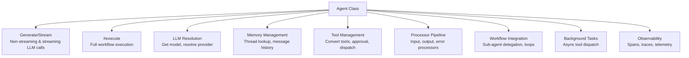
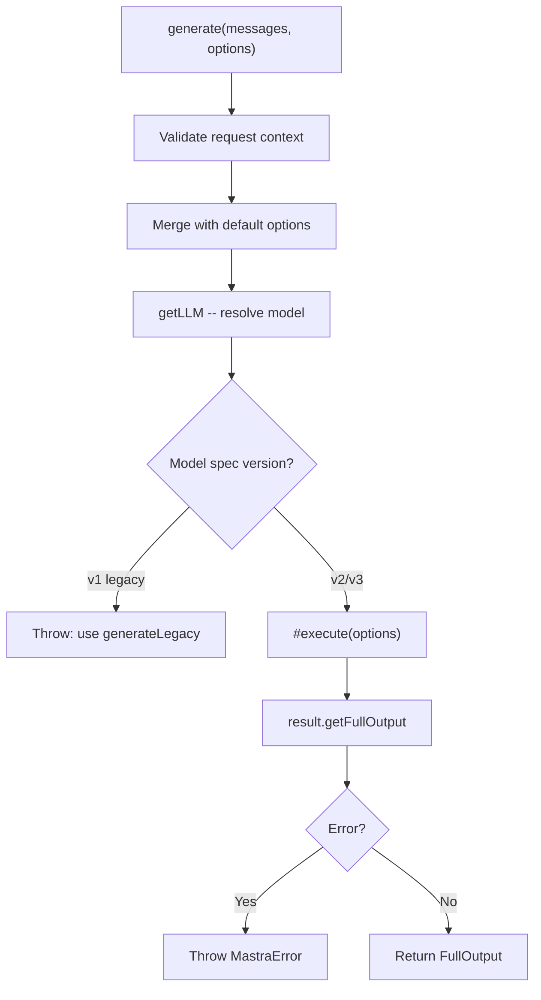
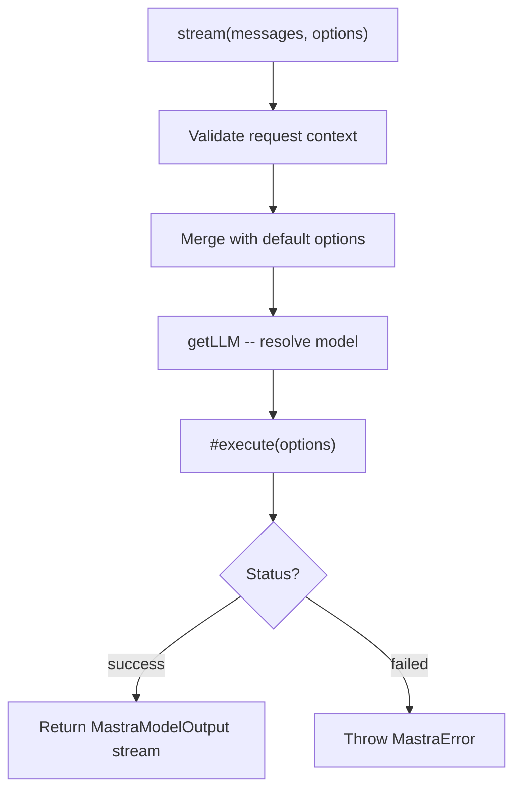
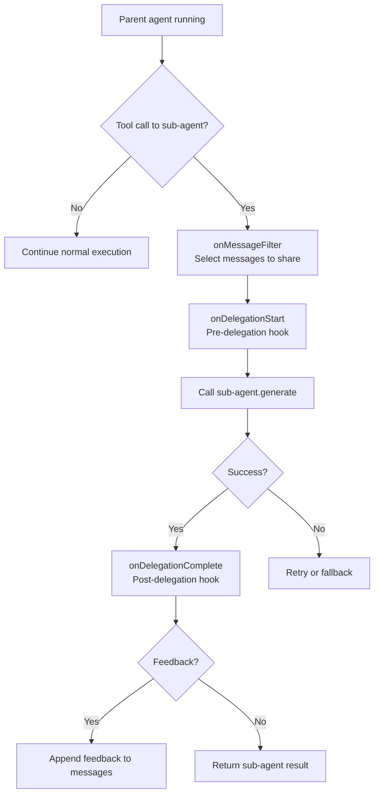

# Mastra -- Agent Core

## The Agent Class

`agent/agent.ts` contains the `Agent` class -- the central orchestrator for all AI interactions. Every generation, stream, tool call, memory lookup, and processor invocation flows through this class.

## Responsibilities



## Class Structure

```typescript
// agent/agent.ts (simplified)
export class Agent<TAgentId, TTools, TOutput, TRequestContext> extends MastraBase {
  // Identity
  public id: TAgentId;
  public name: string;

  // Model -- dynamic: single config, array with retries, or fallback chain
  model: DynamicArgument<MastraModelConfig | ModelWithRetries[], TRequestContext> | ModelFallbacks;
  #originalModel: MastraModelConfig | ModelFallbacks;
  maxRetries?: number;

  // Configuration
  #instructions: DynamicArgument<AgentInstructions, TRequestContext>;
  #tools: DynamicArgument<TTools, TRequestContext>;
  #memory?: DynamicArgument<MastraMemory, TRequestContext>;
  #workflows?: DynamicArgument<Record<string, AnyWorkflow>, TRequestContext>;
  #agents: DynamicArgument<Record<string, Agent>, TRequestContext>;  // Sub-agents

  // Processors (all wrapped in DynamicArgument for context-aware resolution)
  #inputProcessors?: DynamicArgument<InputProcessorOrWorkflow[], TRequestContext>;
  #outputProcessors?: DynamicArgument<OutputProcessorOrWorkflow[], TRequestContext>;
  #errorProcessors?: DynamicArgument<ErrorProcessorOrWorkflow[], TRequestContext>;
  #maxProcessorRetries?: number;

  // Additional fields
  #requestContextSchema?: z.ZodType<TRequestContext>;
  #agentChannels?: AgentChannel[];
  #skillsFormat?: SkillsFormat;
  #scorers?: Record<string, Scorer>;
  #legacyHandler?: AgentLegacyHandler;

  // Capabilities
  #voice: MastraVoice;
  #browser?: MastraBrowser;
  #workspace?: DynamicArgument<AnyWorkspace, TRequestContext>;
  #backgroundTasks?: AgentBackgroundConfig;

  // Lifecycle
  async generate(messages, options): Promise<FullOutput<TOutput>>;
  async stream(messages, options): Promise<MastraModelOutput<TOutput>>;
  async #execute(options): Promise<ExecutionResult>;
}
```

**Aha moment:** The Agent class is generic over four type parameters. `TRequestContext` flows through the entire execution chain -- model resolution, tool execution, memory lookup, and processor pipelines all receive the same typed context. This enables end-to-end type safety without casting.

## Execution Flow

### generate() -- Non-Streaming



### stream() -- Streaming

The `stream()` method follows the same path as `generate()` but returns a `MastraModelOutput` stream that yields chunks as they arrive from the LLM:



### #execute() -- The Core Pipeline

The private `#execute()` method is where everything comes together:

```typescript
// agent/agent.ts (simplified from line 4715)
async #execute<OUTPUT>({ methodType, resumeContext, ...options }) {
  // 1. Resume from snapshot (suspended workflows)
  const existingSnapshot = resumeContext?.snapshot;

  // 2. Inject browser context if configured
  if (this.#browser) { /* inject browserCtx into requestContext */ }

  // 3. Resolve thread ID from args, context, or snapshot
  const threadId = resolveThreadIdFromArgs({ ... });
  const resourceId = /* from context or options */;

  // 4. Resolve LLM (model router)
  const llm = await this.getLLM({ requestContext, model: options.model });

  // 5. Create run ID and resolve instructions
  const runId = options.runId || this.#mastra?.generateId(...) || randomUUID();
  const instructions = options.instructions || await this.getInstructions(...);

  // 6. Create observability span
  const agentSpan = getOrCreateSpan({ type: SpanType.AGENT_RUN, ... });

  // 7. Convert tools to CoreTool format
  const tools = await this.convertTools({ requestContext, methodType });

  // 8. Query memory for message history
  const messages = await this.#buildMessageList(options, threadId, resourceId, ...);

  // 9. Run the loop (via LLM's stream/generate)
  // This goes through the processor pipeline:
  //   Input processors → LLM call → Output processors
  // And handles:
  //   Tool calls, suspension, background tasks, delegation
}
```

## Model Resolution

The Agent doesn't call the LLM directly. It uses `getLLM()` to get a wrapped model instance:

```typescript
async getLLM(args?: { requestContext?: TRequestContext }): Promise<MastraLLM> {
  // Resolve model from config (can be dynamic function)
  const resolvedModel = await resolveDynamicValue(this.model, args);

  // Handle model fallbacks
  if (Array.isArray(resolvedModel)) {
    return new MastraLLMVNext({ models: resolvedModel, ... });
  }

  // Create MastraLLM wrapper around the model
  return new MastraLLMVNext({ model: resolvedModel, ... });
}
```

**Aha moment:** The model can be a `DynamicArgument` -- either a static value or a function that receives the request context and returns a model. This enables runtime model selection based on context: `model: (ctx) => ctx.user.premium ? 'openai/gpt-5' : 'openai/gpt-4o-mini'`.

## Tool Conversion

Tools are converted from the Agent's tool format to CoreTool format via `convertTools()`:

```typescript
async convertTools({ requestContext, methodType }): Promise<Record<string, CoreTool>> {
  // 1. Resolve dynamic tools
  const tools = await resolveDynamicValue(this.#tools, { requestContext });

  // 2. Ensure all tools have required properties
  const ensuredTools = ensureToolProperties(tools);

  // 3. Wrap tools with Mastra context (logger, memory, storage)
  const wrappedTools = makeCoreTool(ensuredTools, {
    mastra: this.#mastra,
    memory: this.#memory,
    agentId: this.id,
    methodType,
  });

  // 4. Inject background task configuration
  if (this.#backgroundTasks) {
    injectBackgroundSchema(wrappedTools, this.#backgroundTasks);
  }

  return wrappedTools;
}
```

## Message List Management

The Agent uses `MessageList` to manage conversation history:

```typescript
async #buildMessageList(options, threadId, resourceId) {
  // 1. Query memory for existing messages
  if (this.hasOwnMemory()) {
    const memoryMessages = await this.#memory.query({
      threadId,
      resourceId,
      selectBy: options.memory?.selectBy,
    });
  }

  // 2. Build MessageList from user input + memory
  const messageList = new MessageList(inputMessages)
    .addMessages(memoryMessages)
    .filter(this.#getFilterToolsFn());  // Filter out disabled tools

  return messageList;
}
```

## Sub-Agent Delegation

Agents can delegate to other agents with rich hook support:

```typescript
// agent/agent.types.ts
interface DelegationConfig {
  onMessageFilter?: (ctx: MessageFilterContext) => MastraDB[];
  onDelegationStart?: (ctx: DelegationStartContext) => DelegationStartResult;
  onDelegationComplete?: (ctx: DelegationCompleteContext) => DelegationCompleteResult;
  maxIterations?: number;
  bail?: () => void;  // Stop all concurrent delegations
}
```

The delegation flow:



## Background Tasks

The Agent can dispatch tools to run asynchronously:

```typescript
// agent/agent.ts
getBackgroundTasksConfig(): AgentBackgroundConfig | undefined {
  return this.#backgroundTasks;
}

disableBackgroundTasks(): void {
  this.#backgroundTasks = { ...this.#backgroundTasks, disabled: true };
}

enableBackgroundTasks(): void {
  this.#backgroundTasks = { ...this.#backgroundTasks, disabled: false };
}
```

When a tool is dispatched as a background task:
1. The `BackgroundTaskManager` creates a task with a unique ID
2. The tool runs in a separate process/thread
3. The agent loop continues without waiting
4. A built-in `check_background_task` tool lets the LLM check status later

**Aha moment:** The sub-agent background config derivation (`deriveSubAgentBackgroundConfig`) automatically inspects a sub-agent's tools and config to determine if any are background-eligible. This means a sub-agent can have async tools without the parent knowing about them -- the configuration is self-describing.

## Processor Integration

The Agent integrates with the processor pipeline:

```typescript
// All processor fields are DynamicArgument — can be static arrays or functions
// that receive requestContext and return arrays
#inputProcessors?: DynamicArgument<InputProcessorOrWorkflow[], TRequestContext>;
#outputProcessors?: DynamicArgument<OutputProcessorOrWorkflow[], TRequestContext>;
#errorProcessors?: DynamicArgument<ErrorProcessorOrWorkflow[], TRequestContext>;

// Retry count for processor failures
#maxProcessorRetries?: number;
```

Processors are executed by the `ProcessorRunner` during `#execute()`:

```
Input messages → Input Processors → LLM call → Output Processors → Final result
                                        ↓
                                  Error Processors (on failure)
```

## TripWire -- Iteration Control

The `TripWire` class controls iteration limits and early termination:

```typescript
// agent/trip-wire.ts
class TripWire {
  maxIterations?: number;
  onFinish?: MastraOnFinishCallback;
  onStepFinish?: MastraOnStepFinishCallback;

  check(iteration: number): boolean {
    if (this.maxIterations && iteration >= this.maxIterations) {
      return false;  // Stop
    }
    return true;  // Continue
  }
}
```

## Observability

Every agent execution creates an observability span:

```typescript
const agentSpan = getOrCreateSpan({
  type: SpanType.AGENT_RUN,
  name: `agent run: '${this.id}'`,
  entityType: EntityType.AGENT,
  entityId: this.id,
  entityName: this.name,
  input: options.messages,
  attributes: {
    conversationId: threadId,
    instructions: instructionsString,
    model: modelInfo.id,
    provider: modelInfo.provider,
  },
});
```

## Key Files

```
agent/agent.ts                    Agent class (orchestrator)
agent/agent.types.ts              Type definitions for agent config, hooks, delegation
agent/message-list/               MessageList -- conversation history management
agent/trip-wire.ts                Iteration control and early termination
agent/save-queue/                 Async message save queue
agent/agent-legacy.ts             Legacy handler for v1 models
agent/workflows/                  Agent-specific workflows (prepare-stream, etc.)
agent/utils.ts                    Utility functions (model validation, etc.)
```

## Related Documents

- [00-overview.md](./00-overview.md) -- What Mastra is, capabilities
- [01-architecture.md](./01-architecture.md) -- Package map, dependency graph
- [03-agent-loop.md](./03-agent-loop.md) -- Workflow-based agentic loop
- [04-tool-system.md](./04-tool-system.md) -- Tool calling, suspension, approval
- [05-model-router.md](./05-model-router.md) -- Provider resolution, model fallbacks
- [07-processors.md](./07-processors.md) -- Input/output/error processor pipeline

## Source Paths

```
packages/core/src/agent/
├── agent.ts                    ← Agent class (6094 lines, generate/stream/#execute)
├── agent.types.ts              ← AgentConfig, DelegationConfig, IterationCompleteContext
├── message-list/               ← MessageList, message history management
├── trip-wire.ts                ← TripWire -- iteration control
├── save-queue/                 ← SaveQueueManager -- async message persistence
├── agent-legacy.ts             ← AgentLegacyHandler -- v1 model compatibility
└── workflows/                  ← Agent-specific workflows
```
