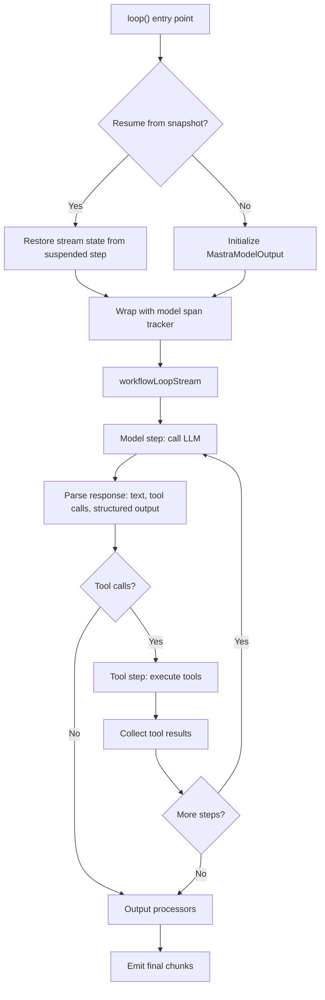
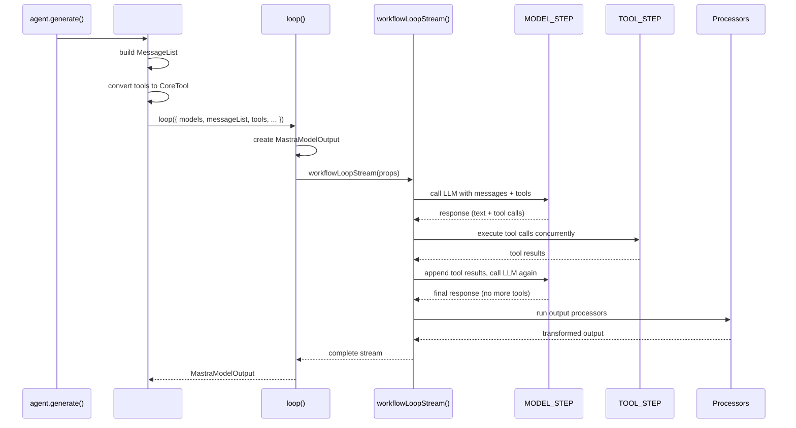
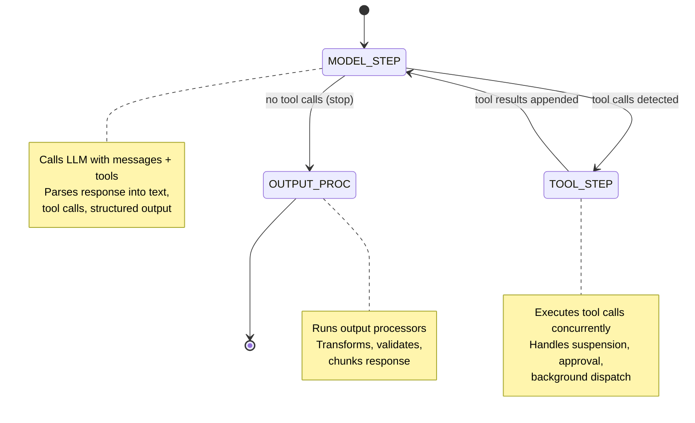

# Mastra -- Agent Loop Deep Dive

## Overview

Mastra's agent loop is built on its **workflow engine** -- unlike Pi's async while-loop or Hermes's sync while-loop. The `loop()` function in `loop/loop.ts` wraps `workflowLoopStream()` from `loop/workflows/stream.ts`, turning every LLM call, tool execution, and processor invocation into a workflow step.

**Key insight:** The workflow-based architecture enables **suspension and resumption**. A conversation can be paused mid-tool-call, serialized to disk, and resumed hours later. This is fundamentally different from Pi and Hermes, where the agent loop is an in-memory while-loop that cannot be paused.

## Architecture





## The loop() Function

```typescript
// loop/loop.ts (simplified)
export function loop<Tools extends ToolSet, OUTPUT>({
  models,           // Model(s) to call -- array for fallbacks
  messageList,      // Conversation history (MessageList)
  tools,            // Available tools for this step
  options,          // LoopConfig with callbacks
  _internal,        // SaveQueueManager, memory, background tasks
  outputProcessors, // Post-LLM transformation pipeline
  requireToolApproval,  // Human-in-the-loop
  toolCallConcurrency,  // Max concurrent tool calls
  maxProcessorRetries,  // Processor retry budget
  isTaskComplete,   // Supervisor scoring
  ...rest
}: LoopOptions<Tools, OUTPUT>) {
  const firstModel = models[0];

  // Create MastraModelOutput that wraps the stream
  modelOutput = new MastraModelOutput({
    model: { modelId: firstModel.model.modelId, provider: firstModel.model.provider },
    stream: workflowLoopStream(workflowLoopProps),
    messageList,
    messageId,
    options: { runId, toolCallStreaming, onFinish, outputProcessors, ... },
  });

  return createDestructurableOutput(modelOutput);
}
```

**Aha moment:** The `loop()` function returns immediately with a `MastraModelOutput` that wraps the async stream. The stream doesn't start producing chunks until the consumer iterates over it. This is lazy evaluation -- the LLM call happens only when someone reads the stream.

## Workflow Steps

The loop is composed of workflow steps that execute in sequence:



## Suspension and Resumption

When a workflow step suspends (e.g., waiting for human tool approval):

```typescript
// From loop/loop.ts
const existingSnapshot = resumeContext?.snapshot;
if (existingSnapshot) {
  for (const key in existingSnapshot?.context) {
    const step = existingSnapshot?.context[key];
    if (step && step.status === 'suspended' && step.suspendPayload?.__streamState) {
      initialStreamState = step.suspendPayload?.__streamState;
      break;
    }
  }
}
```

The stream state is serialized and stored in the workflow snapshot:

```typescript
const serializeStreamState = () => modelOutput?.serializeState();
const deserializeStreamState = (state: any) => modelOutput?.deserializeState(state);

// Passed to workflow step for suspension
streamState: { serialize: serializeStreamState, deserialize: deserializeStreamState }
```

**Aha moment:** The suspension mechanism captures the entire stream state -- accumulated text, tool call arguments, chunk positions, processor states -- and serializes it. When resumed, the stream picks up exactly where it left off. This is how Mastra supports "pause and resume" conversations, which neither Pi nor Hermes can do.

## Tool Execution in the Loop

Tools are executed within a workflow step, not the main loop:

```typescript
// LoopOptions (loop/types.ts)
{
  tools: TOOLS,                    // Tool set for this step
  requireToolApproval: boolean,    // Human-in-the-loop
  toolCallConcurrency: number,     // Max concurrent tool calls (default: 1)
  activeTools: Array<keyof TOOLS>, // Filtered active tool names
}
```

When `requireToolApproval` is true, the workflow step suspends and waits for external approval:

```
Tool call detected
  → Workflow step suspends
  → Step status = 'suspended'
  → External approval required
  → User approves/rejects
  → Workflow resumes with result or rejection
```

## Output Processors in the Loop

Output processors run as part of the workflow pipeline:

```typescript
// Loop configuration
{
  outputProcessors: OutputProcessorOrWorkflow[],
}

// In MastraModelOutput
const result = await outputProcessors.reduce(
  async (stream, processor) => processor.process(stream),
  baseStream
);
```

Each output processor receives the stream and can:
- Transform chunk content
- Filter chunks
- Accumulate state across chunks
- Inject additional chunks

## Loop Configuration

```typescript
// loop/types.ts
export type LoopConfig<OUTPUT> = {
  onChunk?: (chunk: ChunkType<OUTPUT>) => void;     // Each chunk callback
  onError?: ({ error }) => void;                     // Error callback
  onFinish?: MastraOnFinishCallback<OUTPUT>;        // Completion callback
  onStepFinish?: MastraOnStepFinishCallback<OUTPUT>; // Step completion
  onAbort?: (event) => void;                         // Abort callback
  abortSignal?: AbortSignal;                         // External abort signal
  prepareStep?: PrepareStepFunction;                 // Pre-step hook
};
```

## Model Fallbacks in the Loop

When multiple models are passed, the loop handles fallbacks:

```typescript
// LoopOptions
{
  models: [
    { model: primaryModel, maxRetries: 2 },
    { model: fallbackModel1, maxRetries: 1 },
    { model: fallbackModel2, maxRetries: 1 },
  ],
}
```

If the primary model fails (429, 500, etc.), the loop switches to the next model in the array.

## Concurrency Control

```typescript
// LoopOptions
{
  toolCallConcurrency: number,  // Max concurrent tool calls
}
```

- `toolCallConcurrency: 1` (default): Execute tools sequentially
- `toolCallConcurrency: N`: Execute up to N tools concurrently
- Tool results are collected and appended in order

## Supervisor Pattern: isTaskComplete

The loop supports a supervisor pattern where scorers evaluate whether the task is complete after each iteration:

```typescript
// LoopOptions (loop/types.ts)
{
  isTaskComplete: {
    scorers: [myScorer],
    maxIterations: 5,
    feedback: true,  // Auto-add scorer feedback to messages
  },
}
```

After each LLM turn, the scorer evaluates the response. If the task is incomplete:
1. Scorer feedback is added to the message list
2. The loop calls the LLM again
3. This repeats until the scorer says complete or max iterations reached

## Comparison with Pi and Hermes

| Aspect | Pi | Hermes | Mastra |
|--------|-----|--------|--------|
| Loop type | Async while-loop | Sync while-loop | Workflow-based stream |
| Pause/resume | No | No | Yes (suspension) |
| Tool execution | Promise.all() | ThreadPoolExecutor | Workflow step |
| Streaming | Native SSE | Sync OpenAI SDK | Workflow stream transform |
| Processor hooks | None | None | Input/output/error processors |
| Supervisor | None | None | isTaskComplete scorers |
| Concurrency | Promise.all() (unbounded) | ThreadPoolExecutor (max 8) | toolCallConcurrency param |

## Key Files

```
loop/loop.ts                ← Main loop() function
loop/types.ts               ← LoopOptions, LoopConfig, StreamInternal
loop/workflows/stream.ts    ← workflowLoopStream() implementation
loop/network/               ← Network loop (alternative execution mode)
loop/server.ts              ← Server-side loop execution
```

## Related Documents

- [02-agent-core.md](./02-agent-core.md) -- Agent class that creates the loop
- [03-tool-system.md](./03-tool-system.md) -- Tool execution within the loop
- [04-tool-system.md](./04-tool-system.md) -- Tool suspension and approval
- [07-processors.md](./07-processors.md) -- Output processors in the loop
- [08-multi-model.md](./08-multi-model.md) -- Model fallbacks in the loop

## Source Paths

```
packages/core/src/loop/
├── loop.ts                   ← loop() function (entry point)
├── types.ts                  ← LoopOptions, LoopConfig, StreamInternal
├── workflows/stream.ts       ← workflowLoopStream() implementation
├── network/                  ← Network loop (supervisor pattern)
└── server.ts                 ← Server-side execution
```
