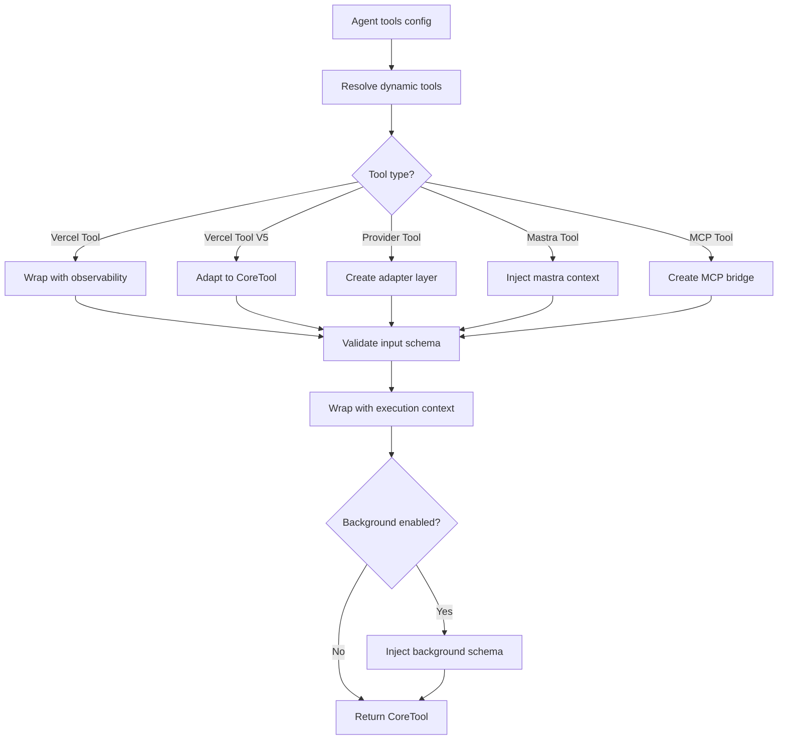
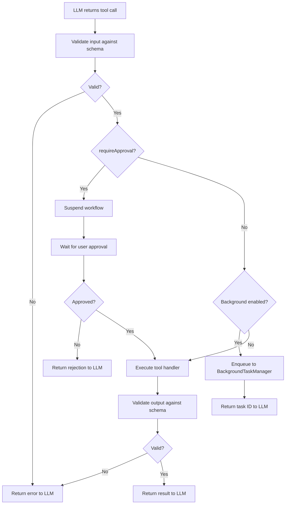

# Mastra -- Tool System

## Overview

Mastra's tool system supports multiple tool formats (Vercel tools, Mastra tools, provider-defined tools, MCP tools), schema validation (Zod, JSON Schema, AI SDK schemas), human-in-the-loop approval, suspension/resumption, background async execution, and sub-agent delegation.

**Key insight:** Mastra tools are **4-tuple typed**: `Tool<TInput, TOutput, TSuspend, TResume>`. The suspend/resume schema types enable a tool to pause execution, save state, wait for external input (like user approval), and resume with typed data. This is unique to Mastra among the three frameworks.

## Tool Creation

```typescript
// tools/tool.ts
export function createTool<
  TId extends string,
  TInputSchema extends SchemaLike,
  TOutputSchema extends SchemaLike,
  TSuspendSchema extends SchemaLike,
  TResumeSchema extends SchemaLike,
  TRequestContext,
  TContext,
>(opts: CreateToolOpts<...>): Tool<...> {
  return new Tool(opts);
}
```

### Basic Tool

```typescript
const weatherTool = createTool({
  id: 'get-weather',
  description: 'Get weather for a location',
  inputSchema: z.object({
    location: z.string(),
    units: z.enum(['celsius', 'fahrenheit']).optional(),
  }),
  execute: async (inputData, context) => {
    const weather = await fetchWeather(inputData.location, inputData.units);
    return { temperature: weather.temp, conditions: weather.conditions };
  },
});
```

### Tool Requiring Approval

```typescript
const deleteFileTool = createTool({
  id: 'delete-file',
  description: 'Delete a file',
  requireApproval: true,
  inputSchema: z.object({ filepath: z.string() }),
  execute: async (inputData, context) => {
    await fs.unlink(inputData.filepath);
    return { deleted: true };
  },
});
```

### Tool with Suspension

```typescript
const approvalTool = createTool({
  id: 'request-approval',
  description: 'Request user approval for an action',
  inputSchema: z.object({ action: z.string() }),
  suspendSchema: z.object({ pendingAction: z.string() }),
  resumeSchema: z.object({ approved: z.boolean() }),
  execute: async (inputData, context) => {
    if (!context.isSuspended) {
      // First call: suspend and wait for approval
      context.suspend({ pendingAction: inputData.action });
      return;  // Execution pauses here
    }
    // Resumed: check the approval result
    const resumeData = context.getResumeData();
    return { approved: resumeData.approved };
  },
});
```

**Aha moment:** The `suspend()` call captures the tool's state and suspends the entire workflow. When resumed, the tool's `execute` runs again from the start, but `context.isSuspended` is true and `context.getResumeData()` contains the typed resume data. This is how Mastra implements human-in-the-loop -- the tool suspends, the UI shows an approval dialog, the user clicks "approve," and the workflow resumes.

## Tool Conversion Pipeline

When an Agent converts tools to CoreTool format:



## CoreTool Builder

```typescript
// tools/tool-builder/builder.ts
export class CoreToolBuilder extends MastraBase {
  async build(tool: ToolToConvert, options: ToolOptions): Promise<CoreTool> {
    // 1. Apply schema compatibility layer for different providers
    const compatSchema = applyCompatLayer(tool.inputSchema, {
      provider: targetProvider,  // openai, anthropic, google, etc.
    });

    // 2. Wrap execution with observability
    const wrappedExecute = async (input, context) => {
      const span = getOrCreateSpan({
        type: SpanType.TOOL_EXECUTION,
        name: `tool: ${tool.id}`,
        input,
      });
      try {
        const result = await tool.execute(input, {
          ...context,
          mastra: this.#mastra,
          memory: context?.memory,
          logger: this.logger,
          agentId: options.agentId,
        });
        span.setOutput(result);
        return result;
      } catch (error) {
        span.setError(error);
        throw error;
      }
    };

    // 3. Inject background task schema if configured
    if (options.backgroundConfig?.enabled) {
      injectBackgroundSchema(coreTool, options.backgroundConfig);
    }

    return coreTool;
  }
}
```

## Schema Compatibility

Mastra applies provider-specific schema compatibility layers:

```typescript
// tools/tool-builder/builder.ts
import {
  OpenAISchemaCompatLayer,
  AnthropicSchemaCompatLayer,
  GoogleSchemaCompatLayer,
  DeepSeekSchemaCompatLayer,
  MetaSchemaCompatLayer,
  applyCompatLayer,
} from '@mastra/schema-compat';
```

Each provider has different schema requirements. For example:
- OpenAI requires strict JSON Schema with no additional properties
- Anthropic is more permissive with nested schemas
- Google has specific enum handling

The `applyCompatLayer()` function transforms a Zod schema into the provider-specific format.

## Tool Validation

```typescript
// tools/validation.ts
function validateToolInput(tool: CoreTool, input: unknown): void {
  // Validate against inputSchema
  if (tool.inputSchema) {
    const result = tool.inputSchema.safeParse(input);
    if (!result.success) {
      throw new MastraError({
        id: 'TOOL_INPUT_VALIDATION_FAILED',
        text: `Tool ${tool.id} input validation failed: ${result.error.message}`,
      });
    }
  }
}

function validateToolOutput(tool: CoreTool, output: unknown): void {
  // Validate against outputSchema
  if (tool.outputSchema) {
    const result = tool.outputSchema.safeParse(output);
    if (!result.success) {
      throw new MastraError({
        id: 'TOOL_OUTPUT_VALIDATION_FAILED',
        text: `Tool ${tool.id} output validation failed: ${result.error.message}`,
      });
    }
  }
}

function validateToolSuspendData(tool: CoreTool, data: unknown): void {
  // Validate against suspendSchema
}
```

## Background Task Execution

Tools can be dispatched to run asynchronously:

```typescript
// background-tasks/manager.ts
export class BackgroundTaskManager {
  config: {
    globalConcurrency: 10,      // Max concurrent tasks globally
    perAgentConcurrency: 5,     // Max concurrent tasks per agent
    backpressure: 'queue',      // Queue or reject when full
    defaultTimeoutMs: 300_000,  // 5 minute default timeout
  };

  async enqueueTask(tool: CoreTool, input: unknown, context: TaskContext): Promise<EnqueueResult> {
    const taskId = randomUUID();
    const task: BackgroundTask = {
      id: taskId,
      tool,
      input,
      status: 'pending',
      createdAt: Date.now(),
    };

    // Store task context (closure from caller's stream)
    this.taskContexts.set(taskId, context);

    // Dispatch via pubsub
    this.pubsub.publish(TOPIC_DISPATCH, { task });

    return { taskId, status: 'enqueued' };
  }

  async checkTask(taskId: string): Promise<BackgroundTaskStatus> {
    return this.pubsub.getTaskStatus(taskId);
  }
}
```

**Aha moment:** The BackgroundTaskManager uses a pub/sub architecture. Workers subscribe to the `background-tasks` topic and pick up tasks. Results are published on `background-tasks-result`. This means tasks can be processed by separate worker processes, not just threads within the same process.

## Tool Execution Flow



## Provider Tool Integration

Mastra supports provider-defined tools (like OpenAI's built-in web search or code interpreter):

```typescript
// tools/provider-tools.ts
function isProviderTool(tool: ToolToConvert): boolean {
  return tool instanceof ProviderDefinedTool || 'provider' in tool;
}

// Provider tools are passed through to the LLM API
// rather than being executed by Mastra
```

Provider tools are not executed by Mastra -- they are passed through to the provider's API. The provider handles execution internally and returns results.

## MCP Tool Support

MCP (Model Context Protocol) tools bridge external tool servers:

```typescript
// tools/mcp/
// MCP tools connect to MCP servers
// Translate MCP tool calls to Mastra format
// Handle streaming and error mapping
```

## Tool Concurrency

In the agent loop, tool calls are executed with configurable concurrency:

```typescript
// loop/types.ts
{
  toolCallConcurrency: number,  // Default: 1 (sequential)
}
```

- Sequential (default): One tool at a time, results in order
- Concurrent: Up to N tools execute in parallel, results collected as they complete

## Tool Streaming

Tools can stream their output:

```typescript
// tools/stream.ts
export class ToolStream {
  async *execute(tool: CoreTool, input: unknown): AsyncGenerator<Chunk> {
    // Execute tool and yield chunks as they arrive
    for await (const chunk of tool.execute(input)) {
      yield chunk;
    }
  }
}
```

## Key Files

```
tools/tool.ts                   Tool class and createTool function
tools/tool-builder/builder.ts   CoreToolBuilder -- tool conversion
tools/validation.ts             Input/output/suspend validation
tools/stream.ts                 Tool streaming support
tools/toolchecks.ts             Tool type guards
tools/provider-tools.ts         Provider tool detection
tools/types.ts                  CoreTool, VercelTool, MCPTool types
background-tasks/manager.ts     BackgroundTaskManager -- async dispatch
background-tasks/types.ts       Background task types
background-tasks/create.ts      Task creation helpers
```

## Related Documents

- [02-agent-core.md](./02-agent-core.md) -- Agent class that owns tools
- [03-agent-loop.md](./03-agent-loop.md) -- Tool execution within the loop
- [05-model-router.md](./05-model-router.md) -- Schema compatibility per provider
- [08-multi-model.md](./08-multi-model.md) -- Background task configuration

## Source Paths

```
packages/core/src/tools/
├── tool.ts                   ← Tool class, createTool()
├── tool-builder/builder.ts   ← CoreToolBuilder -- tool conversion pipeline
├── validation.ts             ← validateToolInput/Output/SuspendData
├── stream.ts                 ← ToolStream -- async generator
├── toolchecks.ts             ← isVercelTool, isProviderTool type guards
├── provider-tools*           ← Provider tool integration tests
├── types.ts                  ← CoreTool, VercelTool, ToolAction types
└── hitl.md                   ← Human-in-the-loop documentation

packages/core/src/background-tasks/
├── manager.ts                ← BackgroundTaskManager (pubsub-based)
├── types.ts                  ← BackgroundTask, TaskContext, EnqueueResult
├── create.ts                 ← Task creation helpers
└── system-prompt.ts          ← System prompt injection for background tasks
```
