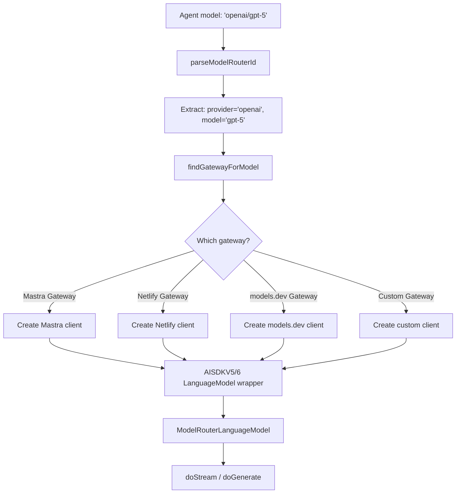
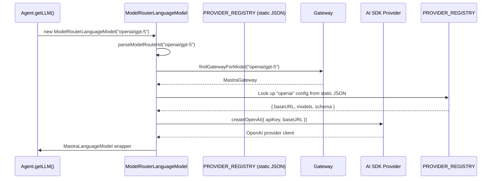
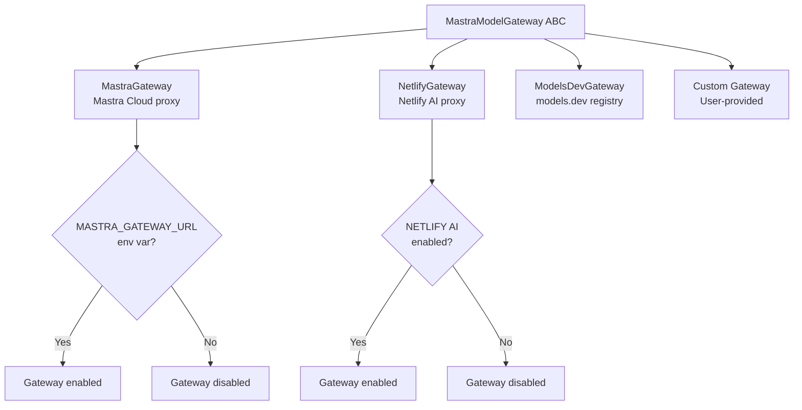

# Mastra -- Model Router

## Overview

Mastra's model router resolves **200+ providers** from simple model ID strings (e.g., `openai/gpt-5`, `anthropic/claude-sonnet-4-6`, `google/gemini-2.5-pro`) into SDK clients. Unlike Hermes's per-provider adapter classes or Pi's AI package provider map, Mastra uses a **gateway plugin architecture** where each gateway knows how to resolve providers within its domain.

**Key insight:** The router is provider-agnostic -- it doesn't need to know about every provider. Instead, gateways (Mastra Gateway, Netlify Gateway, models.dev Gateway, custom gateways) each handle their own provider set. The router just finds the right gateway for a model ID and delegates.

## Architecture





## Model ID Resolution

```typescript
// llm/model/router.ts
export class ModelRouterLanguageModel implements MastraLanguageModelV2 {
  readonly specificationVersion = 'v2';
  readonly modelId: string;       // 'gpt-5'
  readonly provider: string;      // 'openai'
  readonly gatewayId: string;     // 'mastra'

  constructor(config: ModelRouterModelId | OpenAICompatibleConfig, customGateways?: MastraModelGateway[]) {
    // Normalize: string "openai/gpt-5" → { id: "openai/gpt-5" }
    // Or: { providerId: "openai", modelId: "gpt-5" } → { id: "openai/gpt-5" }
    const normalizedConfig = /* ... */;

    // Find the right gateway for this model
    this.gateway = findGatewayForModel(normalizedConfig.id, allGateways);

    // Parse provider and model from the ID
    const parsed = parseModelRouterId(normalizedConfig.id, gatewayPrefix);
    this.modelId = parsed.model;
    this.provider = parsed.provider;

    // Create the SDK client through the gateway
    // Gateway handles API key, base URL, headers
  }

  async doGenerate(options: LanguageModelV2CallOptions) {
    // Delegate to the gateway's underlying model
    return this.gateway.getModel(this.config).doGenerate(options);
  }

  async doStream(options: LanguageModelV2CallOptions): Promise<[ModelStream, () => void]> {
    return this.gateway.getModel(this.config).doStream(options);
  }
}
```

## Gateway Plugin Architecture



Each gateway implements:

```typescript
// llm/model/gateways/base.ts
export interface MastraModelGateway {
  id: string;                        // 'mastra', 'netlify', 'models.dev'
  shouldEnable(): boolean;           // Check env vars, config
  getModel(config: OpenAICompatibleConfig): GatewayLanguageModel;
  getStaticProviders(): Record<string, ProviderConfig>;
}
```

**Aha moment:** Gateways are self-enabling. If the required environment variables aren't set (e.g., `MASTRA_GATEWAY_URL` for Mastra Gateway), the gateway silently disables itself. This means the same code works in offline mode, local mode, or cloud mode without configuration changes.

## Provider Registry

The provider registry is a **static JSON file** imported at module load time -- not a class with `has()` or `getConfig()` methods.

```typescript
// llm/model/provider-registry.ts
import staticRegistry from './provider-registry.json';

// The JSON file contains:
interface RegistryData {
  providers: Record<string, ProviderConfig>;
  models: Record<string, string[]>;  // provider -> [model names]
  version: string;
}

// Filter to enabled gateways only
function sanitizeRegistryDataForRuntime(data: RegistryData, enabledGatewayIds: Set<string>): RegistryData {
  const providers = Object.entries(data.providers)
    .filter(([_, config]) => enabledGatewayIds.has(config.gateway));
  const models = Object.entries(data.models)
    .filter(([providerId]) => providerId in providers);
  return { providers, models, version: data.version };
}
```

There is no `ProviderRegistry` class with `.has()` or `.getConfig()` methods. The registry is just a JSON object exported via `PROVIDER_REGISTRY` constant. Provider lookups happen via `parseModelRouterId()` which extracts the provider from the model ID string, then the gateway is found via `findGatewayForModel()`.

The registry supports **offline mode**:

```typescript
export function isOfflineMode(): boolean {
  const value = process.env.MASTRA_OFFLINE;
  return value === 'true' || value === '1';
}
```

When `MASTRA_OFFLINE=true`, no network fetches for provider data. The static JSON registry is used as-is.

## OpenAI-Compatible Configuration

Any OpenAI-compatible endpoint works with the router:

```typescript
// llm/model/shared.types.ts
interface OpenAICompatibleConfig {
  id: `${string}/${string}`;     // Required: "provider/model"
  url?: string;                   // Custom base URL
  apiKey?: string;                // API key
  headers?: Record<string, string>;
  providerOptions?: ProviderOptions;
}
```

```typescript
// Usage with custom endpoint
const agent = new Agent({
  model: {
    id: 'local/llama-3',
    url: 'http://localhost:8080/v1',
    apiKey: 'not-needed',
  },
});
```

## AI SDK Version Handling

Mastra supports both AI SDK v5 and v6:

```typescript
// llm/model/aisdk/
// v5/model.ts -- AISDKV5LanguageModel wrapper
// v6/model.ts -- AISDKV6LanguageModel wrapper

function isLanguageModelV3(model: GatewayLanguageModel): model is LanguageModelV3 {
  return model.specificationVersion === 'v3';
}
```

The router detects the SDK version from the provider and wraps accordingly.

## Model Fallbacks

Model fallbacks are configured at the Agent level, but the router handles the resolution:

```typescript
// agent/agent.ts
type ModelFallbacks = {
  id: string;
  model: DynamicArgument<MastraModelConfig>;
  maxRetries: number;
  enabled: boolean;
  modelSettings?: DynamicArgument<ModelFallbackSettings>;
  providerOptions?: DynamicArgument<ProviderOptions>;
  headers?: DynamicArgument<Record<string, string>>;
}[];
```

When the primary model fails (429, 500, etc.), the Agent creates a new `ModelRouterLanguageModel` for the fallback model and retries.

## Embedding Model Routing

The router also handles embedding models:

```typescript
// llm/model/embedding-router.ts
export class ModelRouterEmbeddingModel implements MastraEmbeddingModel {
  readonly modelId: string;
  readonly provider: string;

  constructor(config: EmbeddingModelId) {
    // Same resolution as text models
    // Different SDK: create embedding client instead
  }
}
```

## URL Resolution and Transport

The router supports multiple transport types:

```typescript
// llm/model/router.ts
function getOpenAITransport(providerOptions?: ProviderOptions): {
  transport: OpenAITransport;
  websocket?: OpenAIWebSocketOptions;
} {
  return {
    transport: providerOptions?.openai?.transport ?? 'fetch',
    websocket: providerOptions?.openai?.websocket,
  };
}
```

- `fetch` (default): Standard HTTP transport
- `websocket`: WebSocket transport for real-time streaming

## Provider Tools

The router also resolves provider-defined tools:

```typescript
// router-provider-tools.test.ts
// Provider tools (like OpenAI's web_search) are passed through
// to the provider's API, not executed by Mastra
```

When a provider supports built-in tools, the router passes them through to the underlying SDK without wrapping them in Mastra's execution pipeline.

## Key Files

```
llm/model/router.ts             ModelRouterLanguageModel -- main router
llm/model/provider-registry.ts  Provider registry loader
llm/model/provider-registry.json Static provider data (200+ models)
llm/model/provider-types.generated.d.ts  Generated provider type definitions
llm/model/gateways/
├── base.ts                     MastraModelGateway interface
├── mastra.ts                   Mastra Cloud gateway
├── netlify.ts                  Netlify AI gateway
└── models-dev.ts               models.dev gateway
llm/model/shared.types.ts       Shared types (OpenAICompatibleConfig)
llm/model/provider-options.ts   Provider-specific options
llm/model/aisdk/v5/model.ts     AI SDK v5 wrapper
llm/model/aisdk/v6/model.ts     AI SDK v6 wrapper
llm/model/embedding-router.ts   Embedding model routing
```

## Related Documents

- [02-agent-core.md](./02-agent-core.md) -- Agent class that resolves models
- [05-model-router.md](./05-model-router.md) -- This document
- [08-multi-model.md](./08-multi-model.md) -- Model fallback chains
- [09-data-flow.md](./09-data-flow.md) -- End-to-end model call flow

## Source Paths

```
packages/core/src/llm/model/
├── router.ts                   ← ModelRouterLanguageModel (main router class)
├── provider-registry.ts        ← Provider registry loader with offline mode
├── provider-registry.json      ← Static provider data
├── provider-types.generated.d.ts  ← 200+ provider type definitions
├── gateways/                   ← Gateway plugins (Mastra, Netlify, models.dev)
├── aisdk/v5/model.ts           ← AI SDK v5 LanguageModel wrapper
├── aisdk/v6/model.ts           ← AI SDK v6 LanguageModel wrapper
├── shared.types.ts             ← OpenAICompatibleConfig, MastraLanguageModelV2
├── provider-options.ts         ← Provider-specific configuration
├── gateway-resolver.ts         ← Model ID parsing
├── embedding-router.ts         ← Embedding model routing
└── model.loop.ts               ← Model integration with agent loop
```
