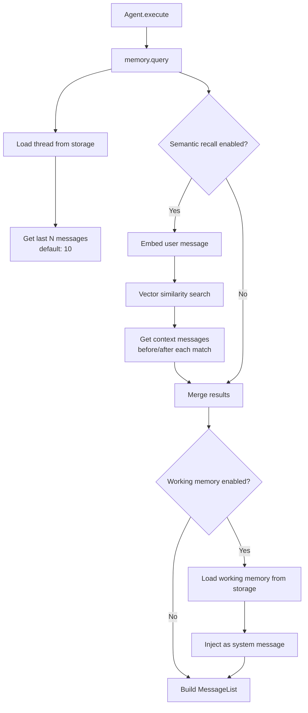
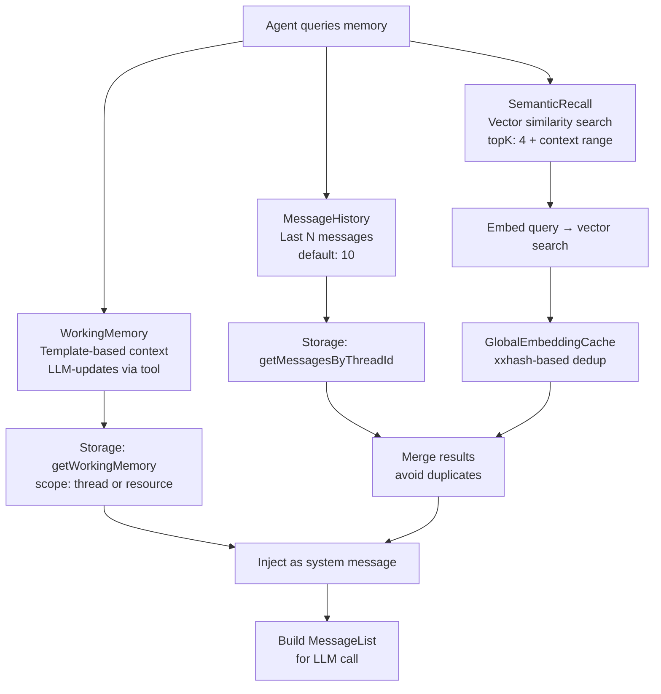

# Mastra -- Memory System

## Overview

Mastra's memory system is built on **MastraMemory**, an abstract base class that provides thread-based conversation management, semantic recall (vector similarity search), working memory (agent-maintained structured context), and integration with the processor pipeline for message filtering.

**Key insight:** Mastra memory is NOT an active participant in the agent loop like Hermes's MemoryManager. Instead, it's a data layer that the Agent queries before building the message list, and it integrates as an **input processor** that injects memory context into the message stream.

## Architecture



## MastraMemory Base Class

```typescript
// memory/memory.ts
export abstract class MastraMemory extends MastraBase {
  readonly id: string;
  MAX_CONTEXT_TOKENS?: number;

  protected _storage?: MastraCompositeStore;   // Message persistence
  vector?: MastraVector;                        // Vector store for semantic recall
  embedder?: MastraEmbeddingModel<string>;      // Embedding model
  protected threadConfig: MemoryConfigInternal; // Thread configuration

  // Thread management
  async getThread(threadId: string): Promise<StorageThreadType | null>;
  async saveThread(thread: StorageThreadType): Promise<void>;
  async deleteThread(threadId: string): Promise<void>;
  async listThreads(input?: StorageListThreadsInput): Promise<StorageListThreadsOutput>;

  // Message management
  async saveMessages(messages: MastraDBMessage[]): Promise<MastraDBMessage[]>;
  async query(query: MemoryQuery): Promise<MastraDBMessage[]>;

  // Memory processors
  process(messages: CoreMessage[], opts: MemoryProcessorOpts): CoreMessage[];
}
```

## Default Configuration

```typescript
export const memoryDefaultOptions = {
  lastMessages: 10,           // Number of recent messages to load
  semanticRecall: false,      // Vector similarity search (disabled by default)
  generateTitle: false,       // Auto-generate thread titles
  workingMemory: {
    enabled: false,
    template: `
# User Information
- **First Name**:
- **Last Name**:
- **Location**:
- **Occupation**:
- **Interests**:
- **Goals**:
- **Events**:
- **Facts**:
- **Projects**:
`,
  },
};
```

## Semantic Recall

Semantic recall retrieves relevant messages from conversation history using vector similarity:

```typescript
// processors/memory/semantic-recall.ts
export class SemanticRecall implements Processor {
  readonly id = 'semantic-recall';

  config: {
    topK: 4;                     // Number of similar messages to find
    messageRange: 1;             // Context messages before/after each match
    scope: 'resource';           // 'thread' or 'resource'
    filter?: SystemModelMessage; // Optional filter for search
  };

  async process(messages: CoreMessage[], messageList: MessageList, ctx: RequestContext) {
    // 1. Embed the latest user message
    const embedding = await this.embedder.doEmbed(text);

    // 2. Search vector store for similar messages
    const results = await this.vector.query(embedding, { topK: this.config.topK });

    // 3. For each match, get surrounding context
    for (const match of results) {
      const contextMessages = await this.storage.getMessagesAround(match.messageId, {
        before: this.config.messageRange.before,
        after: this.config.messageRange.after,
      });
      relevantMessages.push(...contextMessages);
    }

    // 4. Merge with recent messages (avoiding duplicates)
    return mergeMessages(recentMessages, relevantMessages);
  }
}
```

**Aha moment:** Semantic recall uses xxhash for message deduplication. The `globalEmbeddingCache` caches embeddings to avoid re-embedding the same text. This is critical for performance -- without caching, every query would re-embed all messages.

## Working Memory

Working memory provides structured, agent-maintained context:

```typescript
// processors/memory/working-memory.ts
export class WorkingMemory implements Processor {
  readonly id = 'working-memory';

  config: {
    template: { format: 'markdown'; content: string };  // Template to fill
    scope: 'resource';    // 'thread' (current conversation) or 'resource' (all conversations)
    readOnly: false;      // If true, no update tools provided
  };

  async process(messages: CoreMessage[], messageList: MessageList, ctx: RequestContext) {
    // 1. Load working memory from storage
    const workingMemory = await this.storage.getWorkingMemory({ scope: this.config.scope });

    // 2. Format as system message
    const systemMessage = {
      role: 'system' as const,
      content: `Working Memory:\n${workingMemory.content}`,
    };

    // 3. Prepend to messages
    return [systemMessage, ...messages];
  }
}
```

Working memory supports two formats:
- **Markdown**: Free-form template (default)
- **JSON**: Structured data with schema validation

**Aha moment:** Working memory updates happen via a tool (`updateWorkingMemory`) that the LLM can call. The processor only reads and injects the current state. This means the LLM maintains its own memory structure by calling the update tool when it learns something new.

## Message Query Flow

```typescript
// memory/memory.ts
async query(query: MemoryQuery): Promise<MastraDBMessage[]> {
  // 1. Load thread
  const thread = await this.getThread(query.threadId);
  if (!thread) return [];

  // 2. Get recent messages (last N)
  const recentMessages = await this._storage.getMessagesByThreadId(query.threadId, {
    limit: this.threadConfig.lastMessages,
  });

  // 3. If semantic recall enabled, do vector search
  if (this.threadConfig.semanticRecall && query.vectorSearchString) {
    const semanticMessages = await this.semanticRecall.process(
      recentMessages,
      query.vectorSearchString,
      query.threadId,
    );
    return merge(recentMessages, semanticMessages);
  }

  return recentMessages;
}
```

## Memory as Processor

Memory can be used as an input processor:

```typescript
// Agent configuration
const agent = new Agent({
  inputProcessors: [memory],   // Memory injects context before LLM call
  outputProcessors: [...],      // Process LLM response
});
```

When memory is in the input processor chain:
1. It receives the current message list
2. It loads thread history
3. It appends working memory as a system message
4. It injects semantic recall results
5. It returns the enriched message list

## Storage Layer

Memory uses the storage ABC for persistence:

```typescript
// storage/
export interface MastraCompositeStore {
  // Thread operations
  getThread(threadId: string): Promise<StorageThreadType | null>;
  saveThread(thread: StorageThreadType): Promise<void>;
  deleteThread(threadId: string, opts: { deleteMessages?: boolean }): Promise<void>;

  // Message operations
  getMessagesByThreadId(threadId: string, opts?: { limit?: number }): Promise<MastraDBMessage[]>;
  getMessagesAround(messageId: string, opts: { before: number; after: number }): Promise<MastraDBMessage[]>;
  saveMessages(messages: MastraDBMessage[]): Promise<MastraDBMessage[]>;

  // Working memory
  getWorkingMemory(opts: { scope: 'thread' | 'resource' }): Promise<WorkingMemoryRecord | null>;
  saveWorkingMemory(record: WorkingMemoryRecord): Promise<void>;

  // Cloning
  cloneThread(input: StorageCloneThreadInput): Promise<StorageCloneThreadOutput>;
}
```

Storage is augmented with lazy init:

```typescript
// storage/storageWithInit.ts
export function augmentWithInit(storage: MastraCompositeStore): MastraCompositeStore {
  // Wrap each method to call storage.init() if not already initialized
  return new Proxy(storage, {
    get(target, prop) {
      const original = target[prop];
      if (typeof original === 'function') {
        return async (...args) => {
          await target.init?.();
          return original.apply(target, args);
        };
      }
      return original;
    },
  });
}
```

**Aha moment:** The `augmentWithInit` proxy automatically initializes storage on first access. This means the Memory constructor doesn't need to worry about init ordering -- every method call guarantees storage is ready.

## System Reminders

Memory injects system reminders into the conversation:

```typescript
// memory/system-reminders.ts
export function filterSystemReminderMessages(messages: CoreMessage[]): CoreMessage[] {
  // Remove system reminder messages that should not reach the LLM
  return messages.filter(m => !isSystemReminderMessage(m));
}
```

System reminders are used internally by the memory system (e.g., "working memory updated") and should not be visible to the LLM.

## Memory Types and Their Roles



## Comparison with Pi and Hermes

| Aspect | Pi | Hermes | Mastra |
|--------|-----|--------|--------|
| Memory model | Message history + compaction | Multi-provider (Honcho, Mem0, etc.) | Thread-based with semantic recall |
| Working memory | N/A | MemoryManager.get_context() | Template-based, LLM-updated |
| Semantic search | N/A | Provider-dependent | Built-in vector store integration |
| Processor integration | N/A | N/A | Memory as input processor |
| Storage | JSONL files | SQLite/JSON/Provider | Storage ABC (pluggable) |
| Compaction | Built into session | Context compression engine | Token limiting via processors |

## Key Files

```
memory/memory.ts              MastraMemory abstract base class
memory/types.ts               MemoryConfig, WorkingMemoryTemplate, etc.
memory/system-reminders.ts    System reminder filtering
processors/memory/
├── semantic-recall.ts        SemanticRecall processor
├── working-memory.ts         WorkingMemory processor
├── message-history.ts        MessageHistory processor
└── embedding-cache.ts        Global embedding cache
```

## Related Documents

- [02-agent-core.md](./02-agent-core.md) -- Agent class that uses memory
- [06-context-engine.md](./06-context-engine.md) -- Context management (upcoming)
- [07-processors.md](./07-processors.md) -- Processor pipeline (memory as processor)

## Source Paths

```
packages/core/src/memory/
├── memory.ts                 ← MastraMemory base class
├── types.ts                  ← MemoryConfig, WorkingMemoryTemplate
├── system-reminders.ts       ← System reminder filtering
└── mock.ts                   ← Mock memory for testing

packages/core/src/processors/memory/
├── semantic-recall.ts        ← SemanticRecall processor (vector search)
├── working-memory.ts         ← WorkingMemory processor (template injection)
├── message-history.ts        ← MessageHistory processor (recent messages)
└── embedding-cache.ts        ← Global embedding cache (xxhash-based)

packages/core/src/storage/    ← Storage ABC and implementations
```
