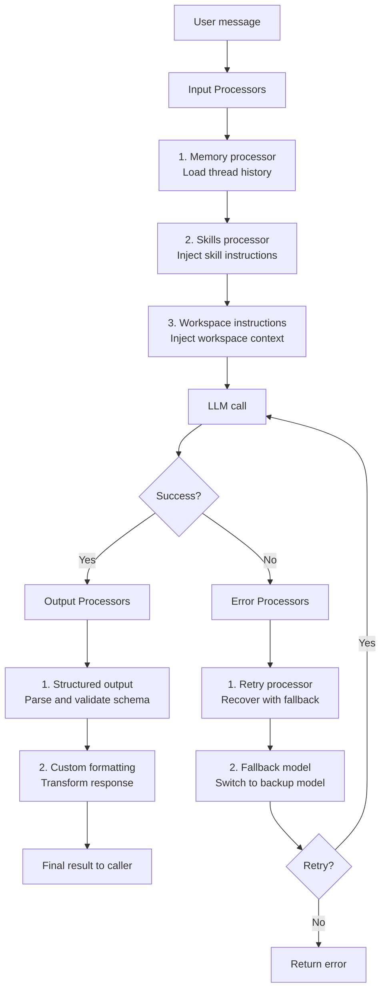
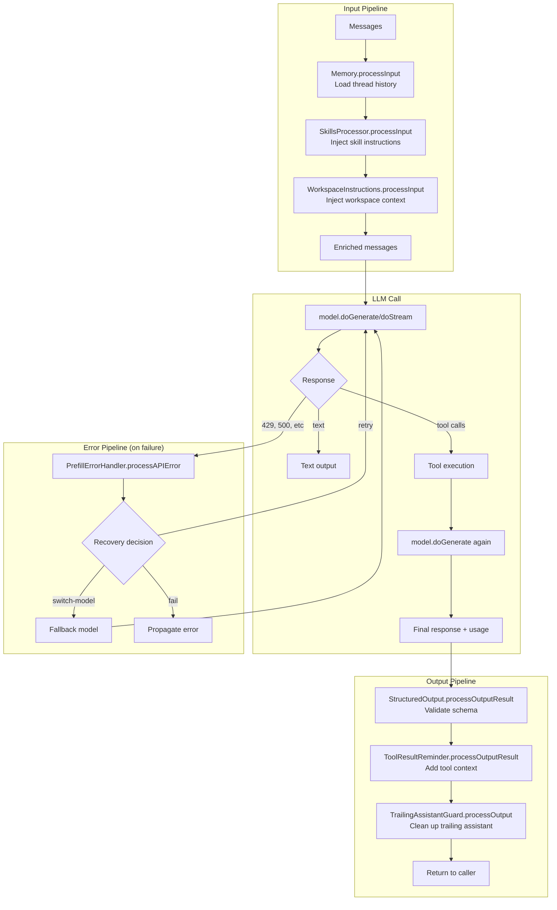

# Mastra -- Processor Pipeline

## Overview

Mastra introduces a unique **processor pipeline** -- a chain of transformations that run before and after every LLM interaction. Input processors transform messages before they reach the LLM, output processors transform responses after the LLM returns, and error processors handle failures with custom recovery logic.

**Key insight:** Processors are not middleware in the traditional sense. They are workflow steps with full access to the agent's state: messages, memory, tools, storage, observability context, and a shared per-request state map. This makes them more powerful than Pi's extensions or Hermes's plugin system.

## Architecture



## Processor Interface

```typescript
// processors/index.ts
export interface Processor {
  readonly id: string;
  name: string;

  // Input: transform messages before LLM
  processInput?(args: ProcessInputArgs): Promise<ProcessInputResult> | ProcessInputResult;

  // Input step: transform before each workflow step
  processInputStep?(args: ProcessInputStepArgs): Promise<ProcessInputStepResult | void>;

  // Output: transform after LLM result resolved
  processOutputResult?(args: ProcessOutputResultArgs): Promise<void>;

  // Output stream: transform streaming chunks
  processOutput?(chunk: ChunkType, state: Record<string, unknown>): Promise<ChunkType | void>;

  // Error: handle failures and decide recovery
  processAPIError?(args: ProcessAPIErrorArgs): Promise<ProcessAPIErrorResult | void>;
}
```

## Processor Context

Every processor method receives a rich context:

```typescript
interface ProcessorContext {
  abort: (reason?: string, options?: TripWireOptions) => never;  // Abort processing
  requestContext?: RequestContext;                               // Request-scoped data
  retryCount: number;                                            // Current retry count
  writer?: ProcessorStreamWriter;                                // Stream custom chunks
  abortSignal?: AbortSignal;                                     // Parent abort signal
  // Plus observability context (traceId, spanId, etc.)
}

interface ProcessorMessageContext extends ProcessorContext {
  messages: MastraDBMessage[];    // Current messages
  messageList: MessageList;       // MessageList instance
}
```

**Aha moment:** The `state: Record<string, unknown>` is shared across ALL processor methods within a single request. This means an input processor can store data that an output processor reads later. It's like a request-scoped bag for inter-processor communication.

## Processor Chain Detail



## Input Processors

Input processors transform or enrich messages before the LLM call:

```typescript
// Built-in input processors:

// 1. Memory processor - loads thread history, injects working memory
class Memory implements Processor {
  async processInput({ messages, messageList, state }) {
    const threadMessages = await this.storage.getMessages(...);
    messageList.addMessages(threadMessages);
    return messageList;
  }
}

// 2. Skills processor - injects skill instructions
class SkillsProcessor implements Processor {
  async processInput({ messages, systemMessages }) {
    const skills = this.getSkillsForMessage(messages);
    systemMessages.push({ role: 'system', content: skills.instructions });
    return { messages, systemMessages };
  }
}

// 3. Workspace instructions processor
class WorkspaceInstructionsProcessor implements Processor {
  async processInput({ messages, systemMessages }) {
    systemMessages.push({ role: 'system', content: this.workspace.instructions });
    return { messages, systemMessages };
  }
}
```

## Output Processors

Output processors transform the LLM response:

```typescript
// 1. Structured output processor - parses and validates schema
class StructuredOutputProcessor implements Processor {
  async processOutputResult({ result, state }) {
    // Validate result against schema
    const parsed = this.schema.safeParse(result);
    if (!parsed.success) {
      throw new Error(`Structured output validation failed: ${parsed.error.message}`);
    }
    state.structuredOutput = parsed.data;
  }
}

// 2. Streaming output processor - transforms chunks in real-time
class CustomFormatter implements Processor {
  async processOutput(chunk, state) {
    if (chunk.type === 'text-delta') {
      // Transform text (e.g., markdown to HTML)
      return { ...chunk, text: markdownToHtml(chunk.text) };
    }
    return chunk;
  }
}
```

## Error Processors

Error processors handle LLM failures and decide recovery strategy:

```typescript
// processors/prefill-error-handler.ts
class PrefillErrorHandler implements Processor {
  async processAPIError({ error, retryCount, state }) {
    if (error.status === 429 && retryCount < this.maxRetries) {
      return { action: 'retry', delay: this.backoff(retryCount) };
    }
    if (error.status === 500 && retryCount < this.maxRetries) {
      return { action: 'switch-model', model: this.fallbackModel };
    }
    return { action: 'fail' };
  }
}
```

The `ProcessAPIErrorResult` options:
- `{ action: 'retry', delay?: number }` -- Retry the same model
- `{ action: 'switch-model', model: MastraModelConfig }` -- Switch to fallback model
- `{ action: 'fail' }` -- Let the error propagate

## Processor Runner

```typescript
// processors/runner.ts
export class ProcessorRunner {
  async processInput(args: ProcessInputArgs): Promise<ProcessInputResult> {
    let result = args.messageList;
    for (const processor of this.inputProcessors) {
      if (processor.processInput) {
        result = await processor.processInput({ ...args, messages: result });
      }
    }
    return result;
  }

  async processOutputResult(args: ProcessOutputResultArgs): Promise<void> {
    for (const processor of this.outputProcessors) {
      if (processor.processOutputResult) {
        await processor.processOutputResult(args);
      }
    }
  }

  async processAPIError(args: ProcessAPIErrorArgs): Promise<ProcessAPIErrorResult | void> {
    for (const processor of this.errorProcessors) {
      if (processor.processAPIError) {
        const result = await processor.processAPIError(args);
        if (result) return result;  // First processor that returns result wins
      }
    }
  }
}
```

**Aha moment:** Error processors use a "first match wins" strategy. The first error processor that returns a result determines the recovery action. This allows a chain of specialized error handlers: one for rate limits, one for timeouts, one for auth errors, etc.

## Processor State Management

```typescript
// processors/runner.ts
export class ProcessorState<OUTPUT> {
  private inputAccumulatedText = '';
  private outputAccumulatedText = '';
  private outputChunkCount = 0;
  public customState: Record<string, unknown> = {};
  public streamParts: ChunkType<OUTPUT>[] = [];
  public span?: Span<SpanType.PROCESSOR_RUN>;
}
```

ProcessorState persists across loop iterations and is shared by all processor methods. This enables:
- Accumulating text across streaming chunks
- Tracking processor-specific metrics
- Sharing data between input and output processors

## Processor as Workflow

Processors can be workflows, not just single functions:

```typescript
type InputProcessorOrWorkflow = InputProcessor | AnyWorkflow;
type OutputProcessorOrWorkflow = OutputProcessor | AnyWorkflow;
type ErrorProcessorOrWorkflow = ErrorProcessor | AnyWorkflow;

function isProcessorWorkflow(p: InputProcessorOrWorkflow): boolean {
  return p instanceof Workflow;
}
```

When a processor is a workflow:
1. The workflow runs as a step in the agent loop
2. The workflow can have multiple steps with suspension points
3. The workflow result is used as the processor output

**Aha moment:** This means a processor can be a multi-step workflow with human-in-the-loop approval, async operations, and complex branching logic. For example, an input processor that runs a RAG pipeline with multiple retrieval steps, or an output processor that requires human review before emitting the response.

## Retry Logic

```typescript
// From agent configuration
{
  maxProcessorRetries?: number;  // Budget for processor-triggered retries
}
```

- Input/output processor retries require `maxProcessorRetries` to be explicitly set
- Error processor retries from `processAPIError` default to 10 when errorProcessors are configured
- The `retryCount` in ProcessorContext tracks the current count

## Trailing Assistant Guard

```typescript
// processors/trailing-assistant-guard.ts
export class TrailingAssistantGuard {
  // Prevents trailing assistant messages without content
  // Handles edge cases with Claude 4.6+ message format
}
```

The guard ensures the message list doesn't end with an empty assistant message, which would cause API errors.

## Built-in Processors

| Processor | Type | Purpose |
|-----------|------|---------|
| Memory | Input | Load thread history, inject working memory |
| SkillsProcessor | Input | Inject skill instructions |
| WorkspaceInstructionsProcessor | Input | Inject workspace context |
| StructuredOutputProcessor | Output | Parse and validate structured output |
| PrefillErrorHandler | Error | Handle prefill/retry errors |
| ToolResultReminder | Output | Add tool result context to response |
| TrailingAssistantGuard | Output | Clean up trailing assistant messages |

## Key Files

```
processors/index.ts             Processor interface and types
processors/runner.ts            ProcessorRunner -- executes processor chain
processors/step-schema.ts       Processor step schema validation
processors/span-payload.ts      Observability span payloads
processors/prefill-error-handler.ts  Error processor for prefill failures
processors/tool-result-reminder.ts  Output processor for tool context
processors/trailing-assistant-guard.ts  Output processor for message cleanup
processors/processors/          ← Built-in processors
├── skills.ts                   SkillsProcessor
├── workspace-instructions.ts   WorkspaceInstructionsProcessor
└── structured-output.ts        StructuredOutputProcessor
```

## Related Documents

- [02-agent-core.md](./02-agent-core.md) -- Agent class that configures processors
- [03-agent-loop.md](./03-agent-loop.md) -- Processors in the loop
- [06-memory-system.md](./06-memory-system.md) -- Memory as a processor

## Source Paths

```
packages/core/src/processors/
├── index.ts                  ← Processor interface, types
├── runner.ts                 ← ProcessorRunner, ProcessorState
├── step-schema.ts            ← ProcessorStepOutput schema
├── span-payload.ts           ← Observability span payloads
├── prefill-error-handler.ts  ← Error processor for prefill failures
├── tool-result-reminder.ts   ← Output processor
├── trailing-assistant-guard.ts  ← Output processor
├── processors/               ← Built-in processors
│   ├── skills.ts             ← SkillsProcessor
│   ├── workspace-instructions.ts  ← WorkspaceInstructionsProcessor
│   └── structured-output.ts  ← StructuredOutputProcessor
└── memory/                   ← Memory processors (semantic recall, working memory)
```
