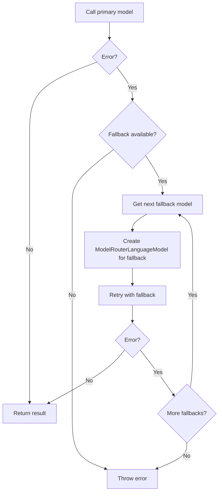
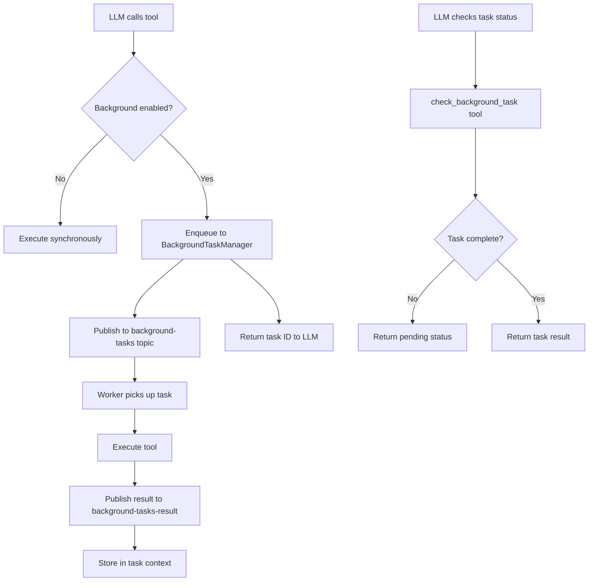

# Mastra -- Multi-Model Execution

## Overview

Mastra supports multi-model execution through three mechanisms: **model fallback chains** (automatic failover on error), **background task dispatch** (async tool execution without blocking the loop), and **sub-agent delegation** (calling other agents with message filtering and feedback hooks).

## Model Fallbacks

### Configuration

Model fallbacks are configured at the Agent level as an array:

```typescript
// agent/agent.ts
const agent = new Agent({
  model: [
    { model: 'openai/gpt-5', maxRetries: 2 },
    { model: 'anthropic/claude-sonnet-4-6', maxRetries: 1 },
    { model: 'google/gemini-2.5-pro', maxRetries: 1 },
  ],
});
```

### Fallback Entry Resolution

```typescript
// agent/agent.ts
static toFallbackEntry(model: MastraModelConfig, maxRetries: number) {
  return {
    id: model.modelId,
    model,
    maxRetries,
    enabled: true,
    modelSettings?: DynamicArgument<ModelFallbackSettings>,
    providerOptions?: DynamicArgument<ProviderOptions>,
    headers?: DynamicArgument<Record<string, string>>,
  };
}
```

### Fallback Execution

When the primary model fails:



**Aha moment:** Each fallback model gets its own `ModelRouterLanguageModel` instance, resolved through the full gateway pipeline. This means fallback models can use different gateways, providers, and configurations -- they're not limited to the same provider as the primary.

### Error Processor Integration

Model fallbacks also integrate with error processors:

```typescript
// Error processor can trigger model switch
class FallbackErrorHandler implements Processor {
  async processAPIError({ error, retryCount }) {
    if (error.status === 429) {
      return { action: 'switch-model', model: fallbackModel };
    }
  }
}
```

When the error processor returns `{ action: 'switch-model' }`, the Agent creates a new `ModelRouterLanguageModel` with the specified model and retries.

## Background Tasks

### Configuration

```typescript
// background-tasks/types.ts
interface AgentBackgroundConfig {
  disabled?: boolean;
  tools?: 'all' | Record<string, ToolBackgroundConfig>;
  waitTimeoutMs?: number;
}

interface ToolBackgroundConfig {
  enabled: boolean;
  waitTimeoutMs?: number;  // How long to wait before checking result
}
```

### BackgroundTaskManager

```typescript
// background-tasks/manager.ts
export class BackgroundTaskManager {
  config: {
    globalConcurrency: 10;      // Max concurrent tasks globally
    perAgentConcurrency: 5;     // Max concurrent tasks per agent
    backpressure: 'queue';      // Queue or reject when full
    defaultTimeoutMs: 300_000;  // 5 minute default timeout
  };

  // Pubsub-based task dispatch
  async enqueueTask(tool, input, context): Promise<EnqueueResult>;
  async checkTask(taskId: string): Promise<BackgroundTaskStatus>;
  async listTasks(filter?: TaskFilter): Promise<TaskListResult>;
  async cancelTask(taskId: string): Promise<void>;
}
```

**Aha moment:** The BackgroundTaskManager uses pub/sub for task dispatch and result collection. This means tasks can be processed by **separate worker processes**, not just threads in the same process. The worker group `background-task-workers` subscribes to the `background-tasks` topic and picks up tasks.

### Background Tool Dispatch

When a tool is configured for background execution:



### Sub-Agent Background Derivation

When a sub-agent is called as a tool, the parent automatically derives background config:

```typescript
// agent/agent.ts
private async deriveSubAgentBackgroundConfig(subAgent, requestContext) {
  // 1. Check if sub-agent has backgroundTasks config
  if (subAgentBgConfig?.disabled !== true && subAgentBgConfig?.tools) {
    return { enabled: true, waitTimeoutMs: subAgentBgConfig.waitTimeoutMs };
  }

  // 2. Check if any sub-agent tool has background.enabled === true
  for (const tool of Object.values(subAgentTools)) {
    if (tool.background?.enabled === true) {
      return { enabled: true, waitTimeoutMs: subAgentBgConfig?.waitTimeoutMs };
    }
  }
}
```

**Aha moment:** The parent agent inspects the sub-agent's tools to determine if background execution is needed. This is self-describing -- the sub-agent doesn't need to tell the parent about its async requirements.

## Sub-Agent Delegation

### Delegation Flow

```mermaid
flowchart TD
    PARENT[Parent agent iteration]
    PARENT --> TOOL{Tool call to sub-agent?}
    TOOL -->|No| CONTINUE[Continue]
    TOOL -->|Yes| FILTER[onMessageFilter<br/>Select messages to share]
    FILTER --> START[onDelegationStart<br/>Pre-delegation hook]
    START --> MODIFY{Modify prompt?}
    MODIFY -->|Yes| NEWPROMPT[Use modified prompt]
    MODIFY -->|No| CALL[Call sub-agent.generate]
    NEWPROMPT --> CALL
    CALL --> RESULT{Success?}
    RESULT -->|Yes| COMPLETE[onDelegationComplete<br/>with bail() support]
    RESULT -->|No| RETRY[Retry or fail]
    COMPLETE --> FEEDBACK{Return feedback?}
    FEEDBACK -->|Yes| APPEND[Append feedback to messages]
    FEEDBACK -->|No| RETURN[Return sub-agent result]
    APPEND --> RETURN
```

### Delegation Hooks

```typescript
// agent/agent.types.ts
interface DelegationConfig {
  // Filter messages shared with sub-agent
  onMessageFilter?: (ctx: MessageFilterContext) => MastraDBMessage[];

  // Before sub-agent call
  onDelegationStart?: (ctx: DelegationStartContext) => DelegationStartResult;

  // After sub-agent returns
  onDelegationComplete?: (ctx: DelegationCompleteContext) => DelegationCompleteResult;

  // Max iterations for this delegation
  maxIterations?: number;
}

interface DelegationCompleteContext {
  // ... tool results, messages, etc.
  bail: () => void;  // Stop all other concurrent delegations
}
```

**Aha moment:** The `bail()` function in `DelegationCompleteContext` allows stopping all other concurrent delegations. If multiple tool calls delegate to different sub-agents simultaneously, one sub-agent's result can trigger `bail()` to cancel the others. This is useful when one sub-agent's answer makes the others irrelevant.

### Message Filtering

The `onMessageFilter` hook controls what context the sub-agent sees:

```typescript
onMessageFilter: (ctx) => {
  // ctx.messages = ALL parent messages
  // ctx.prompt = the delegated prompt
  // ctx.iteration = current iteration number
  // ctx.parentAgentName = parent agent name

  // Return only relevant messages
  return ctx.messages.filter(m =>
    m.role === 'user' ||
    m.toolResults?.length > 0
  );
}
```

## Comparison with Pi and Hermes

| Aspect | Pi | Hermes | Mastra |
|--------|-----|--------|--------|
| Fallbacks | Model switching in AI package | Credential pool rotation | Agent-level fallback chain |
| Background | Promise.all (concurrent) | ThreadPoolExecutor (parallel) | Pubsub-based (distributed) |
| Sub-agents | Not native | Sub-agent patterns | First-class with hooks |
| Message filtering | N/A | N/A | onMessageFilter hook |
| Cancellation | N/A | N/A | bail() function |
| Worker model | Same process | Same process (threads) | Separate worker processes |

## Key Files

```
agent/agent.ts                  Fallback configuration, sub-agent derivation
loop/types.ts                   LoopOptions with model array
background-tasks/manager.ts     BackgroundTaskManager (pubsub-based)
background-tasks/types.ts       Background task types
```

## Related Documents

- [02-agent-core.md](./02-agent-core.md) -- Agent class with fallback config
- [04-tool-system.md](./04-tool-system.md) -- Background tool dispatch
- [05-model-router.md](./05-model-router.md) -- Model resolution for fallbacks

## Source Paths

```
packages/core/src/agent/agent.ts          ← Model fallbacks, sub-agent delegation
packages/core/src/background-tasks/
├── manager.ts                            ← BackgroundTaskManager
├── types.ts                              ← BackgroundTask, EnqueueResult
└── resolve-config.ts                     ← Background config resolution

packages/core/src/loop/types.ts           ← LoopOptions with models array
```
