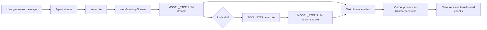

# Mastra -- Data Flow

## Overview

This document traces the end-to-end flow of a message through Mastra -- from user input to LLM response, including processor pipelines, memory lookup, tool execution, and output transformation.

## Full Request Lifecycle

```mermaid
sequenceDiagram
    participant User
    participant Agent
    participant Exec as #execute()
    participant Memory
    participant InProc as Input Processors
    participant Router as Model Router
    participant Loop as Agent Loop
    participant Tool as Tool Execution
    participant OutProc as Output Processors
    participant ErrProc as Error Processors
    participant Storage

    User->>Agent: generate("Hello")
    Agent->>Exec: #execute(options)
    Exec->>Exec: Validate request context
    Exec->>Exec: Resolve model via getLLM()
    Exec->>Memory: query({ threadId, resourceId })
    Memory->>Storage: Load thread messages
    Storage-->>Memory: Message history
    Memory->>Memory: Apply semantic recall (if enabled)
    Memory->>Memory: Load working memory
    Memory-->>Exec: MessageList
    Exec->>InProc: processInput(messages)
    InProc->>InProc: Memory processor injects history
    InProc->>InProc: Skills processor injects instructions
    InProc-->>Exec: Enriched messages
    Exec->>Router: ModelRouterLanguageModel.doGenerate()
    Router->>Loop: workflowLoopStream()

    Loop->>Loop: MODEL_STEP: Call LLM
    Loop->>Loop: Parse response
    Loop->>Tool{Tool calls?}
    Tool->>Tool: TOOL_STEP: Execute tools
    Tool->>Tool: Collect results
    Tool->>Loop: Append results, retry LLM

    Loop-->>Exec: MastraModelOutput stream
    Exec->>OutProc: processOutputResult(result)
    OutProc->>OutProc: Validate structured output
    OutProc-->>Exec: Transformed result
    Exec-->>Agent: FullOutput
    Agent-->>User: Response text
```

## Step 1: Agent.generate()

```typescript
// agent/agent.ts
async generate(messages, options): Promise<FullOutput<TOutput>> {
  // 1. Validate request context against schema
  await this.#validateRequestContext(options?.requestContext);

  // 2. Merge with default options (supports dynamic functions)
  const defaultOptions = await this.getDefaultOptions({ requestContext: options?.requestContext });
  const mergedOptions = deepMerge(defaultOptions, options);

  // 3. Resolve LLM (model router)
  const llm = await this.getLLM({ requestContext: mergedOptions.requestContext, model: mergedOptions.model });

  // 4. Execute
  const result = await this.#execute({ ...mergedOptions, messages, methodType: 'generate' });

  // 5. Return full output
  return await result.result.getFullOutput();
}
```

## Step 2: #execute() -- Context Setup

```typescript
// agent/agent.ts
async #execute({ methodType, resumeContext, ...options }) {
  // 1. Resume from snapshot (suspended workflows)
  const existingSnapshot = resumeContext?.snapshot;

  // 2. Inject browser context
  if (this.#browser) { /* ... */ }

  // 3. Resolve thread ID
  const threadId = resolveThreadIdFromArgs({ ... });
  const resourceId = /* from context or options */;

  // 4. Create run ID
  const runId = options.runId || randomUUID();

  // 5. Create observability span
  const agentSpan = getOrCreateSpan({ type: SpanType.AGENT_RUN, ... });

  // 6. Convert tools
  const tools = await this.convertTools({ requestContext, methodType });
}
```

## Step 3: Message List Construction

```typescript
// Build message list from memory + user input
const messageList = new MessageList(inputMessages);

// Query memory for existing messages
if (memory) {
  const memoryMessages = await memory.query({ threadId, resourceId });
  messageList.addMessages(memoryMessages);
}

// Filter out disabled tools
messageList.filter(this.#getFilterToolsFn());
```

## Step 4: Input Processor Pipeline

```
User message
  ↓
InputProcessor[0].processInput()
  → Memory processor: loads thread history, injects working memory
  ↓
InputProcessor[1].processInput()
  → Skills processor: injects skill instructions
  ↓
InputProcessor[2].processInput()
  → Workspace instructions: inject workspace context
  ↓
Enriched message list → LLM
```

## Step 5: LLM Call via Model Router

```
Enriched messages
  ↓
ModelRouterLanguageModel.doGenerate()
  ↓
findGatewayForModel("openai/gpt-5")
  ↓
MastraGateway.getModel("openai/gpt-5")
  ↓
createOpenAI({ apiKey, baseURL }).doGenerate(options)
  ↓
LLM response: { text, toolCalls, usage, finishReason }
```

## Step 6: Tool Execution

```
LLM returns tool calls
  ↓
Validate input schemas
  ↓
{ requireApproval? }
  ├─ Yes → Suspend workflow, wait for approval
  └─ No → { background enabled? }
            ├─ Yes → Enqueue to BackgroundTaskManager, return task ID
            └─ No → Execute tool handler
                      ↓
                    Validate output schema
                      ↓
                    Return result
  ↓
Append tool results to messages
  ↓
Call LLM again with results
```

## Step 7: Output Processor Pipeline

```
LLM response (text + tool calls)
  ↓
OutputProcessor[0].processOutputResult()
  → Structured output processor: validates schema
  ↓
OutputProcessor[1].processOutputResult()
  → Custom formatter: transforms response
  ↓
OutputProcessor[2].processOutputResult()
  → Tool result reminder: adds context
  ↓
Final result → Agent.generate() return value
```

## Step 8: Error Recovery

If any step fails:

```
Error in LLM call (429, 500, etc.)
  ↓
ErrorProcessor[0].processAPIError()
  → Prefill error handler: { action: 'retry', delay: 1000 }
  ↓
Retry with same model
  ↓
{ Still failing? }
  ├─ Yes → ErrorProcessor[1].processAPIError()
  │         → Fallback handler: { action: 'switch-model', model: fallbackModel }
  │         ↓
  │         Retry with fallback model
  └─ No → Continue normal flow
```

## Streaming Flow



In streaming mode, each processor's `processOutput()` method receives chunks in real-time:

```typescript
async processOutput(chunk: ChunkType, state: Record<string, unknown>) {
  if (chunk.type === 'text-delta') {
    // Transform each text chunk
    return { ...chunk, text: transform(chunk.text) };
  }
  return chunk;
}
```

## Related Documents

- [02-agent-core.md](./02-agent-core.md) -- Agent.generate() and #execute()
- [03-agent-loop.md](./03-agent-loop.md) -- Workflow-based loop execution
- [05-model-router.md](./05-model-router.md) -- Model resolution
- [07-processors.md](./07-processors.md) -- Processor pipeline

## Source Paths

```
packages/core/src/agent/agent.ts          ← generate(), stream(), #execute()
packages/core/src/loop/loop.ts            ← loop() entry point
packages/core/src/loop/workflows/stream.ts  ← workflowLoopStream()
packages/core/src/processors/runner.ts    ← ProcessorRunner
packages/core/src/llm/model/router.ts     ← ModelRouterLanguageModel
packages/core/src/tools/tool.ts           ← Tool execution
packages/core/src/memory/memory.ts        ← Memory query
```
