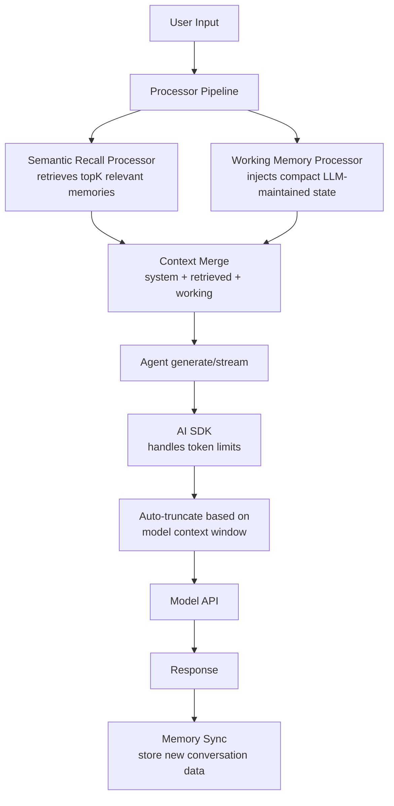

# Mastra -- Context Management & Compression

## Overview

Mastra approaches context management differently from both Pi and Hermes. Rather than implementing explicit token-level compression or summarization, Mastra relies on **memory-driven context management** -- using semantic recall to retrieve only relevant context, working memory to maintain a compact evolving state, and workflow-based suspension to handle context boundaries naturally. The framework delegates token limits to the underlying AI SDK, which handles truncation based on the model's context window.

**Key insight:** Mastra doesn't have a traditional "context compressor." Instead, it uses a combination of memory retrieval (topK semantic recall), working memory (LLM-maintained compact state), and the AI SDK's built-in context window management. This is a deliberate architectural choice -- the framework focuses on **intelligent context selection** rather than **post-hoc compression**.

## Context Architecture



## Memory-Driven Context Selection

### Semantic Recall Processor

The semantic recall processor retrieves only contextually relevant memories, keeping the conversation focused without loading entire history:

```typescript
// processors/memory/semantic-recall.ts
export const semanticRecall = defineProcessor({
  name: 'semantic-recall',
  type: 'input',
  configSchema: z.object({
    topK: z.number().default(3),           // How many memories to retrieve
    messageRange: z.object({
      before: z.number().default(2),       // Messages before the triggering one
      after: z.number().default(2),        // Messages after the triggering one
    }).default({ before: 2, after: 2 }),
    includeHidden: z.boolean().default(false),
  }),
});
```

The processor fetches `topK` memories by semantic similarity, then injects the surrounding message context (2 before, 2 after by default). This means the context window contains **highly relevant fragments** rather than the full conversation history.

### Working Memory Processor

Working memory is a compact, LLM-maintained state that evolves with each interaction:

```typescript
// processors/memory/working-memory.ts
export const workingMemory = defineProcessor({
  name: 'working-memory',
  type: 'input',
  configSchema: z.object({
    template: z.string().optional(),       // Custom memory template
    relevanceThreshold: z.number().default(0.7),
  }),
});
```

Working memory acts as a **natural compression layer** -- the LLM extracts and maintains only the essential facts, preferences, and decisions from the conversation, discarding noise automatically.

## How Mastra Handles Context Limits

### AI SDK Auto-Truncation

Mastra delegates context window management to the AI SDK (Vercel AI SDK v5/v6). The SDK handles:

1. **Model context window detection** -- each model declares its context size
2. **Message ordering** -- system messages preserved, older messages dropped first
3. **Token counting** -- respects the model's actual token limits
4. **Graceful degradation** -- drops oldest context before system prompts

```typescript
// packages/core/src/_types/ai-sdk.types.d.ts
// AI SDK handles context window management internally:
// - maxTokens limits output, not input
// - context window truncation is automatic
// - system messages are always preserved
```

### No Explicit Compression Trigger

Unlike Pi (absolute token reserve) or Hermes (percentage-based trigger), Mastra has **no explicit compression trigger**. Context management is proactive:

| Approach | How it works |
|----------|-------------|
| Semantic Recall | Only load relevant context, not full history |
| Working Memory | LLM-maintained compact state (~50-200 tokens) |
| AI SDK Truncation | Automatic at model context window boundary |
| Workflow Suspension | Natural context boundaries via step suspension |

## Comparison: Pi vs Hermes vs Mastra

| Aspect | Pi | Hermes | Mastra |
|--------|----|--------|--------|
| **Strategy** | Token reserve | Percentage trigger | Memory-driven selection |
| **Compression** | Summarize old turns | GEPA-based compression | Working memory (LLM-maintained) |
| **Trigger** | Tokens remaining < N | Context > X% of window | No trigger (proactive) |
| **Tool Call Integrity** | Preserved during summarization | Tool-call/result pairs kept intact | Memory stores tool results as structured data |
| **Anti-thrashing** | Skip if last compression < N turns | Track compression history | N/A (no post-hoc compression) |
| **Context Window** | Model-declared | Model-declared | AI SDK managed |

### Pi's Token Reserve Approach

Pi tracks absolute token counts and triggers compression when `tokens_remaining < threshold`. It summarizes older conversation turns while preserving tool-call/result pairs. The summarization is aggressive but maintains structural integrity.

### Hermes's Percentage-Based Trigger

Hermes compresses when the context exceeds a percentage of the model's window (e.g., 80%). It uses a GEPA-based compression approach that prioritizes keeping evolution-relevant information -- the data that would be valuable for RL training traces.

### Mastra's Proactive Selection

Mastra never compresses post-hoc. Instead:
1. **Semantic recall** loads only topK relevant memories (not full history)
2. **Working memory** maintains a compact evolving state
3. **AI SDK** handles token limits automatically
4. **Workflow suspension** creates natural context boundaries

## Context Integrity During Tool Execution

Mastra preserves tool-call/result integrity through its streaming architecture. The `ModelSpanTracker` class tracks tool execution as part of the conversation context:

```typescript
// observability/mastra/src/model-tracing.ts
case 'tool-call': {
  this.#endChunkSpan({
    toolName: acc.toolName,
    toolCallId: acc.toolCallId,
    toolInput,  // Parsed JSON, not raw text
  });
  break;
}

case 'tool-result': {
  const metadata = { toolCallId, toolName, isError, dynamic, providerExecuted };
  this.#createEventSpan(chunk.type, providerExecuted ? result : undefined, { metadata });
  break;
}
```

Tool calls and their results are stored as structured pairs in memory, ensuring that compression (via memory retrieval) always retrieves both sides of a tool interaction.

## Workflow Suspension as Context Boundary

Mastra's unique workflow-based architecture creates natural context boundaries:

```typescript
// When a step suspends, context is cleanly partitioned:
// 1. Pre-suspension context is preserved in workflow state
// 2. Post-resumption starts with fresh context + workflow state
// 3. No need for compression -- context is naturally bounded
```

This means long-running agent conversations don't accumulate unbounded context -- each workflow step operates within its own context window, with only essential state carried forward.

## Key Optimizations

### 1. TopK Retrieval Limits Context Growth

By fetching only `topK` (default 3) memories, Mastra caps the maximum context injected from memory, regardless of conversation length.

### 2. Working Memory Stays Compact

Working memory is LLM-maintained and naturally stays under ~200 tokens -- the LLM extracts only essential information, acting as an intelligent filter.

### 3. Message Range Windowing

The `messageRange: { before: 2, after: 2 }` configuration ensures that semantic recall injects only the local context around each relevant memory, not the entire conversation thread.

## What Mastra Does NOT Do

| Feature | Why Not |
|---------|---------|
| Token counting | Delegated to AI SDK |
| Summarization | Working memory handles this via LLM extraction |
| Compression triggers | Proactive context selection makes them unnecessary |
| Anti-thrashing logic | No post-hoc compression means no thrashing risk |
| Context window detection | AI SDK provides this |

## Related Documents

- [06-memory-system.md](./06-memory-system.md) -- Semantic recall and working memory configuration
- [07-processors.md](./07-processors.md) -- Processor pipeline that runs context selection
- [03-agent-loop.md](./03-agent-loop.md) -- Workflow-based loop with natural context boundaries
- [10-comparison.md](./10-comparison.md) -- Pi vs Hermes vs Mastra architecture comparison

## Source Paths

```
packages/core/src/
├── memory/
│   ├── memory.ts                 ← MastraMemory ABC, memoryDefaultOptions
│   └── types.ts                  ← Memory configuration types
├── processors/memory/
│   ├── semantic-recall.ts        ← topK retrieval with messageRange windowing
│   └── working-memory.ts         ← LLM-maintained compact state
├── _types/ai-sdk.types.d.ts      ← AI SDK type definitions for context management
└── processor-provider/
    └── index.ts                  ← Processor provider interface

observability/mastra/src/
└── model-tracing.ts              ← Tool call/result pair tracking in traces
```
