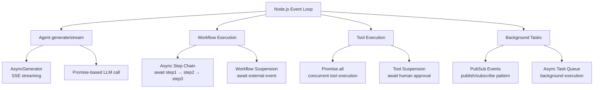

# Mastra -- Async/TypeScript Patterns

## Overview

Mastra is a **native async TypeScript framework** -- every operation flows through the event loop naturally. Unlike Hermes (sync-first with asyncio bridges) or Pi (async run() but mostly linear), Mastra's entire architecture is built around TypeScript's Promise-based concurrency: workflow steps execute as async chains, streaming uses async generators, background tasks use pubsub events, and tool execution leverages Promise.all for parallelism.

**Key insight:** TypeScript's single-threaded async model eliminates the sync/async bridging complexity that Hermes faces. There's no `asyncio.to_thread()`, no ThreadPoolExecutor, no threading.Lock. Everything is async/await, Promise-based, and runs on the Node.js event loop. Concurrency is controlled by `Promise.all`, semaphores, and pubsub patterns.

## Async Architecture



## Async Generators: Streaming Pipeline

Mastra's streaming is built on async generators with `TransformStream` for pipeline composition:

```typescript
// packages/core/src/llm/model/model.ts (simplified)
async stream(messages, options) {
  // Returns an async generator that yields chunks
  const response = await provider.stream(messages, options);

  // Wrap with TransformStream for processor integration
  return response.pipeThrough(
    new TransformStream({
      async transform(chunk, controller) {
        // Run output processors on each chunk
        const processed = await processorRunner.processOutput(chunk);
        controller.enqueue(processed);
      },
    })
  );
}
```

### Stream Types and Chunk Handling

The streaming pipeline handles multiple chunk types, each with different async semantics:

```typescript
// observability/mastra/src/model-tracing.ts
wrapStream<T extends { pipeThrough: Function }>(stream: T): T {
  return stream.pipeThrough(
    new TransformStream({
      transform: (chunk, controller) => {
        // Capture time-to-first-token on first content
        switch (chunk.type) {
          case 'text-delta':
          case 'tool-call-delta':
          case 'reasoning-delta':
            this.#captureCompletionStartTime();
            break;
        }

        controller.enqueue(chunk);

        // Handle chunk span tracking based on chunk type
        switch (chunk.type) {
          case 'text-start': case 'text-delta': case 'text-end':
            this.#handleTextChunk(chunk);
            break;
          case 'tool-call-input-streaming-start':
          case 'tool-call-delta':
          case 'tool-call-input-streaming-end':
          case 'tool-call':
            this.#handleToolCallChunk(chunk);
            break;
          case 'step-start':
            this.startStep(chunk.payload);
            break;
          case 'step-finish':
            this.#endStepSpan(chunk.payload);
            break;
          // 20+ chunk types handled...
        }
      },
    })
  ) as T;
}
```

The `TransformStream` is a **synchronous transform** -- `transform()` is called for each chunk as it arrives. This is more efficient than an async transform because it doesn't create a Promise per chunk.

## Promise-Based Tool Execution

Tools execute concurrently via `Promise.all` with error isolation:

```typescript
// packages/core/src/agent/agent.ts (simplified)
async #executeTools(toolCalls) {
  // Run all tool calls in parallel
  const results = await Promise.allSettled(
    toolCalls.map(async (toolCall) => {
      const tool = this.tools.get(toolCall.name);
      if (!tool) throw new Error(`Tool not found: ${toolCall.name}`);

      // Execute tool with timeout
      const result = await Promise.race([
        tool.execute(toolCall.input, context),
        new Promise((_, reject) =>
          setTimeout(() => reject(new Error('Tool timeout')), tool.config?.timeout ?? 60000)
        ),
      ]);

      return { toolCallId: toolCall.id, result };
    })
  );

  // Separate successes and failures
  return results.map((r, i) =>
    r.status === 'fulfilled'
      ? { toolCallId: toolCalls[i].id, result: r.value }
      : { toolCallId: toolCalls[i].id, error: r.reason }
  );
}
```

### Tool Suspension (Async Wait for Human Approval)

When a tool requires human approval, the agent suspends:

```typescript
// Tool suspension pattern
async executeWithApproval(toolCall, context) {
  // Emit approval request event
  context.events.emit('tool-approval-required', {
    toolCallId: toolCall.id,
    toolName: toolCall.name,
    input: toolCall.input,
  });

  // Wait for external approval signal
  const approval = await new Promise<ApprovalResult>((resolve) => {
    const handler = (result) => {
      if (result.toolCallId === toolCall.id) {
        context.events.off('tool-approval', handler);
        resolve(result);
      }
    };
    context.events.on('tool-approval', handler);
  });

  if (approval.approved) {
    return tool.execute(toolCall.input, context);
  } else {
    throw new Error('Tool execution denied by user');
  }
}
```

## Background Tasks: PubSub Pattern

Mastra's BackgroundTaskManager uses a pubsub pattern for distributed task execution:

```typescript
// packages/core/src/background-tasks/manager.ts
class BackgroundTaskManager {
  #subscribers: Map<string, Set<(data: unknown) => void>> = new Map();

  // Publish an event -- all subscribers get notified
  publish(topic: string, data: unknown) {
    const subs = this.#subscribers.get(topic) ?? new Set();
    for (const subscriber of subs) {
      subscriber(data);  // Sync notification in async context
    }
  }

  // Subscribe to a topic
  subscribe(topic: string, handler: (data: unknown) => void) {
    if (!this.#subscribers.has(topic)) {
      this.#subscribers.set(topic, new Set());
    }
    this.#subscribers.get(topic)!.add(handler);

    // Return unsubscribe function
    return () => this.#subscribers.get(topic)!.delete(handler);
  }
}
```

**Key pattern:** The pubsub is synchronous (`subscriber(data)` not `await subscriber(data)`) because notifications fire in async context -- subscribers should do their own async work. This avoids blocking the publisher on subscriber latency.

## LLM Recording: Async MSW Interception

Mastra's LLM recorder captures and replays streaming responses with async timing:

```typescript
// packages/_llm-recorder/src/llm-recorder.ts
async function captureStreamingResponse(response: Response) {
  const reader = response.body?.getReader();
  if (!reader) return { chunks: [], timings: [] };

  try {
    while (true) {
      const { done, value } = await reader.read();  // Async read
      if (done) break;

      const chunk = decoder.decode(value, { stream: true });
      chunks.push(chunk);

      const now = Date.now();
      timings.push(now - lastTime);  // Capture inter-chunk timing
      lastTime = now;
    }
  } finally {
    reader.releaseLock();  // Ensure lock release even on error
  }
}

// Replay with timing simulation
function createStreamingResponse(recording, options) {
  const stream = new ReadableStream({
    async pull(controller) {
      if (chunkIndex >= chunks.length) {
        controller.close();
        return;
      }

      // Simulate original chunk timing (capped at max delay)
      if (options.replayWithTiming && timings[chunkIndex]) {
        const delay = Math.min(timings[chunkIndex]!, maxDelay);
        if (delay > 0) {
          await new Promise(r => setTimeout(r, delay));
        }
      }

      controller.encode(chunks[chunkIndex]);
      chunkIndex++;
    },
  });

  return new Response(stream, { ... });
}
```

## Comparison: Hermes vs Pi vs Mastra Async Patterns

| Pattern | Hermes (Python) | Pi (TypeScript) | Mastra (TypeScript) |
|---------|----------------|-----------------|---------------------|
| **Main loop** | Sync `while True` | Async `async run()` | Workflow steps (async chain) |
| **Concurrent tools** | ThreadPoolExecutor(max_workers=8) | Promise.all() | Promise.allSettled() with timeout |
| **Streaming** | Sync OpenAI SDK iterator | AsyncGenerator | TransformStream pipeline |
| **Background tasks** | threading.Thread(daemon=True) | agent.run() queue | PubSub event system |
| **Sync/Async bridge** | asyncio.to_thread() | N/A (all async) | N/A (all async) |
| **Thread safety** | threading.Lock, RLock | N/A (single-threaded) | N/A (single-threaded) |
| **Human approval** | Not implemented | Not implemented | await Promise + event listener |
| **Event loop** | Per-operation asyncio.run() | Single Node.js loop | Single Node.js loop |
| **Error isolation** | Future.exception() | Promise.allSettled() | Promise.allSettled() |

### Key Differences

**Hermes needs bridges** because Python's async ecosystem is fragmented. The LLM SDK is sync, so Hermes wraps it in `asyncio.to_thread()`. Concurrent tools need a thread pool. State needs locks.

**Pi is simpler** -- everything is async, but the main loop is essentially a linear `while true { await }` chain. Background tasks queue into the same event loop.

**Mastra is the most async-native** -- workflows are async step chains, tools are Promise.allSettled, streaming is TransformStream, background is pubsub. Every piece is designed for Node.js's single-threaded async model from the ground up.

## Trace Generator: Async Tree Construction

Mastra's trace generator creates hierarchical span trees with proper async parent-child relationships:

```typescript
// observability/_test-utils/src/trace-generator.ts
function generateTrace(opts: GenerateTraceOptions = {}): TracingEvent[] {
  // Generate start events (parents before children - tree order)
  for (const spanInfo of spanTree) {
    const startTime = new Date(currentTime);
    events.push(createTracingEvent(TracingEventType.SPAN_STARTED, span));
  }

  // Generate end events (children before parents - reverse tree order)
  for (let i = nonEventSpans.length - 1; i >= 0; i--) {
    const endTime = new Date(currentTime);
    events.push(createTracingEvent(TracingEventType.SPAN_ENDED, span));
  }

  return events;
}
```

This mimics real async execution: parent spans start first, children complete before parents.

## Async Error Handling and Retries

Mastra handles model errors through the `#execute()` pipeline's error processor workflow, not through inline retry logic. Each `ModelFallbacks` entry has a `maxRetries` field that controls per-model retry attempts:

```typescript
// packages/core/src/agent/agent.ts (lines 121-129)
type ModelFallbacks = {
  id: string;
  model: DynamicArgument<MastraModelConfig>;
  maxRetries: number;      // Retries per fallback entry
  enabled: boolean;
  // ...
}[];

// On failure in #execute(), error processors run.
// If configured, the next enabled fallback model is tried.
// Tool isolation via Promise.allSettled prevents one tool failure
// from killing the entire execution.
```

The model router itself (`ModelRouterLanguageModel`) is stateless — it delegates `doGenerate`/`doStream` to the gateway's underlying SDK client and lets errors propagate up to the Agent's `#execute()` pipeline.

## Key Optimizations

### 1. TransformStream Over Async Transforms

Using `TransformStream` (synchronous transform) instead of async transforms per chunk avoids creating a Promise for every streaming chunk. For a 1000-chunk response, that's 1000 fewer Promise allocations.

### 2. Promise.allSettled for Tool Isolation

`Promise.allSettled` (not `Promise.all`) ensures one failing tool doesn't cancel the others. Each tool's success/failure is captured independently.

### 3. PubSub for Loose Coupling

Background tasks use pubsub rather than direct async calls. This means task producers don't need to await consumers -- the system is decoupled and can scale horizontally.

### 4. Reader Lock Management

The streaming capture uses `reader.releaseLock()` in a `finally` block, ensuring the ReadableStream is always unlocked even if capture fails midway.

## Related Documents

- [03-agent-loop.md](./03-agent-loop.md) -- Workflow-based agent loop with async steps
- [04-tool-system.md](./04-tool-system.md) -- Tool execution with suspension and approval
- [08-multi-model.md](./08-multi-model.md) -- Background task management
- [09-data-flow.md](./09-data-flow.md) -- End-to-end streaming flow

## Source Paths

```
packages/core/src/
├── agent/agent.ts              ← #executeTools with Promise.allSettled, async generate/stream
├── background-tasks/manager.ts  ← PubSub pattern for background execution
├── llm/model/router.ts          ← Async retry with fallback model
└── _llm-recorder/src/
    └── llm-recorder.ts          ← Async stream capture/replay with timing

observability/
└── mastra/src/
    └── model-tracing.ts         ← TransformStream pipeline for span tracking
```
