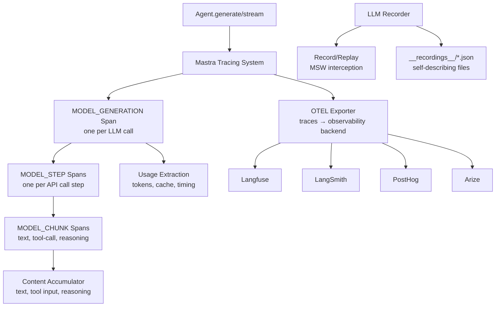

# Mastra -- Observability, Tracing, and Training Traces

## Overview

Mastra's approach to conversation tracing is **observability-first** -- it uses OpenTelemetry-compatible spans to capture model executions, tool calls, and processor events as structured telemetry data. Unlike Hermes's ShareGPT-format trajectory recording (designed for RL training), Mastra's traces are designed for debugging, monitoring, and performance analysis. The LLM recorder provides snapshot-like replay capabilities for testing, while the observability system captures production traces.

**Key insight:** Mastra doesn't have explicit RL training traces. Its tracing system is built on OpenTelemetry spans, which capture hierarchical execution data (MODEL_GENERATION → MODEL_STEP → MODEL_CHUNK) with input/output summaries. This is optimized for observability and debugging rather than training data generation. However, the same trace infrastructure can export conversation data in structured formats.

## Trace Architecture



## OpenTelemetry Span Hierarchy

Mastra's tracing uses a three-level span hierarchy:

```typescript
// observability/mastra/src/model-tracing.ts
// Span hierarchy:
// MODEL_GENERATION (root)
//   └── MODEL_STEP: step 0
//         ├── MODEL_CHUNK: text
//         ├── MODEL_CHUNK: reasoning
//         └── MODEL_CHUNK: tool-call
//   └── MODEL_STEP: step 1
//         └── MODEL_CHUNK: object
//   └── ...

class ModelSpanTracker {
  #modelSpan?: Span<SpanType.MODEL_GENERATION>;      // Root span
  #currentStepSpan?: Span<SpanType.MODEL_STEP>;       // Step span
  #currentChunkSpan?: Span<SpanType.MODEL_CHUNK>;     // Chunk span
}
```

### Span Types and Their Data

Each span type captures specific data:

```typescript
// MODEL_GENERATION span (root level)
modelSpan.end({
  attributes: {
    completionStartTime,     // Time to first token
    usage: extractUsageMetrics(rawUsage, providerMetadata),
  },
});

// MODEL_STEP span (per API call)
stepSpan.end({
  output: otherOutput,
  attributes: {
    usage,                   // Token counts for this step
    isContinued,             // Whether model continued (didn't finish)
    finishReason,            // "stop", "tool_calls", "length", etc.
    warnings,                // Model provider warnings
  },
  metadata: cleanMetadata,   // Provider-specific metadata
});

// MODEL_CHUNK span (per content unit)
chunkSpan.end({
  output: accumulatedContent,  // text, tool input, reasoning
});
```

## Message Content Extraction

Mastra's tracing extracts conversation messages from LLM API requests without capturing full payloads:

```typescript
// observability/mastra/src/model-tracing.ts
function extractStepInput(request: StepStartPayload['request']): StepInputPreview {
  if (!request) return undefined;
  const { body } = request;
  if (body == null) return request;

  try {
    const parsed = typeof body === 'string' ? JSON.parse(body) : body;
    return summarizeRequestBody(parsed);  // Returns summarized, not full body
  } catch {
    return request;  // Body was not valid JSON
  }
}

function summarizeRequestBody(body: unknown): StepInputPreview {
  // Extract messages/contents from the request
  if (Array.isArray(body.messages)) {
    return normalizeMessages(body.messages);  // { role, content } pairs
  }
  if (Array.isArray(body.input)) {
    return normalizeMessages(body.input);
  }
  if (Array.isArray(body.contents)) {
    return body.contents.map(item => ({
      role: typeof item?.role === 'string' ? item.role : 'user',
      content: Array.isArray(item?.parts)
        ? item.parts.map(summarizePart).filter(Boolean).join('')
        : '',
    }));
  }
  // Return metadata-only summary if no messages found
  return { model: body.model, keys: Object.keys(body) };
}

// Summarize individual message content
function summarizeMessageContent(content: unknown): string {
  if (typeof content === 'string') return content;
  if (Array.isArray(content)) {
    return content.map(summarizePart).filter(Boolean).join('');
  }
  // Handle complex message structures
  if (content && typeof content === 'object') {
    if ('parts' in content && Array.isArray(content.parts)) {
      return content.parts.map(summarizePart).filter(Boolean).join('');
    }
  }
  return content == null ? '' : String(content);
}

// Summarize message parts (text, tool calls, images, etc.)
function summarizePart(part: unknown): string {
  if (typeof part === 'string') return part;
  if ('text' in part && typeof part.text === 'string') return part.text;
  if ('functionCall' in part) return `[tool: ${part.functionCall.name}]`;
  if ('toolName' in part) return `[tool: ${part.toolName}]`;
  if ('type' in part) {
    switch (part.type) {
      case 'image': return '[image]';
      case 'tool-call': return `[tool: ${part.toolName}]`;
      case 'tool-result': return '[tool-result]';
      case 'reasoning': return '[reasoning]';
      default: return `[${part.type}]`;
    }
  }
  return '[object]';
}
```

**Key insight:** The tracing system summarizes content to keep spans bounded. Full message bodies aren't stored in spans -- only the extracted role+content preview. This keeps trace files manageable while preserving the conversation structure.

## LLM Recorder: Conversation Replay

The LLM recorder captures full HTTP interactions (including streaming) for testing:

```typescript
// packages/_llm-recorder/src/auto-recording.ts
export interface LLMRecording {
  hash: string;                          // Unique hash for matching
  request: {
    url: string;
    method: string;
    body: unknown;                       // Full request body
    timestamp: number;
  };
  response: {
    status: number;
    headers: Record<string, string>;
    body?: unknown;                      // For non-streaming
    chunks?: string[];                   // For streaming (SSE)
    chunkTimings?: number[];             // Inter-chunk timing data
    isStreaming: boolean;
  };
}
```

### Recording File Format

Recordings are self-describing JSON files:

```typescript
export interface RecordingFile {
  meta: RecordingMeta;
  recordings: LLMRecording[];
}

export interface RecordingMeta {
  name: string;                  // Recording set name
  testFile?: string;             // Test file that created it
  testName?: string;             // Test name
  provider?: string;             // "openai", "anthropic", etc.
  model?: string;                // "gpt-4o", "claude-3.5-sonnet"
  createdAt: string;             // ISO timestamp
  updatedAt?: string;            // ISO timestamp (last update)
}
```

### Replay with Timing Simulation

The recorder can replay responses with original chunk timing:

```typescript
function createStreamingResponse(recording, options) {
  const stream = new ReadableStream({
    async pull(controller) {
      if (options.replayWithTiming && timings[chunkIndex]) {
        const delay = Math.min(timings[chunkIndex]!, maxDelay);
        await new Promise(r => setTimeout(r, delay));
      }
      controller.enqueue(chunks[chunkIndex]);
      chunkIndex++;
    },
  });
  return new Response(stream, { ... });
}
```

## Trace Generation and Testing

Mastra provides utilities for generating test traces:

```typescript
// observability/_test-utils/src/trace-generator.ts
function generateTrace(opts: GenerateTraceOptions = {}): TracingEvent[] {
  // Generate span tree with configurable depth/breadth
  const spanTree = generateSpanTree(opts);

  // Start events in tree order (parents before children)
  for (const spanInfo of spanTree) {
    events.push(createTracingEvent(TracingEventType.SPAN_STARTED, span));
  }

  // End events in reverse tree order (children before parents)
  for (let i = nonEventSpans.length - 1; i >= 0; i--) {
    events.push(createTracingEvent(TracingEventType.SPAN_ENDED, span));
  }

  return events;
}
```

This generates realistic trace data for testing observability exporters.

## Export Destinations

Mastra supports multiple observability backends:

```typescript
// Supported exporters
const exporters = {
  langfuse: () => new MastraLangfuseExporter(config),
  langsmith: () => new MastraLangSmithExporter(config),
  posthog: () => new MastraPostHogExporter(config),
  arize: () => new MastraArizeExporter(config),
  arthur: () => new MastraArthurExporter(config),
  otel: () => new OpenTelemetryExporter(config),
};
```

Each exporter converts Mastra's internal span format to the backend's protocol.

## Comparison: Hermes vs Mastra Tracing

| Aspect | Hermes (Python) | Mastra (TypeScript) |
|--------|----------------|---------------------|
| **Format** | ShareGPT JSONL | OpenTelemetry spans |
| **Purpose** | RL training data | Debugging/observability |
| **Content** | Full conversation + tool calls | Summarized spans, bounded spans |
| **Storage** | JSONL files | Observability backend |
| **Compression** | TrajectoryCompressor with async processing | No compression (spans are summaries) |
| **Training Ready** | Yes (ShareGPT format) | No (needs export transformation) |
| **Streaming Capture** | Not implemented | Full SSE chunk capture with timing |
| **Replay** | Not implemented | LLM recorder with MSW |
| **Tool Call Tracking** | Tool-call/result pairs in messages | MODEL_CHUNK spans for tool events |
| **Usage Tracking** | Token counting for cost | extractUsageMetrics with cache tokens |

### Hermes's Trajectory Approach

Hermes records full conversations in ShareGPT format, then uses a `TrajectoryCompressor` to process hundreds of JSONL files concurrently with `asyncio.Semaphore` and `asyncio.gather`. The output is training-ready data with tool-call/result pairs preserved.

### Mastra's Observability Approach

Mastra captures hierarchical spans with summarized content. The focus is on debugging and monitoring, not training data generation. Spans are bounded (not full payloads) and exported to observability backends (Langfuse, LangSmith, etc.).

## Converting Mastra Traces to Training Data

While Mastra doesn't natively produce training traces, the observability data can be transformed:

```
Span Hierarchy → Conversation Trace:
1. MODEL_GENERATION span → top-level conversation
2. MODEL_STEP spans → turns in the conversation
3. MODEL_CHUNK spans → content within each turn
4. Usage metrics → token counts per turn
5. Tool call chunks → tool call/response pairs

Export as ShareGPT:
{
  "system": extractSystemPrompt(),
  "conversations": [
    { "from": "human", "value": userInput },
    { "from": "gpt", "value": assistantResponse, "tool_calls": [...] },
    ...
  ]
}
```

The transformation would extract messages from span inputs/outputs and reconstruct the conversation flow.

## Key Optimizations

### 1. Bounded Span Content

Spans store summarized previews, not full payloads. This keeps trace files manageable even for long conversations with large tool results.

### 2. TransformStream Processing

The `ModelSpanTracker.wrapStream()` uses a synchronous `TransformStream` instead of async transforms. This avoids creating a Promise per streaming chunk, which would be expensive for long responses.

### 3. Content Type Summarization

Binary data (images, audio) is summarized as `[image]`, `[audio]`, etc. Tool calls show `[tool: name]`. This preserves the conversation structure without embedding large payloads in traces.

### 4. Time-to-First-Token Tracking

The `#captureCompletionStartTime()` method captures the first content chunk timestamp, enabling latency analysis in observability dashboards.

## What Mastra Does NOT Do

| Feature | Why Not |
|---------|---------|
| ShareGPT format export | Observability-focused, not training-focused |
| Trajectory compression | Spans are already bounded/summarized |
| RL training data generation | Outside the framework's scope |
| Full message body capture | Would make spans too large |
| Cost tracking per trace | Usage tracking is separate from pricing |

## Related Documents

- [08-multi-model.md](./08-multi-model.md) -- Multi-model execution with observability
- [09-data-flow.md](./09-data-flow.md) -- End-to-end data flow with tracing
- [13-multi-model-deep.md](./13-multi-model-deep.md) -- Model routing and usage metrics
- [Hermes 13-self-evolution.md](../hermes/markdown/13-self-evolution.md) -- Hermes's GEPA training traces

## Source Paths

```
observability/
├── mastra/src/
│   ├── model-tracing.ts          ← Hierarchical span tracking, content summarization
│   ├── usage.ts                  ← Usage metrics extraction from provider responses
│   └── tracing.ts                ← General tracing configuration
├── _test-utils/src/
│   ├── trace-generator.ts        ← Test trace generation with configurable depth/breadth
│   └── test-exporters.ts         ← Testing utilities for observability
├── langfuse/src/                 ← Langfuse observability exporter
├── langsmith/src/                ← LangSmith observability exporter
├── posthog/src/                  ← PostHog observability exporter
├── arize/src/                    ← Arize observability exporter
├── arthur/src/                   ← Arthur observability exporter
└── otel-exporter/src/
    ├── gen-ai-messages.ts        ← OpenTelemetry GenAI semantic conventions
    └── loadExporter.ts           ← OTEL exporter loader

packages/_llm-recorder/src/
└── auto-recording.ts             ← MSW-based LLM recording/replay for testing
```
