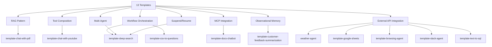

# Mastra -- Production Services, Applications, and Ecosystem

## Overview

The Mastra monorepo contains far more than the core framework (`mastra/`). It houses **27 additional projects** spanning production services, desktop applications, workshops, templates, and ecosystem infrastructure. These projects demonstrate Mastra's versatility as a framework and reveal architectural patterns that aren't visible from the core alone.

**Key insight:** The monorepo is organized into distinct project categories:
1. **Production Services** — services running Mastra Cloud for GitHub/Discord automation
2. **Desktop Applications** — Electron-based code agents
3. **Workshops & Presentations** — educational materials with interactive examples
4. **Templates** — starter projects for common agent patterns
5. **Ecosystem Infrastructure** — skills registry, API servers, eval tooling

## Ecosystem Map

```mermaid
flowchart TD
    CORE[mastra/ -- Core Framework<br/>Agent, Tools, Memory, Processors]

    CORE --> PROD[Production Services]
    CORE --> DESK[Desktop Apps]
    CORE --> WORK[Workshops]
    CORE --> TPL[Templates]
    CORE --> ECO[Ecosystem]

    PROD --> TRIAGE[mastra-triage<br/>GitHub issue triage]
    PROD --> GTC[gtc-planner<br/>GTC 2026 session advisor]
    PROD --> UI_DOJO[ui-dojo<br/>UI framework showcase]

    DESK --> CODE[mastra-code-ui<br/>Electron code agent]

    WORK --> OM[mastra-observational-memory-workshop]
    WORK --> PROC[workshop-processors-beyond-guardrails]
    WORK --> EVAL[eval-workshop-2]
    WORK --> SLIDES[workshops<br/>Harness presentation]
    WORK --> MC_WORK[workshop-mastracode]
    WORK --> PRINC[principles-presentation]
    WORK --> AGENT_CRS[mastra-agent-course]

    TPL --> WEATHER[weather-agent]
    TPL --> BROWSE[template-browsing-agent]
    TPL --> PDF[template-chat-with-pdf]
    TPL --> YT[template-chat-with-youtube]
    TPL --> DEEP[template-deep-search]
    TPL --> SQL[template-text-to-sql]
    TPL --> SLACK[template-slack-agent]
    TPL --> GDOCS[template-google-sheets]
    TPL --> DOCS[template-docs-chatbot]
    TPL --> CSV[template-csv-to-questions]
    TPL --> FEED[template-customer-feedback-summarization]
    TPL --> FLASH[template-flash-cards-from-pdf]
    TPL --> BROWSE_AGENT[template-browsing-agent]

    ECO --> SKILLS[skills<br/>Agent skills discovery]
    ECO --> SKILLS_API[skills-api<br/>Skills marketplace API]
    ECO --> AI_BUDDIES[ai-buddies<br/>Evals + RAG demo]
```



## 1. mastra-triage: GitHub Issue Triage Service

**Type:** Production Service (Mastra Cloud deployment)
**Purpose:** Automates GitHub issue management for the Mastra repository

### Architecture

```
GitHub Actions (mastra-ai/mastra)
  ├── issue-triage.yml        → trigger on issues [opened, reopened]
  ├── cron-discord-triage.yml → cron: Discord → GitHub issue creation
  ├── cron-discord-github-sync.yml → cron: sync Discord messages to issues
  └── cron-github-issues-follow-up.yml → cron: stale issue management
       │
       ▼
Mastra Cloud (this project)
  ├── Workflows:
  │   ├── triageWorkflow           → Classify area → derive squad → estimate effort/impact
  │   ├── discordToGithubWorkflow  → Create GitHub issues from Discord threads
  │   ├── discordSyncWorkflow      → Sync Discord messages to GitHub issues
  │   ├── githubIssueManagerWorkflow → Add follow-up labels to stale issues
  │   ├── forumThreadAnalysisWorkflow → Manual: analyze Discord trends
  │   └── discordAnalysisWorkflow → Manual: categorize Discord posts
  ├── Agents:
  │   ├── classificationAgent      → Labels issues by product area (gpt-4o-mini)
  │   ├── effortImpactAgent        → Estimates effort and impact (gpt-4o-mini)
  │   ├── threadClassifierAgent    → Classifies threads for reporting (gemini-3-pro)
  │   └── analysisAgent            → Analyzes categories (gpt-4o-mini)
  └── Tools:
      └── fetchForumPosts → Discord forum client
```

### Engineering Squad Assignment

| Squad | Areas |
|-------|-------|
| trio-tnt | Workflows, Networks, Storage, RAG, Streaming, Server Cache, Pubsub |
| trio-wp | Playground, CI/Tests, Bundler, Deployer, CLI, Client SDK |
| trio-tb | Agents, Tools, Memory, MCP, Processors |
| trio-tron | Voice, Cloud Admin, Cloud Runner, Cloud Builder |
| trio-tracery | Evals, Observability |
| Growth | Examples, Docs, Website, Analytics |

**Source:** `mastra-triage/src/mastra/workflows/`, `mastra-triage/src/mastra/agents/`

## 2. mastra-code-ui: Electron Desktop Code Agent

**Type:** Desktop Application (Electron)
**Purpose:** VS Code-like coding agent with Mastra integration

### Architecture

```
Electron App (mastra-code-ui)
├── Main Process (Node.js)
│   ├── mastracode agent integration
│   ├── node-pty terminal
│   ├── LSP (typescript-language-server)
│   └── ast-grep code analysis
├── Renderer Process (React 19)
│   ├── xterm.js terminal
│   ├── React Markdown rendering
│   └── Syntax highlighting
└── Build (electron-vite + electron-builder)
    └── macOS dmg (arm64 + x64)
```

### Key Dependencies

- `@mastra/core`, `@mastra/libsql`, `@mastra/mcp`, `@mastra/memory` — Mastra integration
- `mastracode` — The coding agent (patched version)
- `node-pty` — Pseudoterminal for shell execution
- `@ast-grep/napi` — AST-based code analysis
- `playwright-core` — Browser automation
- `@tavily/core` — Web search
- `vscode-languageserver-protocol` — LSP integration

**Source:** `mastra-code-ui/src/`, `mastra-code-ui/electron.vite.config.ts`

## 3. gtc-planner: GTC 2026 Session Advisor

**Type:** Full-Stack Web Application
**Purpose:** NVIDIA GTC conference session browser with AI recommendations

### Architecture

```
├── src/mastra/          # Mastra backend
│   ├── agents/          # gtc-advisor agent
│   └── tools.ts         # 10 tools: search, filter, recommend, schedule, itinerary CRUD
├── web/                 # Vite + React frontend
│   ├── src/components/  # EventsPanel, SessionDetail, PartyDetail, Chat
│   └── public/          # sessions.json (954 sessions), parties.json (35 parties)
└── Deployment: Railway (2 services: API + Web)
```

**Key features:** Observational Memory (agent learns preferences), itinerary builder with conflict detection, Nemotron-3 Super 120B model via OpenRouter.

**Source:** `gtc-planner/src/mastra/`, `gtc-planner/web/`

## 4. ui-dojo: UI Framework Showcase

**Type:** Reference Application
**Purpose:** Compare Mastra integration with 3 major AI UI frameworks

### What's Inside

| Feature | Pages |
|---------|-------|
| **AI SDK** | `ai-sdk/index.tsx` — Vercel AI SDK `useChat` hook |
| **Assistant UI** | `assistant-ui/index.tsx` — Thread components + `useExternalStoreRuntime()` |
| **CopilotKit** | `copilot-kit/index.tsx` — CopilotKit Chat |
| **Generative UIs** | Tool response custom UI components |
| **Workflows** | Multi-step with suspend/resume (Human in the Loop) |
| **Agent Networks** | Multiple agents coordinating through routing agent |
| **Client SDK** | Mastra Client SDK with each framework |

**Source:** `ui-dojo/src/pages/`, `ui-dojo/src/mastra/`

## 5. mastra-triage: Production Issue Triage (detailed above)

Already covered in section 1.

## 6. mastra-observational-memory-workshop: OM Workshop

**Type:** Workshop with interactive examples
**Duration:** 1 hour
**Date:** February 12, 2026

### Observational Memory Architecture

```
Agent Loop
    │
    ├── Messages accumulate → hits 30k tokens
    │       │
    │       ▼
    │   Observer Agent (background)
    │       → Compresses messages into dense observations
    │       → Drops raw text, keeps decisions
    │
    ├── Observations accumulate → hits 40k tokens
    │       │
    │       ▼
    │   Reflector Agent (background)
    │       → Restructures observations
    │       → Maintains stable context window
    │
    └── Agent sees only observations (not raw messages)
```

### Workshop Examples

| Example | Tools | OM Benefit |
|---------|-------|------------|
| 00-personal-assistant | Slack, Calendar, Meeting Notes | Compresses verbose Slack threads |
| 01-code-research | File read, grep, command exec | Compresses file contents + command output |
| 02-playwright | Playwright MCP (browser) | Compresses DOM snapshots (5-40x) |

### Key Metrics

- Text conversations: 3-6x compression
- Tool-heavy workloads: 5-40x compression
- 4-10x cost savings via prompt caching (stable context window)
- SOTA on LongMemEval: 84.2% (gpt-4o), 94.9% (gpt-5-mini)

**Source:** `mastra-observational-memory-workshop/examples/`, `mastra-observational-memory-workshop/slides/`

## 7. workshop-processors-beyond-guardrails: Processors Workshop

**Type:** 45-minute hands-on workshop
**Focus:** Mastra Processors framework (intercept/modify every phase of agent loop)

### The 5 Processor Phases

```
User Input
    │
    ▼
┌─────────────────────────┐
│ 1. processInput         │  Input validation (topic guard, PII detection)
└─────────────┬───────────┘
              ▼
┌─────────────────────────┐
│ 2. processInputStep     │  Per-step control (model swap, tool gating)
└─────────────┬───────────┘
              ▼
┌─────────────────────────┐
│ Agent Loop (LLM call)   │
└─────────────┬───────────┘
              ▼
┌─────────────────────────┐
│ 3. processOutputStream  │  Real-time stream monitoring (cost tracking)
└─────────────┬───────────┘
              ▼
┌─────────────────────────┐
│ 4. processOutputStep    │  Step-level quality checks (drift detection)
└─────────────┬───────────┘
              ▼
┌─────────────────────────┐
│ 5. processOutputResult  │  Post-completion side effects (webhooks)
└─────────────────────────┘
```

### Three Progressive Examples

| Example | Port | Focus |
|---------|------|-------|
| 00-guardrails | 4111 | Topic Guard (LLM) + PII Guard (regex) + ModerationProcessor in parallel |
| 01-beyond-guardrails | 4112 | Model router, tool dependency enforcer, drift monitor, cost tracker, response enricher |
| 02-enterprise-pipeline | 4113 | 10 processors: regex pre-filter → input pipeline → model router → output pipeline → webhooks |

### Performance Hierarchy

```
Regex pre-filters      →  μs latency,  $0 cost
Safeguard models       →  ms latency,  ¢ cost
Parallel LLM checks    →  latency = slowest check (not sum)
Model routing per step  →  ~90% savings on follow-up steps
Conditional checks     →  only pay when the condition fires
Stream-time abort      →  stop generation mid-stream if budget exceeded
```

**Source:** `workshop-processors-beyond-guardrails/examples/`, `workshop-processors-beyond-guardrails/slides/`

## 8. eval-workshop-2: Evals Workshop

**Type:** Hands-on eval workshop
**Focus:** Evaluating AI agents with Mastra

### Structure

| Demo | Description |
|------|-------------|
| demo-1-basics | Foundational Mastra: agents, tools, workflows, scorers |
| demo-2-docs-agent | Documentation agent with complete eval pipeline: custom scorers, dataset creation, online/offline evaluation, CI integration |

**Source:** `eval-workshop-2/demo-1-basics/`, `eval-workshop-2/demo-2-docs-agent/`

## 9. workshops: "Build Your Own Claude Code" Presentation

**Type:** Interactive HTML slide deck
**Focus:** Agent harness architecture principles

### Key Concepts Covered

| Topic | Key Point |
|-------|-----------|
| Harness | Manages stateful execution of agent loop — the difference between demo and product |
| System Prompts | Dynamic, context-aware at runtime, not static |
| Workspace Primitives | Skills, AGENTS.md/CLAUDE.md, FileSystems, Sandboxes |
| Memory | Foundation of everything; compaction is the killer; design deliberately from day one |
| Modes | BUILD, PLAN, FAST, TRIAGE, REVIEW — live or die by system prompts |
| Steering | Q&A flows, clarification, option selection, always include free-form input |
| Protocols | MCP & ACP are load-bearing; emit events; tasks are atomic unit of work |
| Multi-Model | Mix deliberately: Opus for reasoning, Codex for code, Kimi for cost |
| Tool Policies | Parallel agents = parallel side effects; track tokens/costs especially in YOLO mode |

**Source:** `workshops/` (vanilla HTML/CSS/JS, no build step)

## 10. workshop-mastracode: MastraCode Workshop

**Type:** Workshop with progressive examples
**Focus:** Building coding agents with MastraCode

### Workshop Examples

| Example | Description |
|---------|-------------|
| examples/03-mastra-code | Progressive MastraCode agent examples (basic → full TUI) |

Also referenced in the `workshops/` presentation under the agent harness pattern.

**Source:** `workshop-mastracode/examples/`, `workshop-mastracode/workshop-outline.md`

## 11. principles-presentation: Principles of Building AI Agents

**Type:** Presentation slides + example project
**Authors:** Shane Thomas and Sam Bhagwat
**Edition:** 3rd

**Source:** `principles-presentation/slides/`, `principles-presentation/project/`

## 12. mastra-agent-course: Agent Course

**Type:** Educational course material
**Purpose:** Teaching agents to work with the Mastra framework

Includes `AGENTS.md` for AI coding agents working in the repository.

**Source:** `mastra-agent-course/`

## 13. ai-buddies: Evals + RAG Demo

**Type:** Demo project
**Focus:** Showcases Mastra's evals, RAG, MCP, memory, and logging capabilities

### Dependencies

- `@mastra/core`, `@mastra/evals`, `@mastra/libsql`, `@mastra/loggers`, `@mastra/mcp`, `@mastra/memory`, `@mastra/rag`
- `ai` SDK, `zod`

**Source:** `ai-buddies/`

## 14. skills: Agent Skills Discovery

**Type:** Ecosystem Infrastructure
**Purpose:** Official Mastra skills for AI coding agents

### How It Works

```
Agent (Cursor, Claude Code, etc.)
    │
    ▼
npx skills add mastra-ai/skills
    │
    ▼
Clone from GitHub → Install skill files
    │
    ▼
Agent loads SKILL.md files automatically
    │
    ▼
Skills provide reference files:
  ├── references/create-mastra.md      ← Setup & Installation
  ├── references/embedded-docs.md      ← Find APIs in node_modules
  ├── references/remote-docs.md        ← Fetch from mastra.ai/llms.txt
  ├── references/common-errors.md      ← Common errors and solutions
  └── references/migration-guide.md    ← Version upgrade workflows
```

### .well-known Discovery Standard

Mastra supports the RFC 8615 Well-Known URI standard:

```
https://mastra.ai/.well-known/skills/index.json    → Skills index
https://mastra.ai/.well-known/skills/mastra/SKILL.md → Individual skill
```

Agents can discover skills automatically without manual configuration.

**Source:** `skills/SKILL.md`, `skills/references/`

## 15. skills-api: Skills Marketplace API

**Type:** API Server
**Purpose:** Serves a browsable registry of 34,000+ skills from 2,800+ repositories

### Architecture

```
Data Sources:
  ├── Scraped from GitHub (SKILL.md files)
  ├── S3 storage (AWS, MinIO, Cloudflare R2)
  └── Bundled fallback data
       │
       ▼
API Server (Hono-based)
  ├── GET /api/skills          → Search and list (paginated)
  ├── GET /api/skills/top      → Top by installs
  ├── GET /api/skills/:id      → Individual skill
  ├── GET /api/skills/sources  → Source repositories
  └── POST /api/admin/refresh  → Trigger data refresh
       │
       ▼
Storage Priority: S3 > Filesystem > Bundled data
```

### Library Usage

```typescript
import { createSkillsApiServer, scrapeAndSave, fetchSkillFromGitHub } from '@mastra/skills-api';

const app = createSkillsApiServer({ cors: true, prefix: '/api' });
```

**Source:** `skills-api/src/`

## 16-28. Templates: Starter Projects

All templates follow the same scaffolding pattern:

```bash
npx create-mastra@latest --template <template-name>
```

### Template Matrix

| Template | Pattern Demonstrated | Key Dependencies |
|----------|---------------------|------------------|
| **weather-agent** | Agent + workflow with API tools + scorers | OpenAI, weather API |
| **template-browsing-agent** | Browser automation via Stagehand | Browserbase, OpenAI |
| **template-chat-with-pdf** | RAG (chunking → vector search → answer) | PDF parser, vector DB |
| **template-chat-with-youtube** | Transcript fetching + tool composition | YouTube API, memory |
| **template-deep-search** | Self-evaluating research loop + nested workflows + suspend/resume | Exa search, multi-agent |
| **template-text-to-sql** | Schema introspection → SQL generation → execution | SQLite, natural language |
| **template-slack-agent** | Slack bot webhook → Mastra agent streaming | Slack Bolt |
| **template-google-sheets** | Composio integration for Google Sheets | Composio SDK |
| **template-docs-chatbot** | MCP server + Mastra agent consuming MCP tools | MCP protocol |
| **template-csv-to-questions** | CSV → LLM summarization → question generation workflow | CSV parser |
| **template-customer-feedback-summarization** | Observational Memory for trend tracking | OM, sentiment analysis |
| **template-flash-cards-from-pdf** | PDF parsing + AI image generation | PDF parser, image gen |
| **template-browsing-agent** | Stagehand web automation + Mastra agent | Browserbase, Stagehand |
| **template-github-review-agent** | GitHub PR/code review automation | GitHub API, code analysis |

### Key Patterns Across Templates



## Project Categories Summary

| Category | Projects | Purpose |
|----------|----------|---------|
| **Core Framework** | mastra/ | Agent, tools, memory, processors, model router |
| **Production Services** | mastra-triage/, gtc-planner/ | Real-world deployments on Mastra Cloud/Railway |
| **Desktop App** | mastra-code-ui/ | Electron-based coding agent |
| **UI Showcase** | ui-dojo/ | Compare 3 AI UI frameworks |
| **Workshops** | om-workshop/, processors/, evals/, workshops/, mastracode/ | Educational materials with live examples |
| **Presentations** | principles-presentation/, agent-course/ | Conference talks and courses |
| **Ecosystem** | skills/, skills-api/, ai-buddies/ | Skills discovery, API server, demo |
| **Templates** | weather-agent/, template-* (13 total) | Starter projects for common patterns |

## Related Documents

- [00-overview.md](./00-overview.md) — What Mastra is, core architecture
- [01-architecture.md](./01-architecture.md) — Package map and monorepo structure
- [10-comparison.md](./10-comparison.md) — Mastra vs Pi vs Hermes

## Source Paths

```
src.mastra-ai/
├── mastra/                              ← Core framework (documented separately)
├── mastra-triage/                       ← Production GitHub/Discord triage service
├── mastra-code-ui/                      ← Electron desktop code agent
├── gtc-planner/                         ← GTC 2026 conference session advisor
├── ui-dojo/                             ← UI framework comparison showcase
├── mastra-observational-memory-workshop/ ← Observational Memory workshop
├── workshop-processors-beyond-guardrails/ ← Processors framework workshop
├── eval-workshop-2/                     ← Evals workshop with demo projects
├── workshops/                           ← "Build Your Own Claude Code" presentation
├── workshop-mastracode/                 ← MastraCode workshop
├── principles-presentation/             ← Principles of Building AI Agents slides
├── mastra-agent-course/                 ← Agent educational course
├── ai-buddies/                          ← Evals + RAG demo project
├── skills/                              ← Agent skills discovery (CLI plugin)
├── skills-api/                          ← Skills marketplace API server (34k+ skills)
├── weather-agent/                       ← Weather agent + workflow template
├── template-browsing-agent/             ← Browser automation via Stagehand
├── template-chat-with-pdf/              ← RAG-powered PDF chat
├── template-chat-with-youtube/          ← YouTube transcript Q&A
├── template-deep-search/                ← Self-evaluating research assistant
├── template-text-to-sql/                ← Natural language database queries
├── template-slack-agent/                ← Slack bot webhook integration
├── template-google-sheets/              ← Google Sheets via Composio
├── template-docs-chatbot/               ← MCP server + agent chatbot
├── template-csv-to-questions/           ← CSV → summary → question workflow
├── template-customer-feedback-summarization/ ← Observational Memory for feedback
└── template-flash-cards-from-pdf/       ← PDF → flash cards with AI images
```
