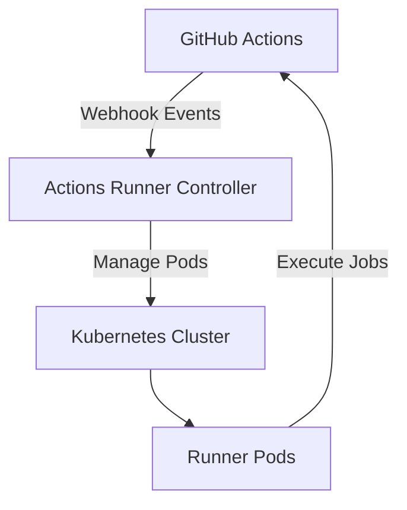

# Sub-Project Exploration: Actions Runner Controller

## Overview

Actions Runner Controller (ARC) is a Kubernetes controller for managing GitHub Actions self-hosted runners. It automatically scales runner pods based on workflow demand, supporting both repository-level and organization-level runners. This is used by the Matrix/Element team for their CI/CD infrastructure.

## Architecture



### Structure

```
actions-runner-controller/
├── cmd/                    # CLI entry points
├── controllers/            # Kubernetes controllers
├── apis/                   # CRD API definitions
├── config/                 # Kubernetes manifests (CRDs, RBAC)
├── charts/                 # Helm charts
├── build/                  # Build scripts
├── hack/                   # Development utilities
├── github/                 # GitHub API integration
├── hash/                   # Hashing utilities
├── logging/                # Logging configuration
├── acceptance/             # Acceptance tests
├── contrib/                # Community contributions
├── docs/                   # Documentation
├── Dockerfile
└── go.mod
```

## Key Insights

- Kubernetes operator pattern using controller-runtime
- CRD-based: defines RunnerDeployment, RunnerReplicaSet custom resources
- Webhook-driven autoscaling based on GitHub workflow job events
- Helm charts for deployment
- Go 1.22.1
- Not Matrix-specific but used for Element's CI infrastructure
- Originally from `actions/actions-runner-controller` (GitHub official)
