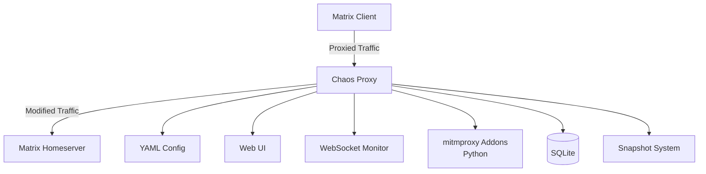

# Sub-Project Exploration: Chaos

## Overview

Chaos is a chaos testing/fault injection tool for Matrix homeservers and clients. Written in Go with Python mitmproxy addons, it enables testing of Matrix deployments under adverse network conditions by intercepting, modifying, and disrupting HTTP/WebSocket traffic between clients and servers.

## Architecture



### Structure

```
chaos/
├── chaos.go                # Main package
├── cmd/                    # CLI commands
├── config/                 # Configuration loading
├── internal/               # Internal packages
├── web/                    # Web UI for monitoring
├── ws/                     # WebSocket interception
├── mitmproxy_addons/       # Python mitmproxy extensions
├── snapshot/               # State snapshot system
├── demo/                   # Demo scenarios
├── restart/                # Service restart utilities
├── config.sample.yaml      # Sample configuration
├── config.demo.yaml        # Demo configuration
├── docker-compose.yml      # Deployment
└── go.mod
```

## Key Insights

- Purpose-built for Matrix infrastructure testing
- Combines Go (main proxy) with Python (mitmproxy addons) for flexibility
- WebSocket interception for sync/federation traffic
- Web UI for real-time traffic monitoring and fault injection
- SQLite for recording intercepted traffic
- Docker Compose deployment with sample configurations
- Snapshot system for capturing and replaying traffic patterns
- Useful for testing client resilience to network failures, slow responses, dropped connections
