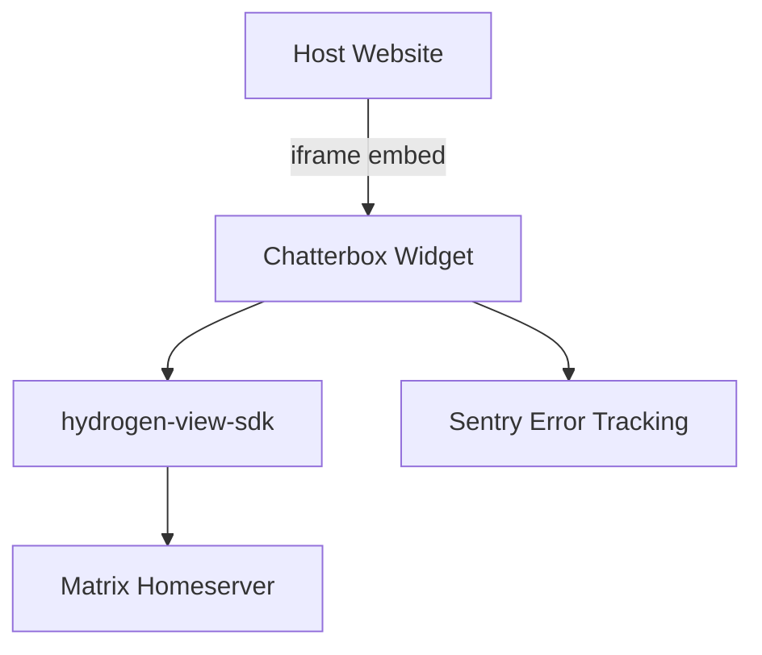

# Sub-Project Exploration: Chatterbox

## Overview

Chatterbox (v0.5.2) is an embeddable Matrix chat widget that lets website operators add secure, real-time chat to any web page. It is built on Hydrogen's view SDK (`hydrogen-view-sdk`) and renders as an iframe, providing a lightweight Matrix client experience without requiring users to install a Matrix client.

## Architecture



### Structure

```
chatterbox/
├── src/                    # TypeScript source
├── public/                 # Static assets
├── scripts/                # Build scripts (after-build.sh)
├── cypress/                # E2E tests
├── chatterbox.html         # Demo page
├── index.html              # Entry HTML
├── vite.config.js          # Main build config
├── parent-vite.config.js   # Parent page integration build
├── Dockerfile              # Nginx-based deployment
├── default-nginx.conf      # Nginx configuration
└── package.json
```

## Key Insights

- Builds to two outputs: the widget itself and a parent-page integration script
- Hydrogen View SDK provides the Matrix client implementation (lightweight, IndexedDB-backed)
- Cypress for E2E testing the embedded widget
- Nginx-based Docker deployment
- Sentry for error tracking in production
- Dual build configuration (main widget + parent page script)
- AGPL-3.0 + Commercial dual license
