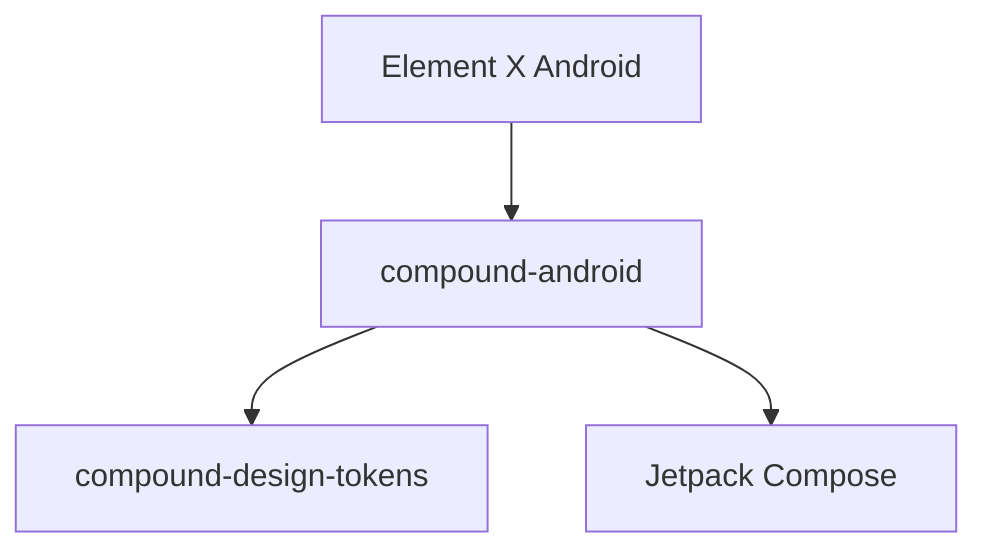

# Sub-Project Exploration: Compound Android

## Overview

Compound Android is the Android implementation of Element's Compound design system, providing Jetpack Compose UI components for use in Element X Android and other Matrix Android applications.

## Architecture



### Structure

```
compound-android/
├── compound/               # Library module
├── scripts/                # Build scripts
├── build.gradle.kts        # Root build config
├── settings.gradle.kts     # Module settings
├── gradle/                 # Gradle wrapper
└── renovate.json           # Dependency update config
```

## Key Insights

- Jetpack Compose-based UI components
- Gradle build system with Kotlin DSL
- SonarCloud integration for code quality
- Renovate for automated dependency updates
- Dual-licensed (open source + commercial)
