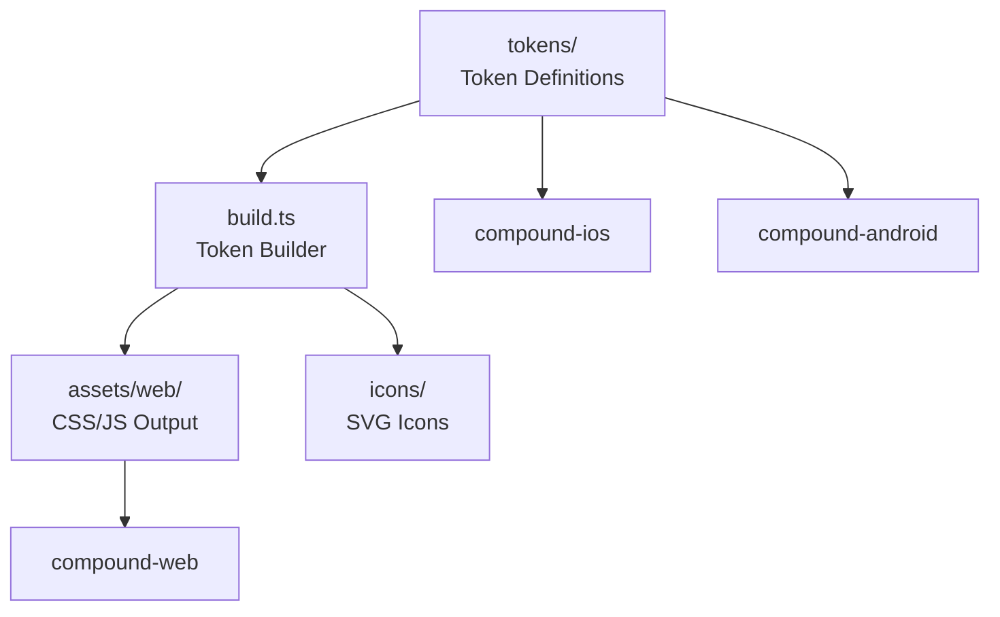

# Sub-Project Exploration: Compound Design Tokens

## Overview

Compound Design Tokens (`@vector-im/compound-design-tokens`) is the cross-platform design token system for Element's Compound design language. Version 4.0.1, it defines colors, typography, spacing, and other design primitives that are consumed by compound-web (React), compound-ios (Swift), and compound-android (Kotlin).

## Architecture



### Structure

```
compound-design-tokens/
├── tokens/                 # Source token definitions
├── src/                    # Build tooling source
│   └── syncIcons.ts        # Icon synchronization
├── assets/
│   └── web/
│       └── js/             # Generated JS/CSS token files
├── icons/                  # SVG icon assets
├── docs/                   # Token documentation
├── examples/               # Usage examples
├── scripts/                # Build/sync scripts
├── build.ts                # Main build script
├── Package.swift           # Swift Package Manager support
└── package.json
```

## Key Insights

- Cross-platform distribution: npm (web JS/CSS), Swift Package Manager (iOS), direct consumption (Android)
- Token build pipeline uses tsx (TypeScript execution)
- Icons are synced from a source of truth via `syncIcons.ts`
- Biome for formatting and linting (not ESLint/Prettier)
- Version 4.0.1 consumed by compound-web 7.8.0 and compound-ios
