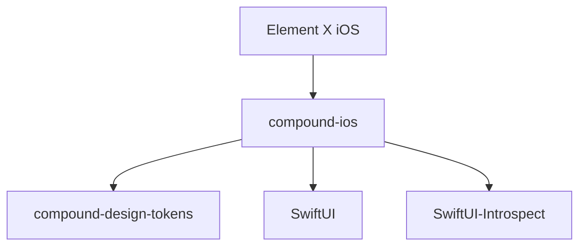

# Sub-Project Exploration: Compound iOS

## Overview

Compound iOS is the iOS/SwiftUI implementation of Element's Compound design system, providing reusable UI components for Element X iOS and other Matrix iOS applications. Distributed as a Swift Package (iOS 16+).

## Architecture



### Structure

```
compound-ios/
├── Sources/                # Swift source files
├── Tests/                  # Unit and snapshot tests
├── Inspector/              # UI inspector tool
├── Package.swift           # SPM manifest (iOS 16+)
├── Package.resolved        # Resolved dependencies
└── codecov.yml
```

## Key Insights

- Swift Package Manager distribution
- Depends on compound-design-tokens (exact version 4.0.1)
- Uses SwiftUI-Introspect for UIKit bridging
- SFSafeSymbols for type-safe SF Symbols
- Prefire for preview-based testing
- swift-snapshot-testing for visual regression
- iOS 16+ minimum deployment target
