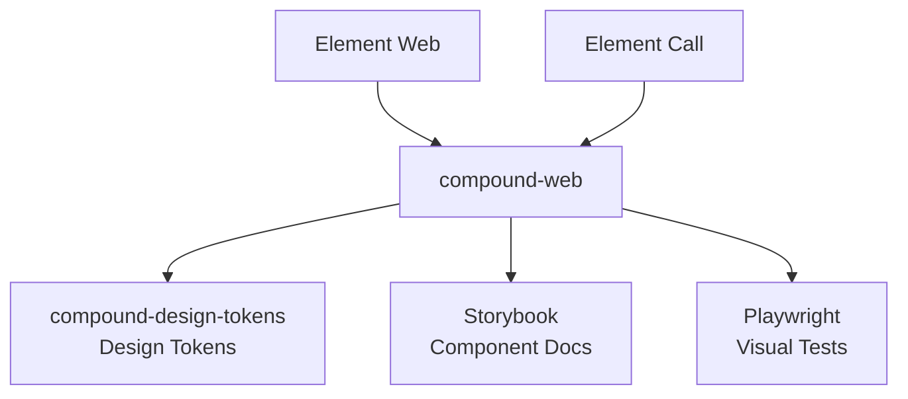

# Sub-Project Exploration: Compound Web

## Overview

Compound Web (`@vector-im/compound-web`) is Element's design system component library for web applications. Version 7.8.0, it provides reusable React components implementing the Compound design language, ensuring visual consistency across Element Web, Element Call, and other Matrix web applications.

## Architecture



### Structure

```
compound-web/
├── src/                    # React components and styles
├── res/                    # Static resources
├── playwright/             # Visual regression tests
├── vite.config.ts          # Build configuration
├── tsconfig.json
└── package.json
```

## Key Insights

- Published as `@vector-im/compound-web` on npm
- Dual CJS/ESM exports with TypeScript declarations
- Storybook for component documentation and development
- Playwright for visual regression testing
- Stylelint for CSS quality enforcement
- Built with Vite, ships as library (not application)
- Consumes `compound-design-tokens` for colors, typography, spacing
