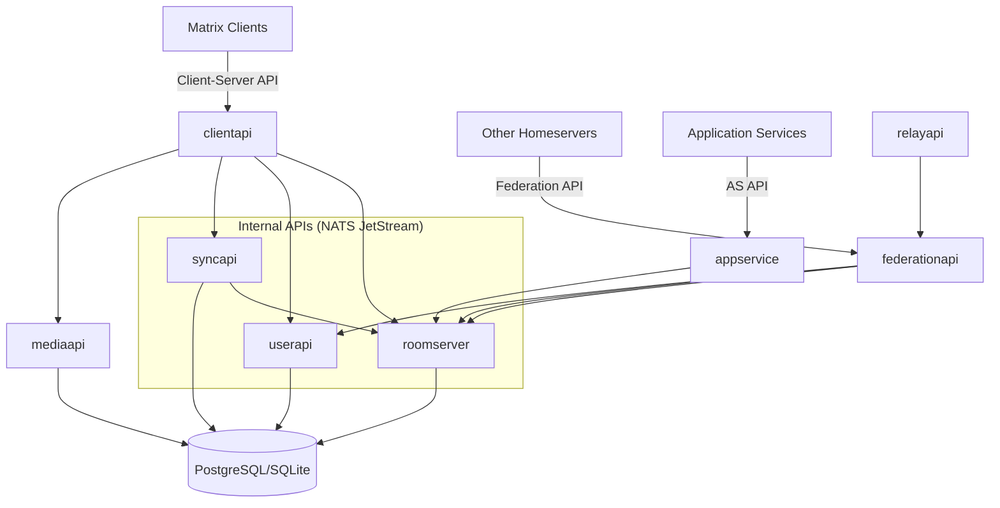

# Sub-Project Exploration: Dendrite

## Overview

Dendrite is a second-generation Matrix homeserver written in Go, designed as a modern replacement for Synapse with a focus on scalability, performance, and clean architecture. It implements the Matrix Client-Server, Server-Server (Federation), and Application Service APIs as separate, well-defined components that can be deployed as a monolith or as independent microservices.

Dendrite supports both PostgreSQL and SQLite databases, includes experimental peer-to-peer modes (Pinecone overlay network, Yggdrasil), and provides full-text search via Bleve.

## Architecture

### High-Level Diagram



### Directory Structure

```
dendrite/
├── cmd/
│   ├── dendrite/                   # Main monolith binary
│   ├── dendrite-demo-pinecone/     # P2P demo (Pinecone overlay)
│   ├── dendrite-demo-yggdrasil/    # P2P demo (Yggdrasil overlay)
│   ├── create-account/             # User creation tool
│   ├── generate-config/            # Config generator
│   ├── generate-keys/              # Key generation tool
│   ├── resolve-state/              # State resolution debugger
│   ├── furl/                       # Federation URL tool
│   └── dendrite-upgrade-tests/     # Upgrade test harness
├── clientapi/                      # Client-Server API handlers
├── federationapi/                  # Server-Server API handlers
├── roomserver/                     # Room state and event DAG management
├── syncapi/                        # Client sync (long-polling, SSE)
├── userapi/                        # User account and device management
├── mediaapi/                       # Media upload/download
├── appservice/                     # Application Service API
├── relayapi/                       # Relay server for P2P federation
├── internal/                       # Shared internal packages
├── setup/                          # Server initialization
├── build/                          # Build scripts
├── test/                           # Integration tests
├── helm/                           # Kubernetes Helm charts
├── contrib/                        # Community contributions
├── docs/                           # Documentation
└── dendrite-sample.yaml            # Sample configuration
```

## Component Breakdown

### Room Server
- **Location:** `roomserver/`
- **Purpose:** Core component managing room state, event DAG, state resolution (v2 algorithm), and event authorization. The heart of Matrix protocol implementation.

### Client API
- **Location:** `clientapi/`
- **Purpose:** Implements Matrix Client-Server API - login, room operations, messaging, profile, presence, typing indicators.

### Federation API
- **Location:** `federationapi/`
- **Purpose:** Implements Server-Server API for federation - event exchange, state queries, key management, backfill.

### Sync API
- **Location:** `syncapi/`
- **Purpose:** Client sync endpoint providing incremental updates. Handles long-polling, server-sent events, and room timeline pagination.

### User API
- **Location:** `userapi/`
- **Purpose:** User account management, device management, access tokens, push notification registration.

### Media API
- **Location:** `mediaapi/`
- **Purpose:** Media upload, download, thumbnail generation, and storage.

### App Service
- **Location:** `appservice/`
- **Purpose:** Application Service API for bridges and bots - transaction forwarding, namespace registration.

### Relay API
- **Location:** `relayapi/`
- **Purpose:** Relay server for P2P federation, allowing nodes to relay events when direct connections are unavailable.

## Entry Points

### Monolith Mode (`cmd/dendrite/`)
- Single binary runs all components in-process
- Components communicate via function calls

### P2P Demo Modes
- `cmd/dendrite-demo-pinecone/` - Embeds a Pinecone overlay network node
- `cmd/dendrite-demo-yggdrasil/` - Uses Yggdrasil mesh networking

## External Dependencies

| Dependency | Purpose |
|------------|---------|
| gorilla/mux | HTTP routing |
| gorilla/websocket | WebSocket support |
| lib/pq | PostgreSQL driver |
| blevesearch/bleve | Full-text search |
| matrix-org/gomatrixserverlib | Matrix protocol types and algorithms |
| matrix-org/pinecone | P2P overlay network |
| dgraph-io/ristretto | In-memory caching |
| getsentry/sentry-go | Error tracking |
| docker/docker | Container integration (testing) |

## Key Insights

- **Microservice-ready architecture** where each component (roomserver, syncapi, etc.) has clean API boundaries
- Uses NATS JetStream for internal message passing between components
- State resolution v2 implementation in the roomserver is the most complex part of Matrix protocol
- P2P demos (Pinecone, Yggdrasil) show Matrix working without centralized servers
- Full-text search via Bleve is built-in (unlike Synapse which requires external search)
- SQLite support makes it suitable for embedded/mobile deployments (used in Element Android P2P)
- Helm charts provided for Kubernetes deployment
- The `are-we-synapse-yet.py` script tracks feature parity with Synapse
