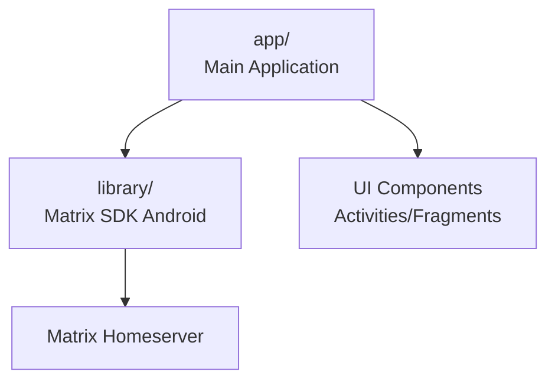

# Sub-Project Exploration: Element Android (Legacy)

## Overview

Element Android is the legacy Matrix client for Android, built with Kotlin and the Android SDK. It is being superseded by Element X Android, which uses the matrix-rust-sdk for its Matrix protocol implementation. This project remains for reference and existing deployments.

## Architecture



### Structure

```
element-android/
├── app/                    # Main application module
├── library/                # Matrix SDK Android (Java/Kotlin)
├── docs/                   # Documentation
├── fastlane/               # Play Store deployment
├── gradle/                 # Gradle wrapper
├── changelog.d/            # Changelog fragments
└── build.gradle
```

## Key Insights

- Legacy project, succeeded by Element X Android
- Gradle build with custom dependency management scripts
- Fastlane for automated Play Store releases
- Integration test scripts for CI
- The `library/` module contains the Android-native Matrix SDK (not rust-based)
