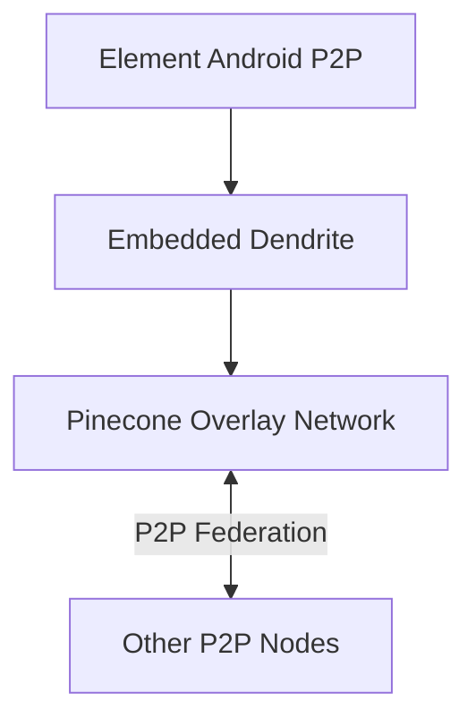

# Sub-Project Exploration: Element Android P2P

## Overview

Element Android P2P is an experimental fork of Element Android that embeds a Dendrite homeserver with Pinecone peer-to-peer overlay networking directly into the Android app. This enables Matrix communication without any centralized server infrastructure, using P2P federation for message delivery.

## Architecture

## Key Insights

- Experimental/demo-only; not for production use
- Embeds Dendrite (Go homeserver) compiled for Android via gomobile
- Pinecone overlay network handles peer discovery and routing
- Fork of element-android with P2P-specific modifications
- Demonstrates Matrix's ability to function without centralized infrastructure
- Breaking changes expected between versions
