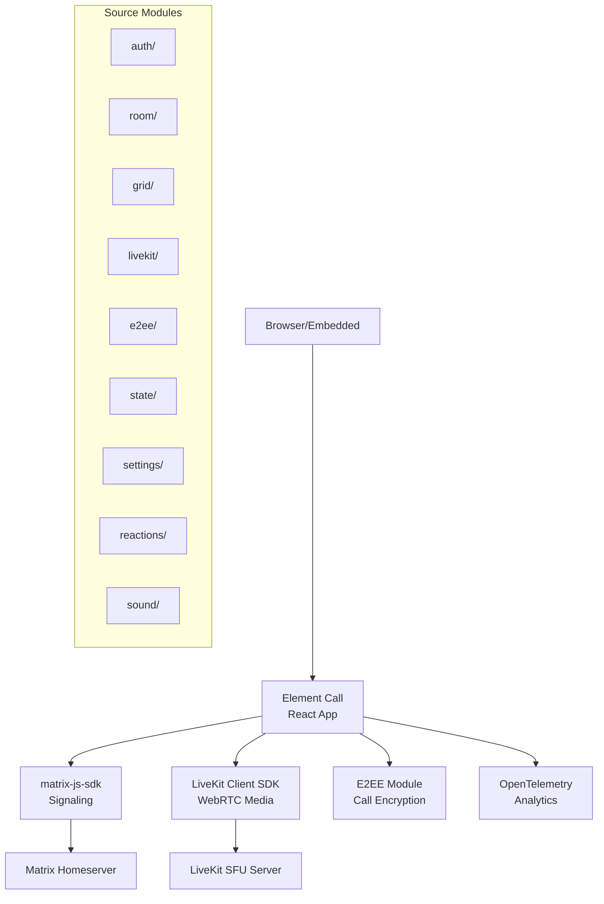

# Sub-Project Exploration: Element Call

## Overview

Element Call is a video/voice conferencing application built on Matrix and LiveKit. It provides WebRTC-based real-time communication with end-to-end encryption, powered by Matrix for signaling and room management. It can operate as a standalone application or be embedded within Element Web/Desktop for in-app calling.

## Architecture

### High-Level Diagram



### Source Structure

```
element-call/
├── src/
│   ├── auth/           # Authentication (Matrix login)
│   ├── room/           # Room management and call setup
│   ├── livekit/        # LiveKit WebRTC integration
│   ├── e2ee/           # End-to-end encryption for calls
│   ├── grid/           # Video grid layout engine
│   ├── state/          # Application state management
│   ├── settings/       # User preferences
│   ├── reactions/      # In-call reactions (emoji)
│   ├── sound/          # Audio feedback
│   ├── analytics/      # Usage analytics (PostHog)
│   ├── otel/           # OpenTelemetry instrumentation
│   ├── config/         # Runtime configuration
│   ├── home/           # Home/landing page
│   ├── profile/        # User profile display
│   ├── button/         # Shared button components
│   ├── form/           # Form components
│   ├── input/          # Input components
│   ├── icons/          # SVG icons
│   └── graphics/       # Visual assets
├── embedded/           # Embedded mode (iframe) integration
├── backend/            # Local dev backend configs
│   ├── dev_homeserver.yaml
│   ├── dev_livekit.yaml
│   └── redis.conf
├── config/             # App configuration
├── playwright/         # E2E tests
├── locales/            # i18n translations
└── package.json
```

## Key Components

### LiveKit Integration (`src/livekit/`)
- Manages WebRTC media tracks via LiveKit client SDK
- Handles room connection, participant tracking, media device selection

### E2EE Module (`src/e2ee/`)
- Implements end-to-end encryption for call media streams
- Uses Matrix key exchange for establishing shared secrets

### Grid Layout (`src/grid/`)
- Adaptive video grid layout engine for multiple participants
- Handles responsive resizing and spotlight modes

### Embedded Mode (`embedded/`)
- Widget API integration for embedding Element Call within Element Web
- Separate Vite config for embedded builds

## Key Insights

- **Dual build modes:** Full standalone app and embedded widget (separate Vite configs)
- LiveKit SFU provides scalable multi-party calling (not peer-to-peer mesh)
- Matrix is used only for signaling and room management; actual media flows through LiveKit
- OpenTelemetry instrumentation for call quality monitoring
- Docker Compose setup for local development with backend services
- TLS certificates included for local HTTPS development
- `lk-jwt-service` (separate project) provides LiveKit JWT token generation for authenticated room access
