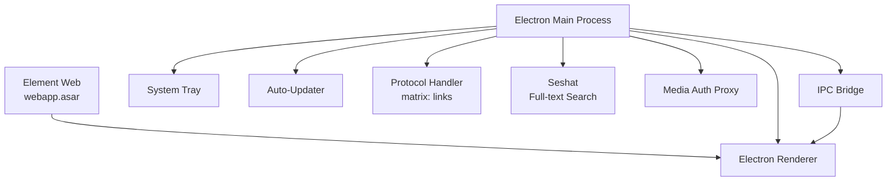

# Sub-Project Exploration: Element Desktop

## Overview

Element Desktop wraps Element Web in an Electron shell, providing a native desktop experience on Windows, macOS, and Linux. It adds desktop-specific features including native notifications, system tray integration, auto-updates, deep linking, media authentication, and optional Seshat (Rust-based full-text search via matrix-sdk-crypto).

Version 1.11.95, synchronized with Element Web releases.

## Architecture



### Source Structure

```
element-desktop/
├── src/
│   ├── electron-main.ts        # Main process entry
│   ├── preload.cts             # Preload script (renderer bridge)
│   ├── ipc.ts                  # IPC message definitions
│   ├── tray.ts                 # System tray management
│   ├── updater.ts              # Auto-update logic
│   ├── protocol.ts             # Deep link handling (matrix: protocol)
│   ├── seshat.ts               # Full-text search integration
│   ├── media-auth.ts           # Authenticated media proxy
│   ├── settings.ts             # Persistent settings store
│   ├── squirrelhooks.ts        # Windows installer hooks
│   ├── macos-titlebar.ts       # macOS titlebar customization
│   ├── vectormenu.ts           # Application menu
│   ├── webcontents-handler.ts  # Web content security
│   ├── language-helper.ts      # Locale detection
│   ├── displayMediaCallback.ts # Screen sharing
│   ├── utils.ts                # Shared utilities
│   ├── i18n/                   # Desktop-specific translations
│   └── @types/                 # TypeScript types
├── hak/                        # Native module build scripts
├── build/                      # Electron builder configs
├── playwright/                 # E2E tests
├── scripts/                    # Build and packaging scripts
├── electron-builder.ts         # Electron Builder configuration
└── package.json
```

## Key Insights

- Element Web is packaged as `webapp.asar` and loaded by Electron renderer
- Seshat provides encrypted full-text search using Rust (via N-API bindings)
- `hak/` directory contains scripts for building native Node modules across platforms
- Media authentication proxy handles Matrix media URLs with access tokens
- Protocol handler enables `matrix:` URI scheme for deep linking
- Squirrel hooks handle Windows installer lifecycle events
- Electron Builder handles cross-platform packaging and distribution
- Playwright tests cover desktop-specific functionality
