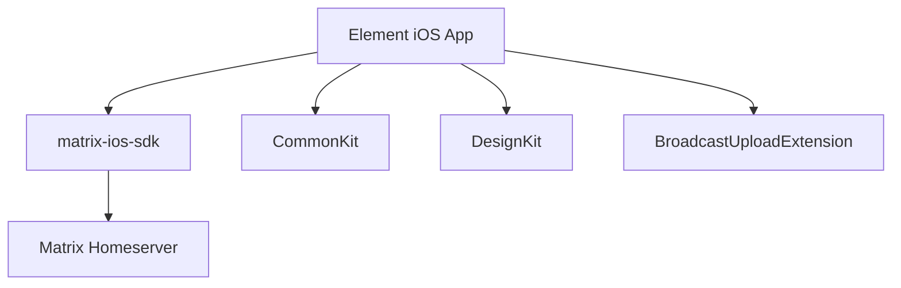

# Sub-Project Exploration: Element iOS (Legacy)

## Overview

Element iOS is the legacy Matrix client for iOS, built with Swift and Objective-C using the matrix-ios-sdk. It is being superseded by Element X iOS, which uses the matrix-rust-sdk via Swift bindings. This project remains for reference and existing deployments.

## Architecture



### Structure

```
element-ios/
├── Config/                 # Build configuration
├── CommonKit/              # Shared utilities
├── DesignKit/              # Design system
├── BroadcastUploadExtension/ # Screen sharing extension
├── matrix-ios-sdk/         # Matrix protocol SDK (submodule)
├── docs/                   # Documentation
├── fastlane/               # App Store deployment
├── changelog.d/            # Changelog fragments
└── Podfile                 # CocoaPods dependencies
```

## Key Insights

- Legacy project, succeeded by Element X iOS
- Mixed Swift/Objective-C codebase
- CocoaPods for dependency management (predates SPM adoption)
- matrix-ios-sdk included as a git submodule
- Fastlane for App Store deployment automation
- Brewfile for development tool management
